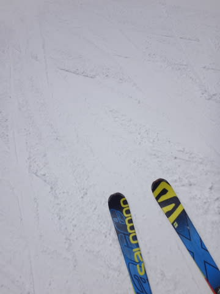
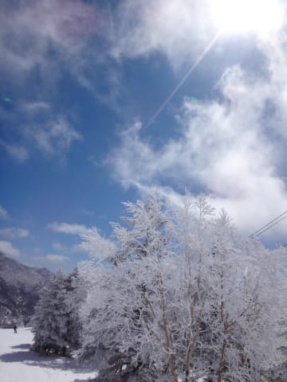
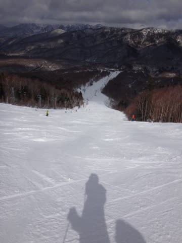

# 3月21日の志賀高原，ゲレンデ状況詳細…すっきり晴れたし，3連休では一番まともだったなぁ…

📅 投稿日時: 2016-03-23 03:29:50

ってことで．

昨日速報レポートした，3連休最終日の志賀高原の

ゲレンデ状況．

本日は，詳細モードにて…

えー．

予想通り．

チラチラ小雪が舞う天気で始まった3連休最終日．

朝の気温は，-6℃ですか…．

ふーーむ．

この時期としては，まぁまぁ冷えてるんだけど…

…でも．

皆さんの日ごろの行いが悪かったようで．

昨晩からの積雪は数mm…（涙）．

ああ．

昨日のガチガチアイスバーンは隠れないままなのね…

と，思いきや．

ガチガチアイスバーンが，圧雪車できれいに削られ，

結構固めとはいえ，適度にエッジが効く気持ちいい

高速バーンに大変身！

やっと．

3連休の最終日で，やっと．

何とか楽しいバーンで滑れるよ…！（感動の涙）

3連休で唯一のまともなコンディションだ～っ！！！

と，喜んでハイスピード大回りをかましていると…

をを！

9時半ごろには日も射してきました！！

…が．

さすが3連休．

ちとゲレンデの人が増えて来ちゃいました…（残念）．

トップスピード大回りは無理になってきたけど．

でも，ゴンドラ待ちがゲート外まで並んだのはほんの数回．

最大でもこの程度の待ち時間なので，全然許せるレベル．

で．

水曜恒例の天気予想で，

　朝はかなり冷える．天気は時折雲が飛んでくるものの晴れそう！

と予想した通り．

10時半ごろになると，すっきりと晴れてきましたね～！

晴れてきたのに，気温は割と低めなので．

すぐに雪が悪くなってしまうことはなく．

いい感じに締まったバーンを，

すっきり日差しの下で滑れるとは…っ！！！

アイスバーン＆氷のコロコロ＆コース上激混み＆ところどころブッシュ＆ガスで前が見えない

という．

スキーで考えうる最悪条件がほぼコンプリート

してしまった昨日の5重苦状態に比べれば．

…なんて．

なんて恵まれているんでしょう…（喜びの涙ちょちょ切れ状態）←今シーズンは喜びの基準が低すぎる…

と，かなり快適（注：今シーズン基準）な午前中を

過ごしたのですが…

さすがに昼間は強烈な日差しが照り付けたので…

最高気温が0℃程度と低めではあったにもかかわらず…

昼ごろには…

あれ？

あれれれれ…

なんだか，ねっとりとクリーミーな春雪になって

きちゃいましたよ…（涙）．

うーむ．

残念…

そして，ゲレンデの一部の雪は．

ああ…

やっぱり薄くなっていく…（激涙）．

まぁ，土が出ているのはごく一部なので，

滑るに支障はないレベルですけど．

とりあえず．

ドボドボ春雪になってしまった焼額を後にして，

奥志賀方面へ来てみると…

をを！

第3ゲレンデは，全く春雪の気配も見せず．

冷えたいい感じのバーンを維持！

…第2高速のエキスパート沿いは…

…

これは…

…

氷！？？

いや，これは…

結構なツルツルバーンなんですけど…（ちょっと涙）

そして，奥志賀も．

やはり，雪が薄くなってきてます…（涙）．

でも．

奥志賀の第2高速沿い，エキスパートコース．

しっかり硬いアイスバーンだったので．

夕方までひどいコブになることはなく．

「アイスバーンが好き！」という，ごく稀にいる

独特な嗜好の人には良かったんじゃないかな…←対象者はかなり限定

ってことで．

奥志賀へ遠征したものの．

焼額がホームの私ですから．

ヤケビラストゴンドラを目指し，焼額に戻ってきますが…

やはり，ドボドボ春雪になった焼額．

夕方はもう荒れ荒れ…（涙）．

そして．

荒れ荒れなだけじゃなく…

うむ？？？

これは…

気温がそれほど上がらなかった本日．

3時ごろには．

荒れ荒れ斜面のまま，凍っているんですが…っ！？？

これは…

これは，滑れたもんじゃないよ～！（涙）

と，泣きながら．

本日も焼額ゴンドラのラスト搬器に乗って，

ヤケビの営業終了を見届けたのでした…

…で．

今日も終わらない．

まだ，終わらない．

4:15の最終ゴンドラに乗って，4:30に滑り終わったあと．

また駐車場の車に飛び乗り．

なぜか4:40には一の瀬ファミリーのクワッドに

乗っているという瞬間移動を繰り出し…

やってきました，一の瀬へ！

4:50の営業終了まで，10分あれば，2本滑れるのだ…っ！！

一の瀬ファミリー正面バーンは…

え？

これは…

つんつるてんアイスバーン？？？

これは…

大勢のスキーヤーに磨き上げられ．

見事なまでのツルツルに…

…これは，しっかりエッジを研いでいないと

気持ちよーーく滑落できる，斜めスケートリンク状態ですか…

この斜面を「最高！」

と言って，ものすごいスピードで落下していく

20000mクラブな方々を驚愕の目で見送りつつ．

この日もしっかり，最後の最後まで滑りつくした，

Skier_Sなのだった…

…しかし．

この3連休．

最終日の午前中だけ，適度に締まったいいコンディション（当シーズン比）

だった以外．

ザブザブ春雪かアイスバーンでしか滑れなかった気がするのだが…（涙）．

ってか．

今シーズンはもう，アイスバーンか春雪でしか滑れないのかも！？？？

いや．

きっと．

きっと．

これまで降らずに，どこかに溜まっていた雪が．

4月に一気に放出されて．

4月は腰パフの冷え冷え新雪が

毎週毎週積もってくれるに違いないっ！！！！←それはもう天変地異レベルだな

## 💬 コメント一覧

### 💬 コメント by (Kon Suke)
**タイトル**: お疲れ様でした
**投稿日**: 2016-03-23 11:00:38

今週は、アイスバーンで楽しかったですよ!

22日も硬めで最高でした。

今週は、20000メートルクラブの会員用と準会員用のシールを持っていきます。

会員を増やしていきましょう。

### 💬 コメント by (Skier_S)
**タイトル**: Kon Suke親分さま
**投稿日**: 2016-03-24 00:45:39

私も硬い斜面は嫌いじゃないはずなのですが…

あれだけツルツルだと，私にとっては

「楽しい」と思えるレベルを超えてました(＾＾；

今週末，シール楽しみです！！！

土曜，一の瀬最終リフトを滑りにヤケビから

移動しますので，

土曜のリフト終了後に受け取らせていただけます

でしょうか…

よろしくお願いします！

### 💬 コメント by (花粉症スキーヤー)
**タイトル**: お会いできて光栄です。
**投稿日**: 2016-03-24 11:49:55

3/21は一ノ瀬ラストリフト？、でお話しできて光栄です。

ありがとうございました。

S様の予報どおり、天気がよくなり、寺子屋など標高の高いところ雪質がよく、期待以上の志賀高原でした。

連休ラスリフ(?)のリアルなS様を見て、スキーが本当に好きな人なんだなあとつくづく思いました。

帰りのこととか、睡眠時間のこととか、いろんなことが頭をよぎりますが、日曜等の午後の志賀高原は空いてて、いい感じで、ヤバイですね(^^;;

S様はまさに昔観た映画の私をスキーにつれてって、的なものを彷彿させます。

私も遠さにめげず頑張ろうと思いました。

ありがとうござい。

### 💬 コメント by (花粉症スキーヤー)
**タイトル**: 訂正
**投稿日**: 2016-03-24 11:54:19

最後の一文

ありがとうござい。→ ありがとうございました。

申し訳ありませんでした(´・_・`)

### 💬 コメント by (私も花粉症スキーヤーのSkier_S)
**タイトル**: 花粉症スキーヤーさま
**投稿日**: 2016-03-25 00:32:12

先日はどうもでした～！

私はあれからもう1本乗ったので，ラストリフト

ではなかったのですが…(笑)

リフト1本でしたが，ご一緒できて楽しかったです．

ありがとうございました（＾＾

しかし，私も結構なスキー好きですが…

一の瀬ファミリー正面バーンには，

わたしよりよっぽどスキーが好きな人が

集まってますので，なかなか刺激に満ちてますよ(笑)．

また，志賀にお越しの際は声かけてください！！

