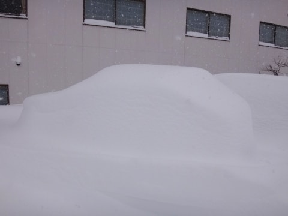
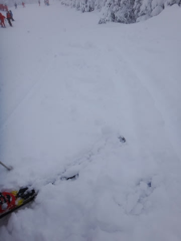
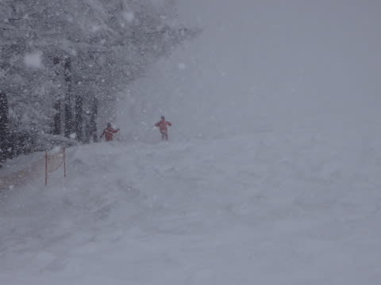
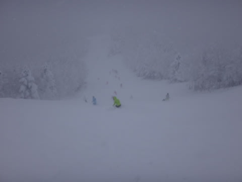

# 12月14日，日曜の志賀高原・焼額山速報モード

📅 投稿日時: 2014-12-14 22:18:31

🏷️ カテゴリ: [2015スキー滑走日記](c09ea645cfc085f86dfcd80f49599dd89.md)

えー．

今日は比較的早く帰ってきたのですが．

なぜか今から仕事をしなくてはならないので．

いつも通り，速報モードで…

土曜からひたすらやむことなく，雪が

えんえん降り続けていたわけですが．

朝，宿の前に出ると…

なんだ？これは？？

誰かが，雪で車の形を作ったわけではなく．

この中に，車が隠れているようですが…

見事に，完全に雪に埋もれてしまってます．

そして，ゲレンデに出ると…

当然新雪なわけで．

この時期，非圧雪コースは無いので．

すごく柔らかく圧雪された上に，15cm位の新雪が

被さった感じでしょうか…

あっという間にコースはぼそぼそに蹴散らされて，

朝イチからかなりの荒れ荒れバーン（涙）．

今日は一日，荒れ荒れゲレンデでした…

天気は，雪が降り続け．

時々強くなり…

うむ．

前が見にくくて，かなり荒れて凸凹したゲレンデ．

全く凸凹が見えないよ…

でも．

かなり積もってくれたおかげで．

ゲレンデのブッシュは，ほぼ完全に隠れましたね～．

ゲレンデ状況は，土曜から降り続けた雪で，

積雪量はもう大丈夫な感じになってきました．

ってことで．

雪もいっぱい積もったので．

来週末からは，第1ゴンドラが動くようです！

（ぱちぱちぱち）

これからの一週間も，かなり積もってくれると思うので

（…というか，豪雪レベル？？）

次の週末は，志賀高原ほぼ全面オープンでしょう！！

詳細レポートは，また明日に…

## 💬 コメント一覧

### 💬 コメント by (Goku)
**タイトル**: Unknown
**投稿日**: 2014-12-15 20:02:20

こんな豪雪な日でも滑り倒して来たんですね。

あっぱれ！

それにしてもこの時期にこの雪はありがたいですね～

来週１ゴンが動くと言うことは、いよいよ全コースオープンですかね＼(^o^)／

### 💬 コメント by (Skier_S)
**タイトル**: Gokuさま
**投稿日**: 2014-12-15 22:12:25

いや、この日はでも3時過ぎには切り上げたんですけど…

来週から1ゴンは、いつもお世話に

なっている索道の方の情報です。

オリンピックコースがあいてくれると

いいんですけどね～

3高はまだ動かないかと…

