# 1月27日の志賀高原は…パウダー天国っ！！！！！！

📅 投稿日時: 2013-01-28 00:32:25

🏷️ カテゴリ: [2013スキー滑走日記](c91dbe557f9a69230b1600e48622fdd61.md)

来たきたキタ～っ！！！！

きましたよー．今日は．

ぱふぱふパウダーデーでしたっ！！

今日は朝から激しく降り続け…

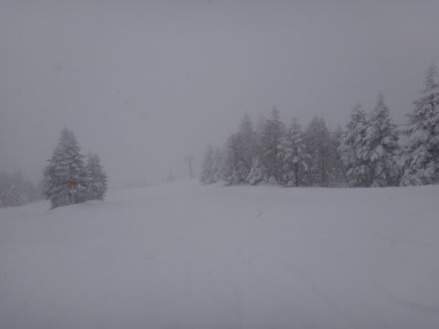

気温もマイナス17度と，かなりの冷え込み．

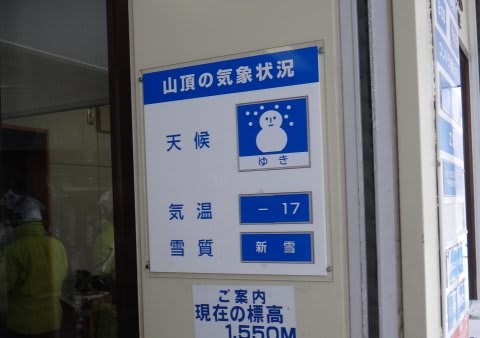

むちゃくちゃ寒いよっ！

これは．

これは，来た．

朝イチに非圧雪バーンへ出ずばなるまいっ！

と，エキスパートコースへ一目散．

うおおおおおっ！！！

フレッシュパウダーーっ！

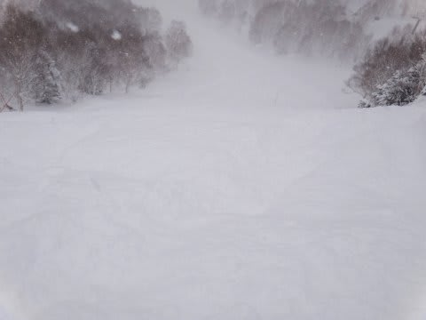

深さは膝上！

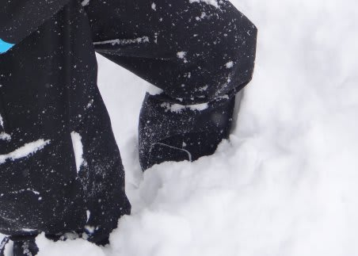

「いただきまーすっ」

って感じで．

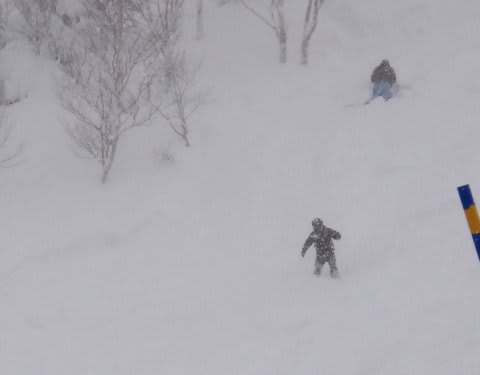

もう，ばふばふのふかふかっ！

し，幸せ…

今シーズン初めての浮遊感ある新雪じゃないかな？？

オリンピックコースも，ぱふぱふパウドゥ全開！

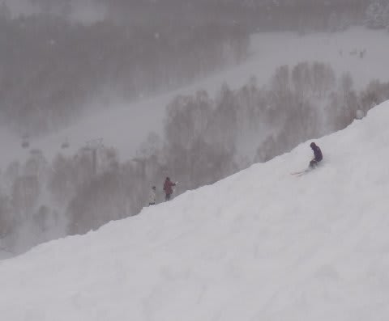

朝のうちは，かなりの雪でちょいと視界が悪めなのが残念だったけど…

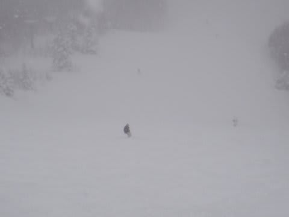

でも，ここも全面膝下パフ状態．

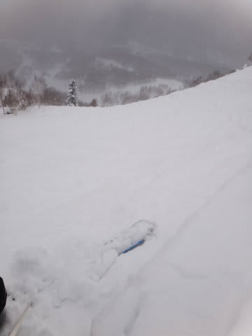

もう，朝のうちはひたすらぱふぱふ．

天気が悪いからか，今日も人が少なく，ゴンドラ待ちもほとんど無し．

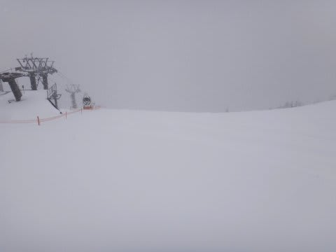

これ以上何を望むものがあるだろうか…

…幸せ．

だけど．

オープンから2時間，10時過ぎには非圧雪コースも大体荒踏みされちゃいました…

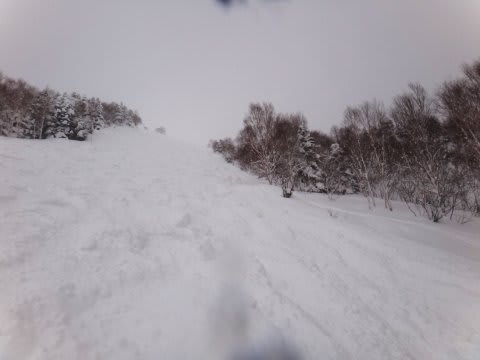

んでも．

なんのまだまだ．

いろんなところを探してみると．

コース脇では，昼前でもまだこんなパフパフが残ってます．

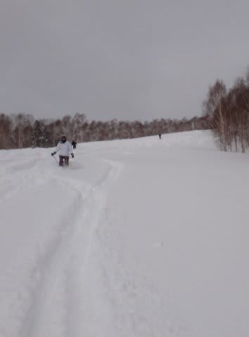

…って感じで．

午前中にいろいろパフパフを味わった後は…

なんと．

すばらしいことに．

昼ごろから，晴れてきました！

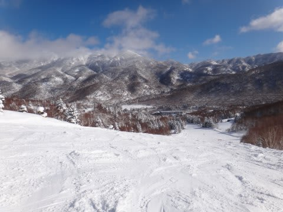

いやー．

これはやっぱり，私の日ごろの行いがいいからに違いないですね～．

＃今シーズンも何度も雨に降られたことは忘れている

そして．昼を過ぎてもまだ，パフパフゾーンは残っていて．

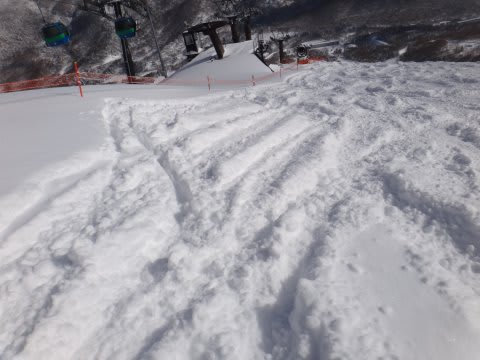

太陽の下，パフパフを味わえたのでした．

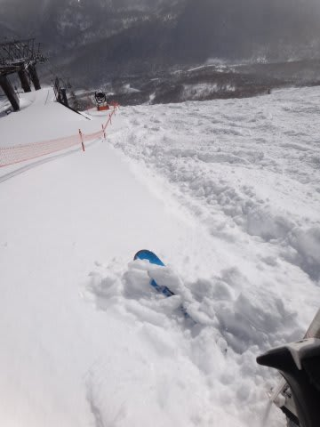

さすがに夕方になると，朝にぱふぱふだったコースはコブだらけになってきたものの…

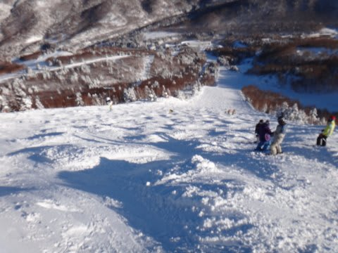

んでも，圧雪コースは夕方までやわらかいいい雪で．

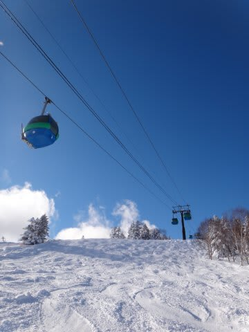

今シーズンベストといえる，たまらない一日を過ごせたのでした…

いやー．良かった．

最高の週末でした．

## 💬 コメント一覧

### 💬 コメント by (いか)
**タイトル**: もふもふ
**投稿日**: 2013-01-28 09:30:26

いやー、素晴らしい光景ですね！

ぼこぼこになっていてもやわらかそうで、楽しそうです。

私も土曜日にアサマに行ってきました。

とっても寒い上に、もふもふしていて、雪はよかったです。が、今シーズンはきれいな圧雪ピカピカバーンにほとんど当たっていないので、そろそろ晴れたときに当たりたいです…(笑)

### 💬 コメント by (Skier_S)
**タイトル**: ぱふぱふ
**投稿日**: 2013-01-28 22:58:23

アサマでももふもふでしたか！

あそこがもふもふになるのは珍しいかと…

きれいな圧雪ピカピカバーンにほとんど当っていないって…

これまでほとんどがもふもふデーだったんですか？

贅沢な悩みかもしれませんね…（笑）

