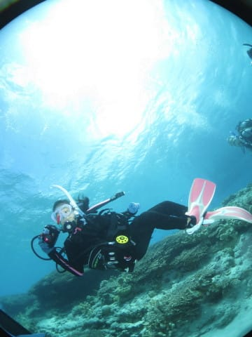
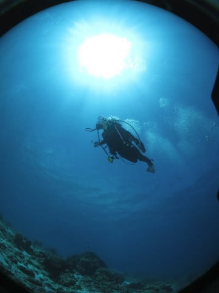

# 2018年8月，子連れ座間味で小5の娘とファンダイビング！その9…ダイビング2日目の2本目は，娘の水中カメラデビュー！

📅 投稿日時: 2019-09-13 01:48:03

ってなことで．

ダイビング器材が次々死んでいった，

Skier_Sです．

本日は，[昨日の記事](e554e7627c331e844453e0c4f22a5086f.md)の最後に

「また後日」と書いたので．

…その続きだとお思いでしょうが．

いや．そこは「後日」と書いたので

あって，「翌日」とは書いてない！！

…と．

時間が無くて昨日の記事の

続きが書けず，書きためておいた

ダイビング日記の続きを載せる

いう内情は伏せたまま．←ここに書いてる時点でばれてるから…

今日も不人気の，ダイビング旅行記

です～！

----

って感じで．

晴天の中の1本目が終わり，

ボートに上がりましたが…

ダイビングから上がってすぐ．

ボートはすぐに移動を開始して．

移動すること10分ほど．

ボートは，ビーチのきれいな

嘉比島の前までやってきました…

天気もいいし．

いや，これ最高の眺め！！

そして．

2本目のダイビングまでの，

1時間の水面休息時間の間．

子供たちは，当然のごとく

海へ飛び込む！！

いや…

気持ちよさそう…

ってな感じで．

エメラルドグリーンの海で

しばらく休むと，ダイビング2本目の時間．

タンクを交換したら．

いざ，本日のダイビング2本目へ…！

ポイント名は，嘉比島の前なので，

ズバリそのまま「嘉比前」．

今回．

娘のダイビングスキルも

まぁ安心してみていられる

レベルだったので．

このダイビングから，娘に

水中カメラをもたせてみました…

いや，両親が2人ともカメラを

もっているのがうらやましい

らしい娘．

「私もカメラもって潜りたい～」

と，常日頃から言っており．

昨年，とある人から

「新しいの買ったからあげる」

と，[譲ってもらった水中カメラ](e8daaf604d60dae869025570ff7cd0efd.md)．

これを，娘がそこそこ上手くなったら

もたせてあげよう…

と思っていたのですが．

思いのほか，潜っているのを見ていても

危なげが無かったので．

経験本数10本目になる

このダイビングから，

カメラをもたせてみました…

うむ．

なんかいろいろ必死に撮ってますが．

…後で見てみると，

娘の好きなデバスズメダイが

いっぱい撮ってありました…

（この2枚，娘撮影）

ってなことで．

このダイビングでは，

写真を撮る娘ばっかり見ていたので．

ダイビング自体の印象は，

非常に薄いのですが…

こんな感じで，

イソギンチャクカクレエビや

アカヒメジの群れや

リュウキュウイソバナの写真やらが

残ってました…

…しかし．

正直．

初心者ダイバーが，カメラに気を

取られるあまり，深度コントロールに

失敗して急浮上する…というのは

よくあるパターンなので．

このダイビングでは．

「カメラに夢中になった娘が，

　急浮上したりしないか…」

と，気が気ではなく．

あまり落ち着いて潜って

いられず．

何を見たか，あんまり

覚えてません…

ってなことで．

無事，初めてカメラをもった娘が．

急浮上したり，

不注意で何かしでかすこともなく．

このダイビングを終えたのでした…

…無事終わって，良かった…
