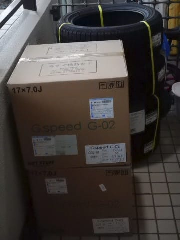
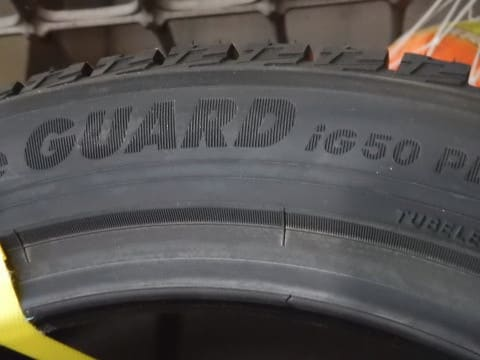
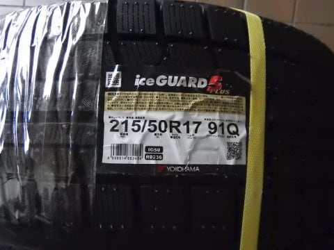
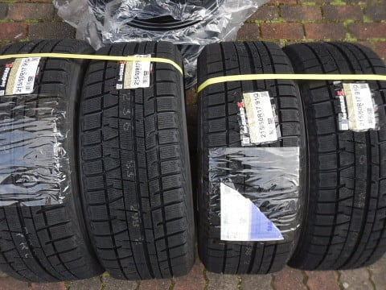
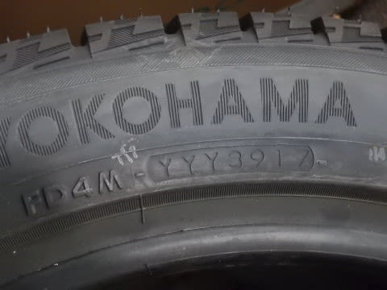
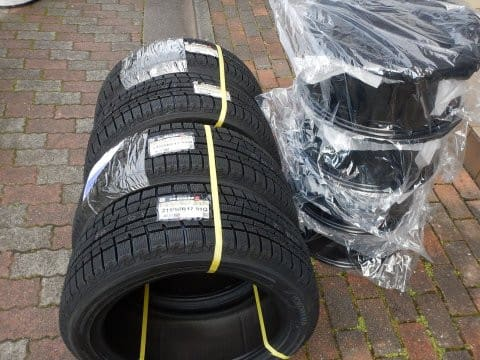
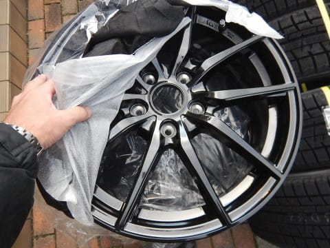

# LEVORG用のスタッドレスタイヤが届いたよ！…今回もYOKOHAMA IG5 plus

📅 投稿日時: 2018-11-25 00:13:00

🏷️ カテゴリ: [車](cba0e8330b3f2ded7c1addfacc75d4547.md)

ってなわけで．

我が家に，定番の志賀高原シーズン券も届いている

ことだし．

明日は，今シーズン初の志賀高原へ行ってきます～！

…そうそう．

志賀高原に行くためには，

タイヤを替えなくてはなりませんね…

そして．今年は車を買い替えたので．

当然，スタッドレスも新品を買わなくてはならない

わけですね（涙）

それも，スタッドレスを履かせるホイールも

無いので．

ホイールごと買わなくてはならないわけですね．

出費が…出費が続く…

ということで．

スバルディーラーや，カー用品店に行ってみたところ．

LEVORGに履ける17～18インチのスタッドレスと

ホイールのセットを見積もってもらったところ．

なんと．

20万円コース（激涙）

に，にじゅうまんえん…(涙）

16インチだったBRレガシィの，倍のお値段

なんですけど…（激涙）

引っ越してここしばらく．

いろんな出費が続いているので．

こんな大金払ってられるか…っ！！

ってことで．

いつも通り，通販でタイヤとホイールを

買いました～！

…それも．

iG6が出て，すでに型落ちになっている，

YOKOHAMAのiG5 plusです．

（商品名はiG5plusなのに…なぜか

　タイヤ刻印はiG50 PLUSになっている）

それも，18インチではなく．

17インチにインチダウンです…

いや…

型落ちとはいえ，まだ3年前．

ブリザックのVRXよりは新しいモデルだし．

さらに，前のレガシィでiG5 plusを履いており．

高速性能やウェット性能，ライフ，燃費が結構良くて．

志賀高原の雪道の効きも不満がないレベルだったし．

こいつでいいか…

と，ポチってしまいました…

また，LEVORG2.0GT-Sは，夏タイヤは225/45R18ですが．

マニュアルにはスタッドレスは17インチの215/50R17が

推奨と書いてあるので．

高い18インチではなく，17インチとしました…

ホントは最新のiG6を買ってみたかったのですが．

タイヤ4本での差額が2万円近くになってしまうので．

まぁ，実績があるこいつでいいよね，と．

で．

製造は…2017年の39週なので，

去年の10月ごろですね．

1年以上前の製造ですか…

でも．

スタッドレスタイヤが2シーズンしかもたない

我が家では，これでも製造4年以内に使いきっちゃう

わけだから，これで十分．

そして．

当然，17インチのホイールも同時購入です．

こいつ．

なんと，1枚税込み6800円という激安ホイール．

定価2万円以上らしいけど…

まぁ，カー用品店で結構安く売っている

ブランドのやつです．

でも，こいつ．

純正ホイールより結構軽いよ！

（強度的に心配だけど…）

とりあえず．

これで，20万コースの半額でタイヤとホイールは

ゲットできたな．

…でも．

カー用品店やディーラーだと，持ち込みの

タイヤ取り付けはすごくいい値段が

取られるので．

さて，どこで取り付けましょうかね…

（続く）

## 💬 コメント一覧

### 💬 コメント by (yumi)
**タイトル**: 🎉🎉🎉⛷️💨💨💨
**投稿日**: 2018-11-25 05:58:40

🎵～🎵

### 💬 コメント by (サトシ父)
**タイトル**: 届きました
**投稿日**: 2018-11-25 07:25:01

我が家もシーズン券届きました。

来月15日初滑りの予定です、今シーズンこそSさんにご挨拶したいなぁ…

プロジェクトXは昨日家族にナイショで発注しちゃいましたwww

### 💬 コメント by (おおすぎ)
**タイトル**: Unknown
**投稿日**: 2018-11-25 13:40:39

実はうちも・・・

シーズン券ではなく、スタッドレスタイヤの方ですが、届きました！！

純正は１７インチなのですが、こちらは奮発して、そのまま１７インチにしました？！

本当は１６インチ推奨なんですけどね！！

S様のご愛用ということで、わたしもあえてig50プラスです♪

S様よりちょっとサイズが小さい、205/55R17 なのですが、なんとなんと車種が少ないということで、めっちゃ割高！！

不人気車種の宿命です・・・

今シーズンはぜひとも、志賀で娘（小４）共々お会いしたいです。

### 💬 コメント by (Skier_S)
**タイトル**: 志賀から帰ってきました
**投稿日**: 2018-11-26 02:50:30

＞yumiさま

今日はリフトですれ違っただけでしたね…

お話しできず残念でした．

でも，いつものメンバー勢揃いの感じの

熊の湯でしたね(笑)

また来週，焼額でお会いしましょう！

＞サトシ父さま

え！！？？

プロジェクトX，家族に内緒で発注ですか！

それはすごい…

家族のみなさん，びっくりしますね．

今シーズン焼額にお越しの際は，ぜひお会いしましょう～！

＞おおすぎさま

スタッドレス購入ですか！

でも，かなり痛い出費ですよね…

iG5plusを履かせたLEVORGで志賀に行ってきましたが，

このタイヤで十分だと思いました(笑)．

お子さんうちの娘と1年違いですね…

うちの娘も他の子供がいると喜びます！

とはいえ，娘はさすが毎週志賀に来ていませんので，

タイミングを合わせる必要がありますね…

でも，最近は焼額朝礼メンバーに子連れの方が

多くなってきた気がするので，うちの娘がいなくても

楽しめるかもしれません(笑)

