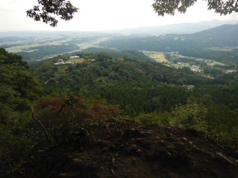
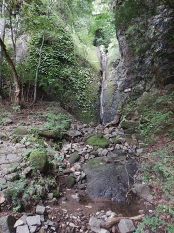
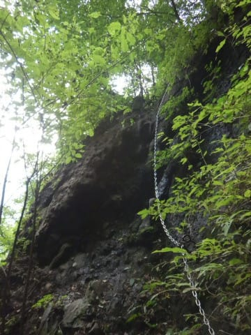

# 上信越道から見える，あの妙義山へ登ってみた，その2

📅 投稿日時: 2020-10-03 01:59:01

10月に入ったのに．

Yetiも狭山も，まだ全然オープン日の

アナウンスが出ませんね…

一体，私はいつシーズンインできるのだろうか…

ってことで．

一体いつまで連載が続くんだ？

と，書いていた本人ですら思ってしまった

焼額山スキー場の歴史の連載も無事

終わったので．

(1-2回で終わらせるつもりだったのに，

思いのほか盛り上がり，調子に乗っていたら

全6回，3万字(原稿用紙70枚分！）にも及ぶ超大作に…

書くの大変だった…）

今回は，妙義山の登山レポートです～！

（[前回はこちら](e5b424c1873fe3e5bc2b9ba837eedda5b.md)）

ーーー

ってな感じで，そばまで近づいてみると．

「あそこにホントに登れんの？」

と思ってしまう絶壁が目に飛び込む，

妙義山．

登山者用駐車場に車を止めて…

いざ，登山コースへ！

…って．

登山コースの入り口，

妙義神社

という神社なのね…

ってなことで．

神社の中，石段を結構登って…

神社の奥から登山道が

続いています．

この，妙義山．

基本的に登山道がしっかり整備されていて．

一番メジャーなのは，妙義山の中でも，

この，白雲山ルート．

赤矢印で示した妙義神社をスタートに，

妙義神社→大の字→奥の院→見晴らし

→大のぞき→天狗岳→相馬山→タルワキ沢

と，左回りに回ります．

このルートでは，登りルートの

奥の院から先，見晴らしまでは

ひたすら鎖場の登りで，

下りのタルワキは急ながらも

鎖場がほとんどないルートになります．

だもんで．

山を見てビビっていた私は．

「前半鎖場でいきなりくじけるより，

　緩やかなタルワキでとりあえず山頂まで

　行って，下りの鎖場が怖かったら

　またタルワキで戻ってくればいいよね…」

と．

普通と逆の右回り，タルワキ登りで

チャレンジしてみたのでした…

ということで．

まずは神社の奥から，

関東ふれあいの道とやらの散策道を，

タルワキ沢の入り口まで歩きます

この道，こんな感じのフラットな

歩きやすい道で．

最初は鼻歌ルンルンのお気楽

散歩気分で歩けます…

まずやってくるのは，第1見晴らし．

ふむ．この先ですか…

…すでに，いきなり向こうは

切り立った崖ですね（戦慄）

まだ，スタートから20分ですが．

結構景色はいいかな…

第1見晴らしから，関東ふれあいの道を

さらに10分ほど歩くと．

今度は滝が出てきます…

うむ．

関東ふれあいの道．

登山ではなく，ゆっくりお散歩には

いい感じかな．

そして，またさらに10分ほど歩くと．

次は第2見晴らしなんですが…

ここは2~3mの岩を登るのに，

補助の鎖を使ってよじ登らないと

いけないところ．

鎖を登って出た先は…

をを！

いい景色！

これから登ろうとしている

白雲山の隣，金洞山が切り立ってますね…

そしてあちらは，金鶏山．

…ただ．

景色はいいけど．

この場所で，すでに足元から下を見ると．

…かなり切り立ってます…

ここで早くも，落ちたら死ねる崖ですね…

まだ，スタートから1時間以下．

登り坂の入り口，タルワキ分岐までも

やってきてないけど．

「もう，いい景色も見たし帰ってもいいかな」

という気分になったところ．

ここから先は，なぜかきれいに整備された

階段をしばらく歩くと…

やってきました，タルワキ分岐．

ここから先がお散歩道と分かれ，

登山ルートとなります．

あまり踏み跡がしっかりしない，まばらな

雑木林の急坂を登っていきますが．

紛らわしい分岐が何ヶ所かあり．

ところどころ，

「どっちがルート？」

と分かりにくいところもあるので．

しっかり目印リボンや…

石に書かれた印をたどっていきましょう…

ふみ跡がある分かりやすい道ではないので，

結構不安になりますが．

足場が崩れて，落石が落ちていくような

急登を続けること，35分ほど．

ところどころこういう岩をよじ登ったり

しながら進んでいると…

出ました．

鎖場！

妙義山では避けられない，鎖場の

洗礼ですが．

タルワキでは，山頂までの鎖場は

この1か所．

最初の斜度は切り立ってますが，

高さは5-6mかな？

足場のホールドもいっぱいあるし．

それほど怖くないです．

妙義山をぐるっと回っておもいましたが．

この鎖場は初級練習コースなので．

普通の左回り，大の字→見晴らしじゃなく，

最初にこっちから行く右回りルートも悪く

ないかも．

鎖場を超えると，今度はガレ場の急登が

続いて…

鎖場から先，かなりの角度の坂を

10分ほど，滑り落ちないように

登っていくと…

なんだか，すごい切り立った崖の横に

出ました…！！

…え？

山頂に行くってことは…

この崖の上に行くってことだよね？？

どうやって登るの？

と思ったら．

この崖の脇に，こんな感じの急な土の坂道があり．

ここをひいこら登ること，5分ほど…

タルワキのコルに到着！

いや…振り返ると，向こう側に切り立った

壁が見えますが．

これからさらに，あそこのてっぺんまで登るのか…

（[続く](e367b9762221c0ce5ede0fdc3eaabd820.md)）

## 💬 コメント一覧

### 💬 コメント by (Noname)
**タイトル**: Unknown
**投稿日**: 2020-10-04 10:52:40

この山の案内図を見たら

「上級登山道では、滑落死亡事故が発生しています。一般登山者は､上級登山道へ入らないでください。」

と言う記載が！！！！！！！！！

そして、Sさんが昇っているルートは紛れもなく上級ルート((((；ﾟДﾟ))))

そう言えば､クレヨンしんちゃんが亡くなったのもこの山でしたっけ？？

### 💬 コメント by (アリス)
**タイトル**: 登山記事感謝です
**投稿日**: 2020-10-04 17:39:50

Skier_S様

登山記事ありがとうございます。

一度は挑戦しようと思っていましたが、標高が低い割には難易度が高いのに驚きです。

やはり、神々が宿っている神聖な山ですので簡単には制覇させてくれないみたいですね。

それにしても、Sさんの判断力素晴らしいです。

右回りへの切り替えはどうなるかドキドキしながら読んでいました。

制覇途中ですが、続きを楽しみにしております。

話は変わりますが

2枚目の画像で、Ｓさんの愛車らしき画像ですが、この時期に車にルーフボックスを付けたんですか？

それと、Gokuさんのヤケビオールスターズの動画で、黒のジャケット、ピンクのスキーパンツ姿で滑走していて、何かと「天才キッズのなおちゃん」のお世話をしているお子さんは、Sさんのお嬢さんでしょうか？

### 💬 コメント by (Skier_S)
**タイトル**: この週末も山に登ってきました
**投稿日**: 2020-10-05 00:43:04

＞Nonameさま

妙義山系はヤバい山です…

年に何度かは滑落事故が起こると言ってました．

日帰り登山としてはレベルが高い山だったと思います…

クレヨンしんちゃんの作者が無くなられたのも妙義荒船佐久高原国定公園内で，

妙義山から10kmほど離れているようですが，山容は似た感じに見えますね…

ちなみに，切り立った崖と逆側は緩いスロープで，登山は難しくないようです．

崖側はロープも手すりもないので，近寄ると危ないようですが…

＞アリスさま

妙義山，標高が低いですが，手ごわいです．

ザイルや本格装備が必要とされない山としては，結構な上級です．

この山を登れれば，一般登山ルートで大体ほとんどのところに

行けるんじゃないか…

と思っちゃいます．

逆に，チャレンジ精神旺盛な方はぜひ行くべき山かと思いました(笑)．

車のルーフボックスは，今の家に引っ越してから，置き場所が

無くなったので，年中つけてます～！

そして，うちの娘のスキーウェアは…予想通り，黒色です(笑)．

