# 2023/4/23(日)の志賀高原焼額山スキー場は…朝はマイナス7℃で冷え冷え！晴れだけど気温は低め，でも午後は緩んで荒れ荒れバーン

📅 投稿日時: 2023-04-24 01:35:46

ということで．

今日もしっかり早朝からラストまで滑り，

12時前に帰宅しました～！

…朝5時起きで早朝から滑ってたので，眠い…

だもんで．

速報モードにて，今日の志賀高原レポート！

まず．

焼額の6時からの早朝営業に間に合うように

5時半ごろに宿から出かけようと思うと…

朝は車がガチガチに凍り付いていて，

昨晩からかなりの冷え込んだようです！

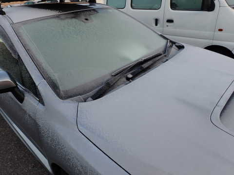

焼額の早朝開始時の気温は-7℃！！

バーンは硬そう…

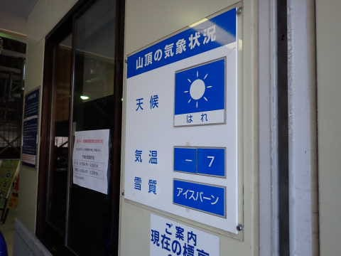

天気も良く，冷えてバーンコンディションが

良さそうってのもあり，早朝はそこそこ人が

並んでましたね…

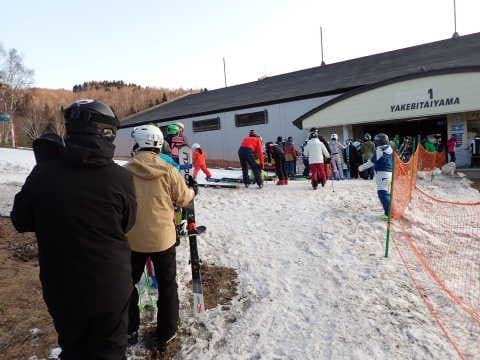

で．

早朝一番のゲレンデは…

うはーーー！！

シマシマっ！！！！

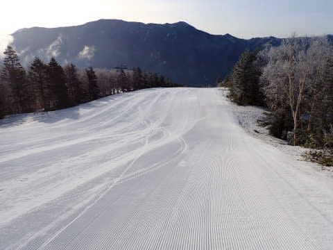

かなりバーンは硬めだけど，完全アイスバーン

というより，表面がザラッとしてエッジが

嚙みこむ余地がある，硬めが好きな人には

大変楽しいバーンコンディション！！

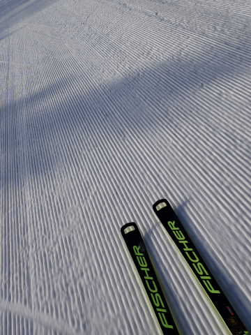

いや…

天気も良くてバーンも締まってて．

これは早朝に来たかいがあった…！！

楽しいよ！！！

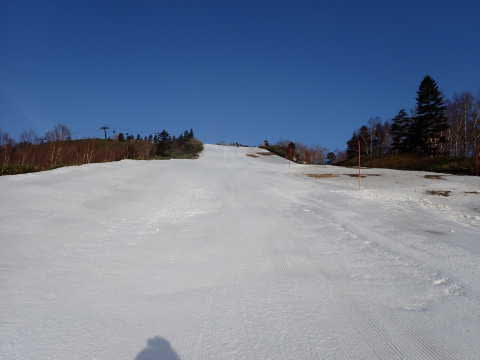

でも…GSコースはバーンが狭くなったなぁ…（涙）

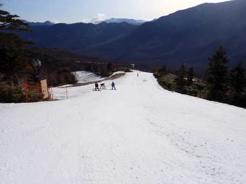

あさイチは一見真っ白ですが，このあたりは

もう雪が薄く，午後はかなり土が出てくるので…

残念ながら，GSコースも今日で営業終了の

ようです（泣）

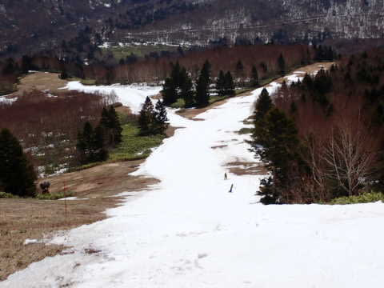

パノラマコースも，一番楽しい急斜面が…

え？？

なんだかかなり土が出てるんですが？？

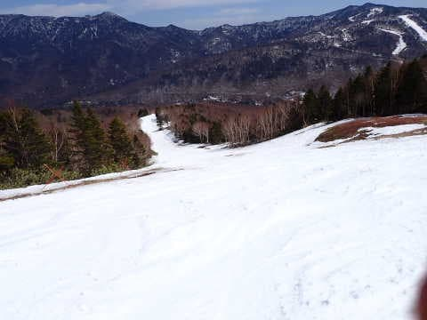

これはヤバい感じ…

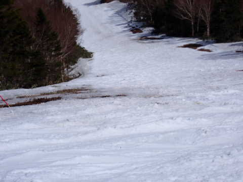

実際近づくと，かなりのブッシュエリアに

なってました…（泣）

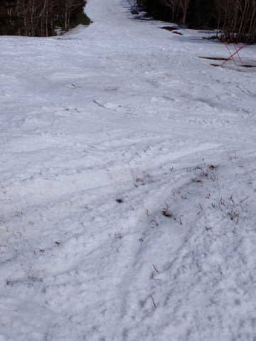

ただ，昨日土が出てた[急斜面直前の部分](http://)や，

4ロマ降り場から下の部分は，今日はきれいに

穴が埋められてたので…

パノラマコースもこれからどこかから雪を運んで，

穴が埋められるんじゃないかな～…

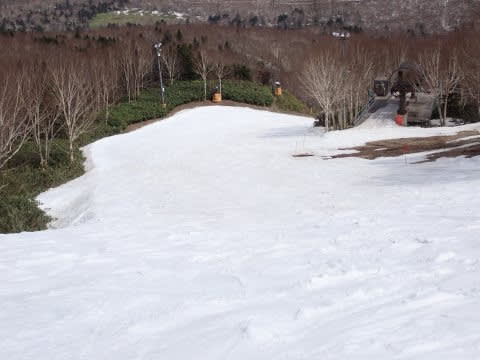

（昨日の[この同じ場所の写真](https://blogimg.goo.ne.jp/user_image/46/c3/bb87e00e48f63a2537c5e09901b3d4dd.jpg)では，コースの

　真ん中に穴が開いてるのが分かるはず…）

そして．

昨日一生懸命雪出しをしていた一番下の部分は，

廊下状ながらもしっかり雪がついてました～！

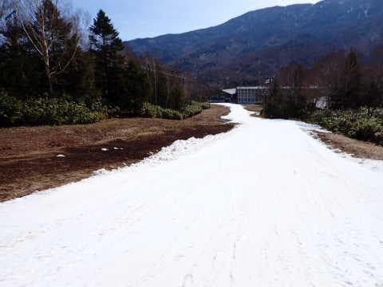

ってなことで．

今日は最高気温は3度ほどまでにしか

上がらず，この時期としてはかなり気温が

低めの一日でしたが．

さすがに午後は春の日差しで雪が緩んで，

バーンは荒れ荒れになってしまったものの…

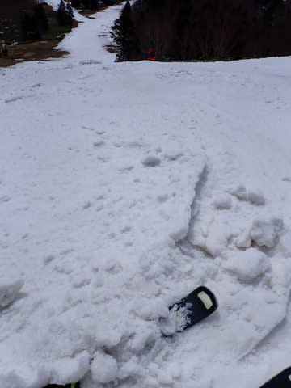

気温が低かったので，最後まで板の

滑りが悪くなることは無く．

結構楽しく一日滑ることができました…！！

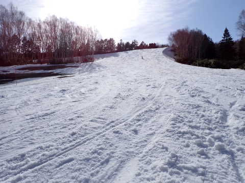

…で．

焼額は，明日からはパノラマコース

1本のみの営業となりますが．

明日以降，平日も毎日6時から

早朝営業をやるようですね…

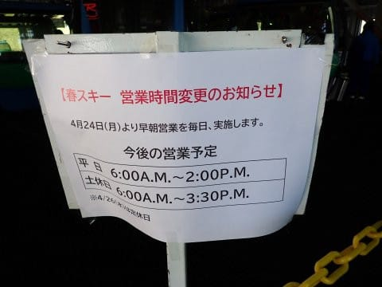

しかし．

果たして，いつまで営業できるのか？？

26日にかなりの雨が降りそうなので．

これを乗り越えらるかどうかが，

30日まで営業できるかどうかの

分かれ目になりそう…

でも，30日以降は厳しいかな…

うーん．

でも．

4月上旬の状況を考えると，

よくまぁ今週まで雪がもったもんだ

という感想なので．

今週土日に冷えてくれて，結構楽しく滑れた

ことに，むしろ感謝せねばなるまい…

## 💬 コメント一覧

### 💬 コメント by (Ski45)
**タイトル**: Unknown
**投稿日**: 2023-04-24 17:32:50

S様

はじめまして。

毎日、S様のブログを読ませていただいており、いつかお見かけしないかなと思ながら、

今年はじめての『焼額山』に早朝途中から参戦したところ、

明らかにハイペースで滑っているグループ発見！

私単独で追尾しましたが、スーパーキッズ？の滑りがうまいことうまいこと。

ゴンドラ乗り場でも遭遇し、声はかけられませんでしたが、

S様はサイボーグではなく、人間だったことが分かりました(笑)

当方、妻と7歳・6歳の子供と滑っていましたが、あと数年もすれば、ご一緒できるかなぁと思い描いております。

当方、『焼額山』までは、1:30程度で到着するのですが、浮気性なので今週末は『ロッテ』or『かぐら』かな。

また、楽しいブログをお願いします♪

### 💬 コメント by (Skier_S)
**タイトル**: ＞Ski45さま
**投稿日**: 2023-04-25 04:15:13

コメントありがとうございます～！

…見られてたんですね．

そうです．実は私も人間なんですよ…

とりあえず，一緒に滑っていたスーパーキッズはすごいでしょ（笑）．

今は3歳と6歳のスーパーキッズもいますから，7歳・6歳なら今すぐでも

ご一緒できるかも！？？

焼額まで1時間半でやってこれるのでしたら，また来シーズンも

焼額にお越しください～！！

その時は声をかけてもらえれば…

### 💬 コメント by (炎の北海道民)
**タイトル**: 焼額山
**投稿日**: 2023-04-25 12:41:05

道外のスキー場を滑ったことがないので、焼額山とその周辺の位置関係がいまいちわかりませんが、スキー場の心意気はブログから伝わりました。

早朝営業といい、雪出しといい、以下に条件良く滑ってもらうかというスキー場の努力が凄いですね。

私のホームゲレンデのキロロは、ナイター営業は短くんり、メインゲレンデのオープンが1月中旬！という遅さ、そして雪不足を理由に4月30日でクローズという感じです。その辺、外資系は見切りが早いんでしょうね。

### 💬 コメント by (Skier_S)
**タイトル**: ＞炎の北海道民さま
**投稿日**: 2023-04-27 06:10:50

コメント回答遅れました…すみません．

焼額山のコース維持の労力のかけ方はすごいです！

そして柔軟に平日も朝6時から営業に切り替えたり，なかなかの営業努力だと

思っています…

圧雪のクオリティもすごい高いですし，焼額は良いですよ！

