# 蛭ヶ岳まで全力で往復してみた，その3…下山！蛭ヶ岳山頂から青根ゲート前まで無休憩で1時間40分

📅 投稿日時: 2022-09-16 01:46:37

もう，平日に仕事を終わらせることを諦めて，

3連休に仕事をやっつけることに決めたので．

今日は

日付が変わる前

という，人間的な時間に仕事を終わらせた

Skier_Sです．←深夜12時近くに仕事が終わることを人間的というのか…？

だもんで．

今日は何とか記事を書く時間が取れた…←いや，記事なんて書いてないで早く寝ようよ

ってなことで．

今日は蛭ヶ岳登山レポート，ラストです！

ーー

ということで．

青根の林道ゲート前の駐車場から

歩くこと約2時間45分．

7時半ちょい前に，蛭ヶ岳の山頂に

到着したわけですが…

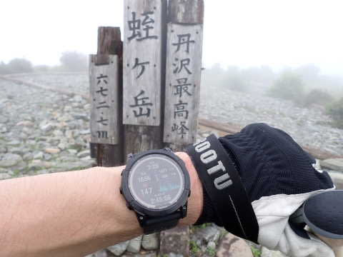

もう，見事にガスで何も見えませんね（泣）

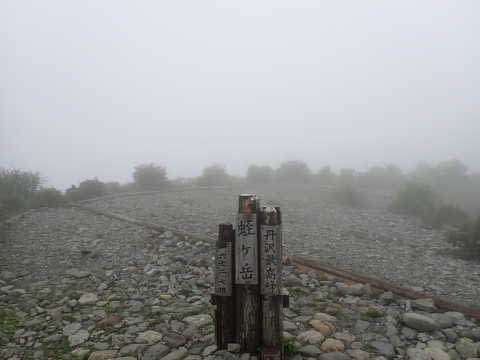

基本的に晴れの日にしか山に行かない

私にとって，最大の楽しみと言える展望が

ないのは残念…（涙）

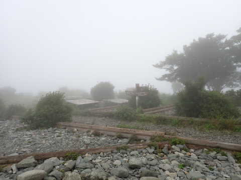

とりあえず，山頂なので，

このベンチでちょっと休憩

しましょうか…

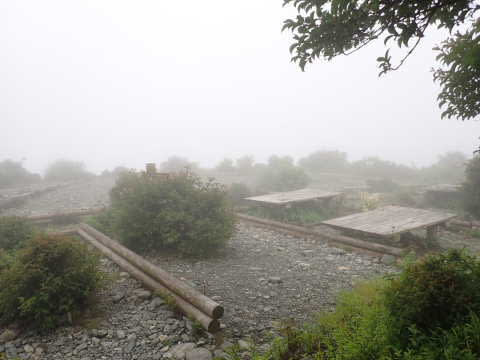

昼までに帰宅しなくてはならないという

縛りがある本日．

なるべく早く往復するためには，

ペースはゆっくりでも止まらず休まず

というのが一番早いわけで．

登っている途中では，1回しか休憩してません…

今日はこれが2度目の休憩．

ここで，アミノバイタルを投入！

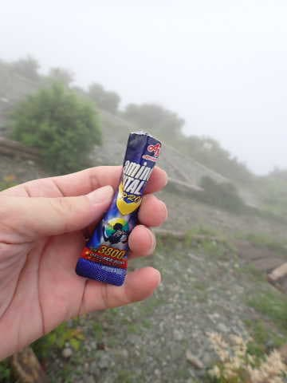

参考までに，登りスタートでVAAMを500ml

持ってスタートし，さらに登りの途中の休憩で

500mlの水にさらにVAAMを溶かしていて．

山頂でほぼ飲みきってます…

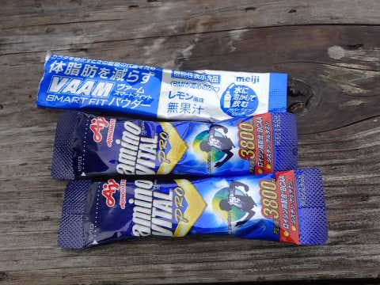

さて．

これで下りのパワー補給が終了したので．

山頂休憩20分で，7:48に下山スタート！

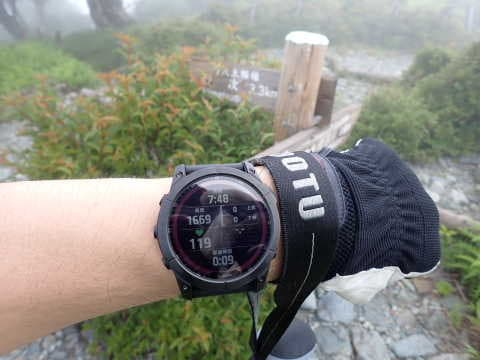

下りは，また急な階段＆坂道で

スタートです…

休憩で心拍数が落ちているので，

トレーニング目的の今回．

心拍が上がるまではハイペースで

下りを飛ばす！

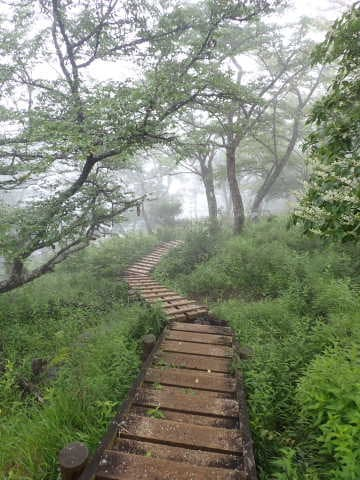

でも，階段は自分の歩幅で降りられ

ないから好きじゃないんだよな…

と，思いつつも．

スタートから5分も下ると一旦階段は終わり．

そして，ガスも晴れてきました…！！

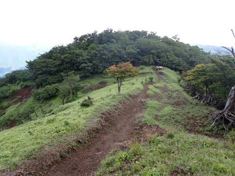

うーん．

ガスってたのは，本当に山頂付近の

わずかな所だけだったんだな…

惜しい．

さらに5分も進まないうちに，

こんな見晴らしがよくなってきました…

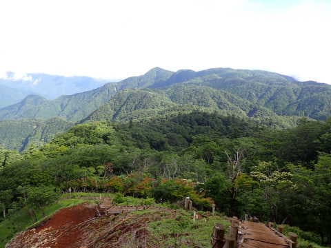

…山頂だけガスってたってのは，

なんかの嫌がらせだったのかな（涙）

なぜ，山頂からこんな景色が見れなかったのか…

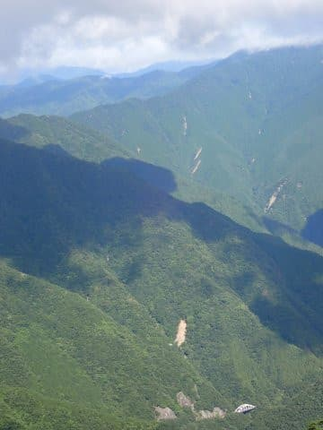

とりあえず，今回はピストン行程なので，

行きと同じルートを通りますが．

階段が続く最初の急斜面が

終わると…

あとは登りの時と同様，ゆったりした

登り下りが続く，比較的フラットな

コースになります！

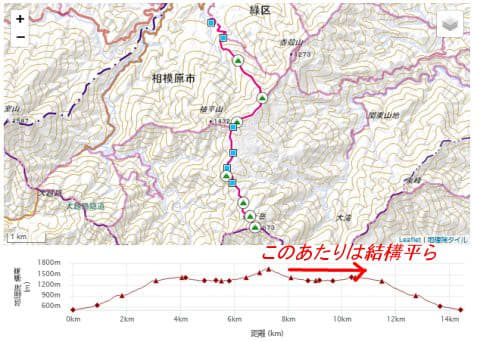

下り気味でフラットなので，10分/km

程度のペースでも全く心拍数が

上がらず，快調に飛ばせますね…！

山頂から3.2kmの姫次は，

下山開始から50分ほどの8:30ごろ

通過！

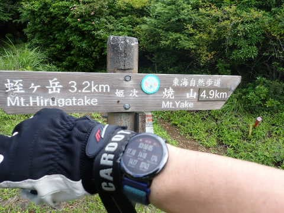

まだ1時間も移動してないので，

休まずにハイペースで飛ばす！

このコース，この日は人もいなかったので，

気持ちよく自分の好きなペースで

歩けます！

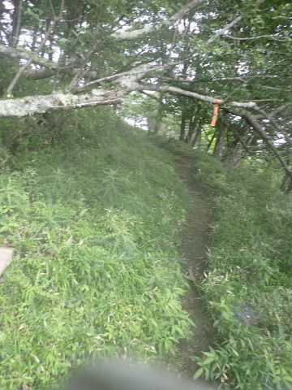

そして．

フラットゾーンの終わり．

ここから急な下りが始まる，

八丁坂の頭分岐には下山スタートから

58分，8:46に通過！

ここでも水分補給に立ち止まっただけで，

休まずに降りる！

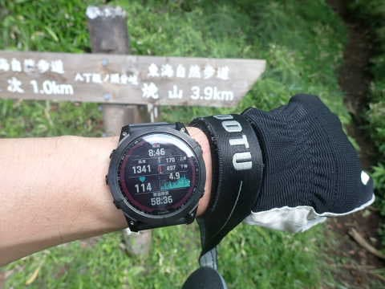

VAAM効果なのか，アミノバイタル効果

なのか…

あるいは，今日は曇り気味で気温がそれほど

高くなかったのが効いているのか．

休みたいと思うことなく，今日は

一気に下山できます…！

…ちょいと一部，狭い道が脇からの

草で覆われかけてるところもあったけど…

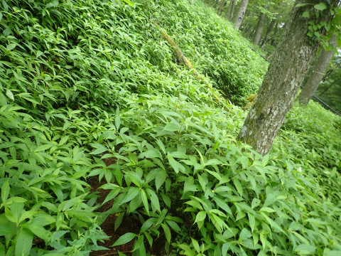

八丁坂の頭の分岐からの最後の3キロ

ちょいは，標高差800mほど下る，

比較的斜度があるところになるけど，

幅が広くて歩きやすい

ルートで…

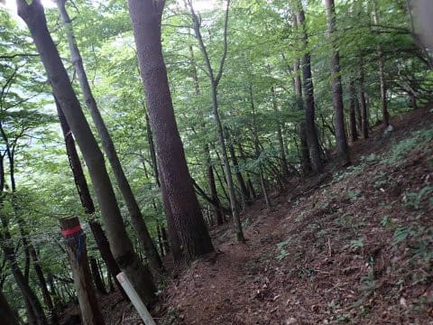

最後の方は，林業用モノレールの

レールに沿って降りていくと…

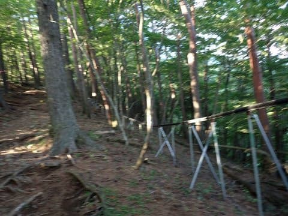

八丁坂分岐から40分，9:25には

林道との合流地点に到着！

山頂からまだ1時間40分のハイペース！

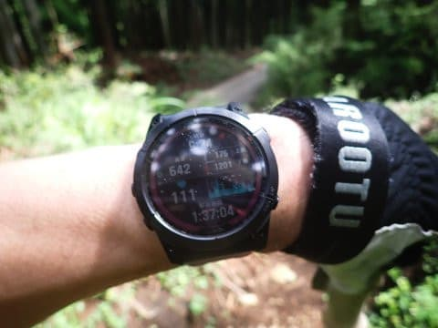

そして最後の林道を駆け下ります…

ここはリアルに走る！

最後になっても走れるほどの体力が

残っているのは，VAAM効果か？？

あと，HOKA ONE ONEのシューズも

すごく走りやすい…

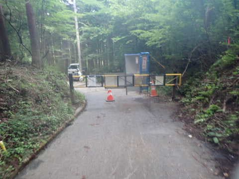

無事，9:30過ぎには駐車場に到着～！！

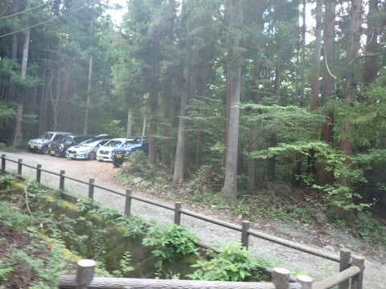

いや…

今回は飛ばした．

山頂から1時間40分，下りは休憩なしで

降りきった…

かなり飛ばした．

ヤマレコの標準コースタイムが8時間34分の

丹沢山に行った時は9時20分に下山だったけど．

今回はそれよりコースタイムが1時間20分

長いのに，9時半に下山できたよ…

でも…

残念ながら，ヤマレコの記録では，

歩くペースは0.5～0.6か…

今回はヤマレコ記録の山行時間が4時間17分

だったので，0.5は切ると思ったんだけどな…

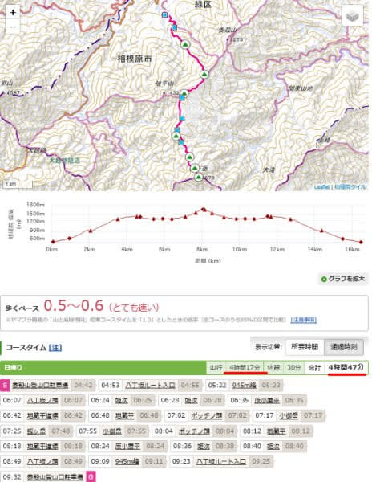

まぁしかし．

ヤマレコの標準コースタイム9時間50分の山を，

昼までに帰宅できる時間にちゃんと下山

できたので，ノープロブレム！！

と．

結局この日も昼に家に帰ってから．

午後は泣きながら仕事をやっつけていた，

Skier_Sだったのでした…（激涙）

（普通はコースタイム10時間近い山に登って，その後夜中まで仕事はしないと思うぞ…）
