# 5年前のeMachinesのPC，E732-F32CをいまさらSSD化してみた　その4

📅 投稿日時: 2016-11-13 00:02:01

🏷️ カテゴリ: [PC,カメラ&小物](c0d8caed13e597efe97b661a8ae56bed0.md)

えー．

風邪で病院に行ったため．

本日土曜は，Yetiに滑りに行けませんでした…（涙）．

でも．

日曜はちゃんと滑りに行くのだ！←風邪が治っていないのでは？

ということで．

本日はスキー場レポートではなく．

連載中の，ノートPCのSSD換装レポートです…

…しかし．

予想外に，長い連載となってしまったこのシリーズ．←このBlog，そういうの多くないか？

今回がようやっと最終回です…

---

ってことで．

無事，ハードディスクの中身が完全クローンされた

SSDが完成したわけですが．

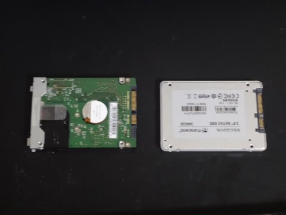

これで，すぐこのSSDをノートPCに組み込める！

…というのは気が早く．

実は，これまでのハードディスクは，厚さが9.5mm．

SSDはそれより薄く，7mmと．

厚さが違います…

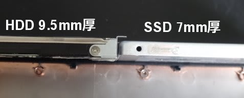

この厚さの違いを調整するためのスペーサが

売っていたりしますが．

今回のこのPC，ハードディスクにこんな感じで，

「足」がついてました．

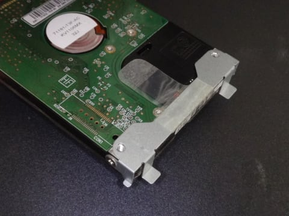

だもんで，この足を外して…

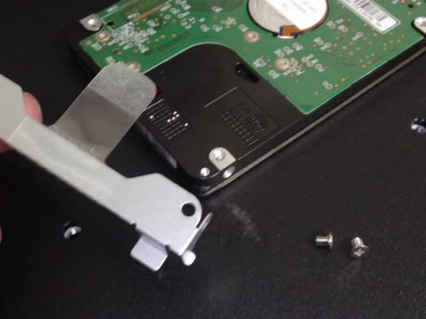

SSDにこんな感じでつけてあげると…

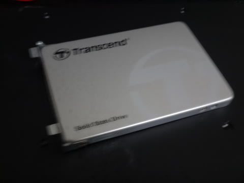

なんと．

丁度いい高さになるようにできてるじゃありませんか！

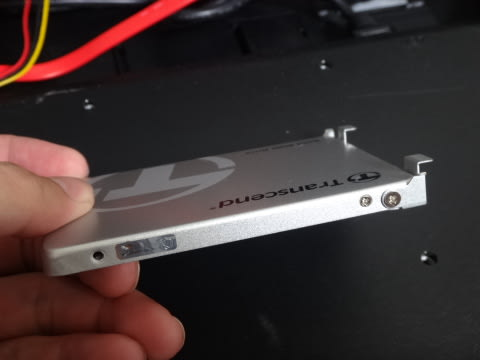

厚さ調整スペーサが要らないとは，都合がいい…

って感じで，足を付けたSSDを，もともとのHDDが入っていた

スペースにとりつけます．

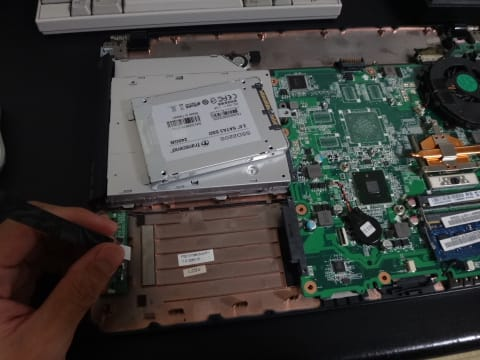

外したのと逆の手順で…

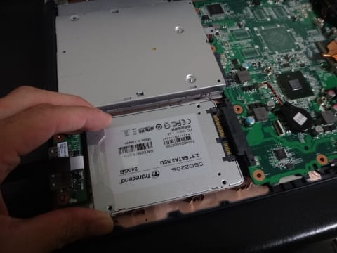

右側に押し込んでやると，ザクッと

コネクタが刺さります．

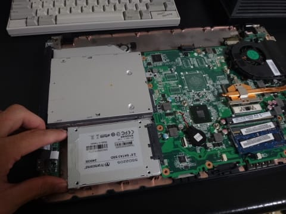

後はFPCを元通りに取り付けて…

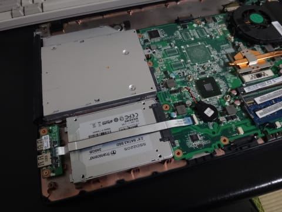

裏蓋を被せると．

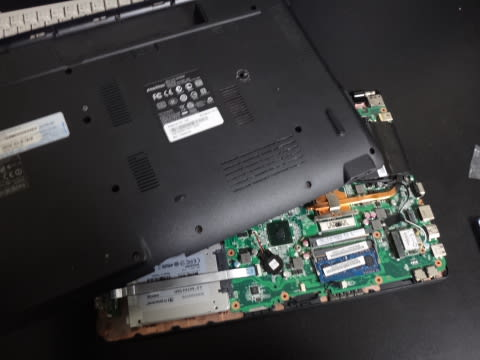

はい，完成！

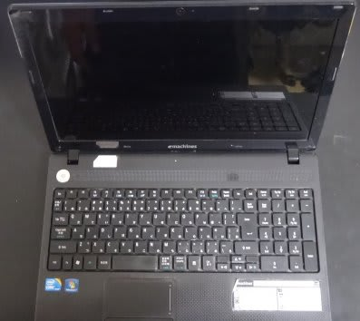

PCの電源を投入すると．

最初の1回はスキャンディスクが走りましたが…

無事起動！

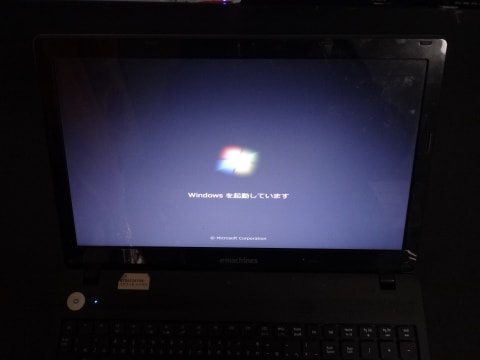

ソフトをインストールし直すなど一切なく，

完全元通りの環境で立ち上がりました！

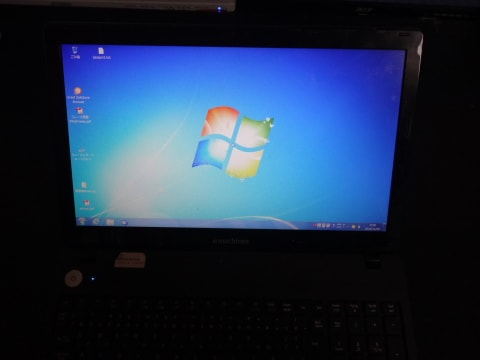

…そして．

起動時間は．

これまで5分以上，ブラウザがまともに使えるまで，

6分くらいかかっていたものが…

起動時間，わずか19秒に短縮！

起動直後に，ブラウザを立ち上げても．

1秒ほどでサックリ起動！

いろんなアプリの立ち上げも爆速に！

ををををを！！

激速化！！

まさか，5年前のPC．

SSD化でここまで速くなるとは…

これは，新しいPC買うより，よっぽどいいや．

…ということで．

5年モノの古いPC.

遅くなったなぁ…と，ハードディスクを積んだ新しい

PCに買い替えるより，

古いPCのハードディスクを，6000円のSSDに換装した方が，

よっぽど快適になりますよ～！！

## 💬 コメント一覧

### 💬 コメント by (takac)
**タイトル**: 助かります！
**投稿日**: 2016-11-13 12:49:24

こんにちは

手元の古いHPノートPCをどうしようか考えていたところでしたので大変参考になりました。

Sさんのブログにはいつも助けられます。

今シーズン、ヤケビでお会いできることを楽しみにしています。

### 💬 コメント by (Skier_S)
**タイトル**: takacさま
**投稿日**: 2016-11-14 01:07:09

お役に立ったのなら何よりです…

古いノートPCが遅くて困ってるなら，

SSD化で最新鋭マシンに負けないように

なるかもしれませんよ～！

もし，新しいPCを買うとしても，

SSD換装できるPCにして，SSD化

することをおススメします…

