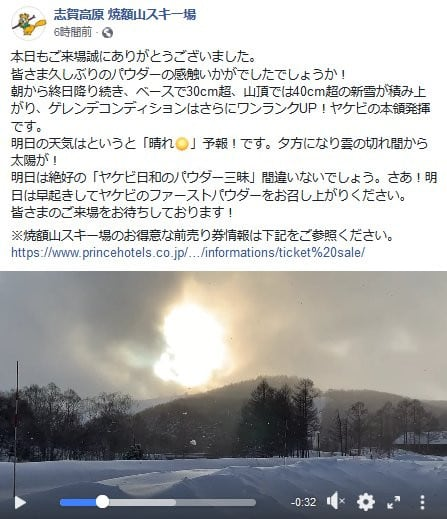

# これから1月25，26日の週末までの志賀高原スキー場の天気は？…雪が積もるのか？あるいは雨で解けちゃうのか？天気図を読み解いてみた

📅 投稿日時: 2020-01-22 06:39:04

🏷️ カテゴリ: [スキー天気予想](c6554f5c3c106093b511a8daae23757e8.md)

えー．

今日，21日火曜は，予想通りの

雪降りの一日になったようで．

朝の積雪は10～20cm程度で，

さらに昼間も降り続き．

…最終的には麓で30cm，山頂で40cm積もったと

焼額の情報が…

なぜ，週末が終わったら降るかな～（涙）

([焼額山公式FB](https://www.facebook.com/yakebitaiyama/posts/2660486097380053)より）

…そして．

このせっかく降った雪が，

23日からの高温でやられてしまうのか？？

それとも，このBlod読者6兆8000億人の

情熱を込めた冷え冷え踊りが勝つのか？？

…そのあたりを，専門天気図から読み解いてみましょう…

えー．まず．

22日の水曜の850hpa図を見ると…

赤く印した0℃線は，まだ志賀高原の

南にありますね…

ｓ

そして，地上天気図はすっかり

高気圧に覆われているので．

22日水曜は，気温はちょいと高めながら，

朝のうちは晴天で，最高雪質を楽しめそう！

…ただ，昼間は気温が上がって日が射すので．

南斜面はちょっと雪が緩むかも…

そして，23日の木曜は．

うーむ．

やはり，赤い0℃線は志賀より北だし．

志賀高原には+3℃線がかかってます…（涙）

そして，23日の地上天気図を見ると．

やはり，水色の降水域が本州を

覆ってます…（泣）

そんなにザーザー降らないと思いますが．

この日は午後に向けて気温が上がり，

午後は液体が空から落ちてきそう…（激泣）

まあ，せいぜいパラパラ程度の降りで，

焼額の山頂付近はギリギリ雪っぽい

かもしれませんが…

で．

24日金曜ですが．

850hpa図を見ると…

ををを！！

予想気温が下がってます！！

赤い0℃線が，志賀より南に

下がってます！

そして，水色の-3℃線が志賀に

かかっているので…

少なくとも，降っても雪の気温に

なってます！

ただ，地上天気図は．

ギリギリ志賀高原は降水域が

かかってないので…

24日は終日曇り空，

雪は降らなさそう．

なので，24日の金曜は，

前日の雨で解けた雪が固まった，

硬いバーンになりそう(涙）

なぜ，冷えたら降らないのか…（泣）

次は，肝心の週末．

25日の土曜ですが．

ををを！

この日も，赤い0℃線はギリギリ志賀より南．

このままの天気図なら．

標高の高い志賀高原は，

雨の危険性は無いです…

でも，地上天気図は．

網掛けの降水域は志賀に

かかってないので．

雪は降らなさそう…

今シーズン，冷えると降らないんですが…（泣）

そして．

26日の日曜の天気図を見ると…

うむ！！

この日も，赤い0℃線はギリギリ志賀より

南にあります！！

で．

地上天気図の網掛けの降水域が

ギリギリ志賀にかかっているので．

うーむ．

雪は降るかもしれないけど．

降ってもせいぜいパラパラって感じで．

全く積もるほどじゃないかな…

ってことで．

まとめると．

22日水曜：朝から晴天！朝は放射冷却で冷えて，

　昨日の雪が圧雪された柔らかふかふかシマシマバーン！

　昼間の気温はちょっと上がって，0℃を超えるかも．

　南斜面は日差しで雪が緩みそうだけど，

　基本的には晴天，トップシーズンの最高の

　スキー日和！

23日木曜：朝は曇り空．気温は朝はギリギリ0℃を

　下回るくらい．昼に向かって気温が上がっていき，

　+3℃を超えてきて…昼ごろのどこかのタイミングで，

　パラパラ降りだす．

　運が良ければ，最初は雪かもしれないけど…

　午後は雨が時折ぱらつく，気温の高い一日

　それほど雨はひどくないので，志賀高原なら

　壊滅的に雪が解けてブッシュだらけになったり

　しないはず．

24日金曜：朝は0℃をわずかに下回る程度．

　昼間も-1～-2度程度と，ギリギリ氷点下をキープ．

　天気は終日曇り，時折薄日が差すかも．

　前日の雨で雪は硬くなりそう．

　でも，雨が降るより100倍まし．

25日土曜：この日も気温は終日氷点下を

　ぎりぎりキープ．終日曇り空．

　雪はガチガチアイスバーンでは

　ないだろうけど，結構固め．

　急斜面は雪が磨かれてツルツルに

　なっていくか…

26日日曜：以前予想より冷えて，

　朝は-5℃程度か？

　この日も終日氷点下をキープして

　くれそう．

　終日曇り．時折雪がぱらつくかも…

　という天気．

　全く雪は積もらなさそう（泣）

　この日も雪は硬めだけど，

　気温が上がって雨にならないだけ

　運がいいと思ってあきらめましょう．

ってな感じで．

6兆8000億人の必死の冷え冷え

踊りの効果で，当初予想よりは

マシな予想になり．←いや，踊りの効果じゃないと思うけど…

土日の雨の危険性は，今のままの

天気図なら回避できそうです…

ただ．

気温が上がる23日に降って，

雪になる気温にまで下がる24日以降に

降らないというのは．

何か呪われてるのか…（涙）

だけど，いいニュースとして．

今の天気図だと．

また，週明けの27，28日に雪に

なりそう．

南岸低気圧なので，すごい重い雪で，

激軽パウダーってわけじゃないけど．

重い分，風に飛ばされずしっかり

積もってくれて，ゲレンデ状況は

回復しそう．

でも，なぜ週末が終わってから

降るかな～…（涙）

## 💬 コメント一覧

### 💬 コメント by (ほっぽ)
**タイトル**: Unknown
**投稿日**: 2020-01-22 08:03:31

Sさん

昨日は日中で30cmほど積もりました。

これからシマシマゲレンデ満喫してきます。

土日ともカッパ装着しなくて良さそうで良かったです😊

昨日の滑走記録をblogにあげておきました。

http://www2.tokai.or.jp/nana_hoppo/

### 💬 コメント by (yumi)
**タイトル**: Unknown
**投稿日**: 2020-01-22 17:34:02

Ｓさぁ～ん😂😅😇

今日、yumiは・・・死にました😇

Ｓさんの予想通り、今季一番でした🎵

エキスパを縦に落下する ほっぽさんを動画に撮りたかった😅

### 💬 コメント by (ほっぽ)
**タイトル**: Unknown
**投稿日**: 2020-01-22 22:39:02

yumiさん

昨日、ヤケビ３高に向かうyumiさんご夫妻を見かけました。

あの雪の中、頑張っていらっしゃいましたね。

今日は若杉さんもyumiさんもお見掛けしませんでした。

明日はヤケビ２ゴン前駐車＆２ゴンスタートの予定です。

例の８：２０から。(^^♪

### 💬 コメント by (Skier_S)
**タイトル**: コメント回答遅れました
**投稿日**: 2020-01-24 00:34:21

＞ほっぽさま

22日の最高コンディションから，23日は一転して最悪になりましたね…

でも，土日は降らなさそうな予想になったので，雨に比べればまだ何とか…

＞yumiさま

22日が最高だったのに，なぜその直後の23日に雨になるのか…

雨にならなければ，最高雪質がずっと続いたのに…

24日，5cmでもいいから積もってほしいところです．

