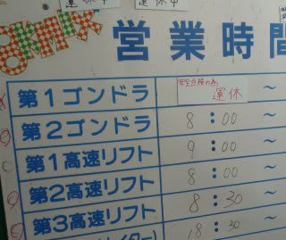
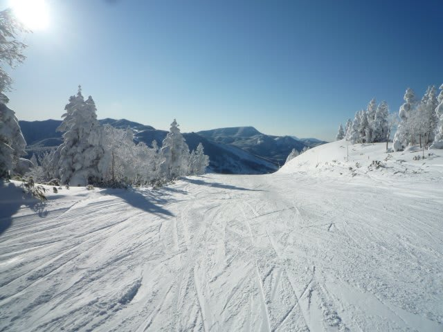
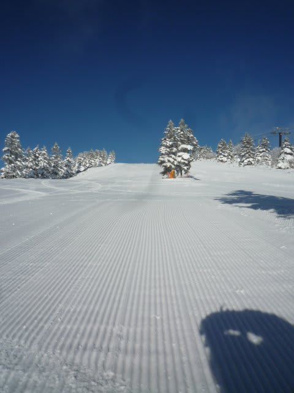
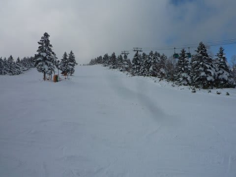
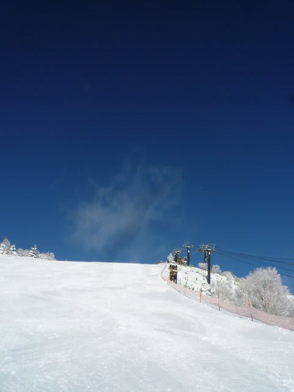

# 1月3日の焼額は晴天なれども…

📅 投稿日時: 2011-01-05 01:59:16

ちょいと投稿が遅くなりましたが．

滞在最終日，1月3日の志賀高原．

朝，天気は最高の晴れ！！

朝から晴れたのは5日間で初めて！！

これは，朝イチゴンドラで人の少ない間に

かっ飛ばす！！！！！

と，気合いっぱいで第一ゴンドラへ向かおうとすると…

なんと．

焼額第一ゴンドラ，機械故障のため営業開始時間未定（激涙）

どうして～っ！

どうしてこんな天気がいい朝に限って，

それも5日間，待ちに待った晴天の日に限って，

それも，泊まった宿の目の前のゴンドラに限って

壊れるかな～っ！！！！！

第1ゴンドラ営業予定は8時なのに，第3高速が動き出す8時45分まで，

滑れずじまい…

この晴天の，ぴかぴかのゲレンデを見ながら待たされる

心境はなんとも…

ホテルの係員に聞いても，

「運転開始はいつになるかわかりません…」

という返事のみ．

仕方ないので，8時半ごろ第1ゴンドラ乗り場へ様子を

見に行くと，

「第2ゴンドラ行きのバスがピストン輸送で出てます」

とのこと．

ええええ～！！！！

ホテルの係員，教えてよ～

ロビーで無駄に30分待っちゃったじゃないかっ！

バスに乗って第2ゴンドラへ．

しかしすでに営業開始45分後．

コースも人が結構滑ったあとで，人も増えてきてます．

あああーーーーー

晴天の朝イチを逃したっ！

くやしい…

＃その後，第3高速が予定より15分早い8時半すぎから営業開始

＃したことを知った…

＃バスに乗って移動した意味なかった…（涙）

＃ホテル係員！！教えてよ！！！（ちょっと怒）

でも，晴天でゲレンデコンディションは最高．

第1ゴンドラが動いてないので，第1ゴンドラ側コースは

ガラガラ．ほとんど誰も滑ってません．

よし，第3高速→第2ゴンドラと乗り継いで，第1ゴンドラ側

コースをすべり続けよう，と思っていたところ．

第1ゴンドラが動いてないので，人が集中した第2ゴンドラは

20分程度のすごい待ちに．

ほかのリフトも混雑してきました…

あーーー．

だめだ．

せっかくの晴天なのに！最高のゲレンデ状況なのに！

10時半にようやっと，待ちに待っていた第1ゴンドラがようやく

動き出しました．

そうしたら．

今まで晴天だったのに，いきなり曇ってきたよ…

がががーーーん．

だめだ．

ついてない…

しかし．

せめてもの救いは，第1ゴンドラが動き出してからは，

ゴンドラもリフトも待ちがなかったこと．

とりあえず，午前中の憂さを晴らすべく，ひたすらゴンドラ

ぐるぐるしました．

オリンピックコースもきれいに圧雪がかかり，

気持ちいい大回りができます．

（この写真は第1ゴンドラが動く前の，朝に撮ったものです）

午後にはコースの人もかなり減りました．

かなり快適に飛ばせました．

…これで，午前中と同じようにすっきり晴れてくれれば…

午後は，基本的に曇りで時々日が射す感じ．

気温はこの5日間でもっとも高く，朝が-8度，昼間は

-3度程度まで上がりました…

でも，終日雪質は最高．

しかし．

この5日間．

ひざパフパウダーも，快晴朝イチゴンドラも

楽しめなかった，イマイチ中途半端な滞在だったなぁ…

普通は5日間もいれば，どっちかにあたってくれそうな

もんだけど…

まぁ，子供は喜んでいたからよしとしよう．

