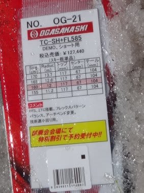

# 2017シーズンモデル，スキー試乗レポート第5回…OGASAKA編

📅 投稿日時: 2016-05-21 02:32:22

今週末，土曜にはスキーに行けないのですが．

…日曜，かぐらに行こうかどうしようか悩んでいる

Skier_Sです．

うーん．

ペアだけのかぐら，滑って楽しいかなぁ…←シーズンインにあの狭い

イエティに9日通った人間が言うことではないのでは？（自己突込み）

ってことで．

まだまだ続く，2017シーズンモデルの試乗レポート．

今日はオガサカ編．

それも，同じTC-SHのプレート違い2種類です．

では，どうぞ～！

○OGASAKA TC-SH FL585 160cm

基礎小回り用．

OGASAKAの技術選クラスのエキスパート向け

TCシリーズですが．

小回り用SH，中回り用MH，大回り用LHのうち，

小回り用のSHです．

TCシリーズは，今年もプレートが

最も強いGR565, 真ん中のFL585，最も弱いFM600の 

3種類から選べます．

この板は，真ん中のグレード，FL585プレートが

付いたものです．

滑ってみると…

荷重はセンター～ちょっとつま先より．

そこを押さえて行くと良く回ります．

トップとテールが踏ん張るというより，

センター付近のエッジがしっかり食いつき，

上手くたわんできれいに回っていく感じ．

エッジの線に乗っても回れますが，ずらしていっても，

しっかりずれの中で捉えていくことができます．

板を大きく動かして，グリップ→ズレと変えていくときも，

グリップがずれた段階でいきなり板の挙動が

変わったりすることなく，ずれた中でも

トップ＆テールのエッジが雪面から圧を受け続けて

くれるので，しっかり雪面からの圧を捉えながら板を

動かしていけます．

SFと同じく，ズレ・キレの出し入れで板の圧が大きく

変わらないので，かなり自由度高く板を動かしていけます．

160cmという長さのせいもありますが，

今シーズンのSFより，軽快に動かせるように感じます．

○OGASAKA TC-SH GR585 165cm

基礎小回り用．

さっきと同じ板ですが，プレートと長さが違うのを

履いてみました．

これは，最も強いGRプレート付きです．

長さも5cm長い，165cmとなります．

滑ってみたところ．

土踏まず～母指球当たりにしっかり仕掛けていくと，

板が反応して回っていく，という性格は変わらないのですが．

…GRプレート付きは，春のザブ雪で滑ると「ちょっと硬い」

と思っちゃいました．

FLプレート付きと比較すると，かなりしっかりした，

張りの強い板になり，同じ板でもかなり

性格が変わったように感じます…．

FLプレートは，捉えていくと自然にたわんでいきますが，

GRプレートは自分で仕掛けてたわませていく板の感じ．

スピードが出た中で，エッジに乗れば気持ちよいミドルが，

圧を受けるずれを上手く使って，板を動かしていけば

ショートが楽しめます．

スピード耐性はGR付きが圧倒的に上．

今回の春雪だとFLプレート付きの方がコントロール

しやすかったけど，おそらくトップシーズンの雪で，

そこそこのスピードを出すと，GRプレート付きの方が

楽しそう．

そこそこのスピードでもコントロールでき，自然に

たわみが出ていくFLプレート，

張りが強くなり高速耐性が上がり，自分から仕掛ける

板になるGRプレートと，プレートでおいしいエリアが

変わってくるので．

この板，プレート選びも重要な要素になりますね～．

## 💬 コメント一覧

### 💬 コメント by (Tomoko.Y)
**タイトル**: 月山は雪たっぷり
**投稿日**: 2016-05-21 16:11:33

先週末、行って参りました～。

同行メンバーの晴れ女パワーか、土日ともピカピカの晴天でした。

まだペアリフト降り場からコブ斜面まで、雪上をトラバースできますよー。

20000メートルには遠く及びませんが、来シーズンは是非お会いして、Friendsシールをいただきたいなあと思っております♪

### 💬 コメント by (Skier_S)
**タイトル**: Tomoko.Yさま
**投稿日**: 2016-05-22 01:26:20

あ，月山行ってきましたか…

混んでませんでしたか？

まだ板履いてリフト乗れるんでしょうか…？

来シーズン，志賀高原でお会いしたら

シールお渡しします～！

ぜひお会いしましょうっ！

