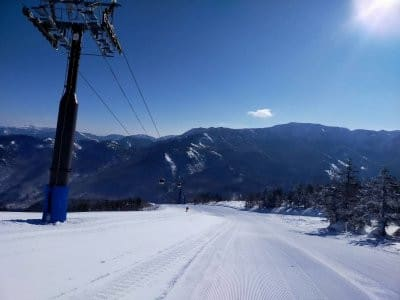
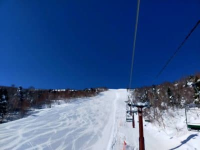
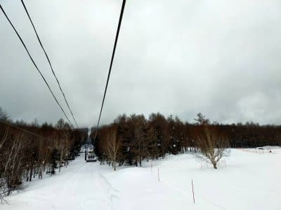
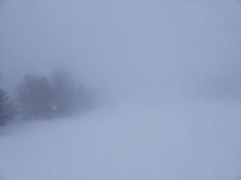
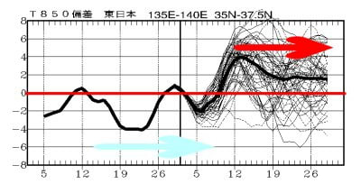
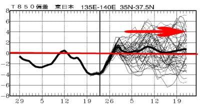
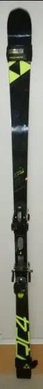
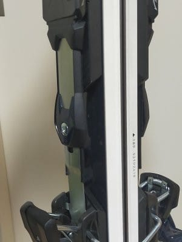
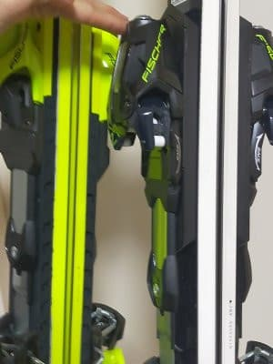

# 今シーズン本格デビューの朝イチ専用大回りスキー板，'20 FISCHER RC4 Worldcup GS Masterのインプレッション

📅 投稿日時: 2022-03-04 01:08:29

えー．

本日の志賀高原．

特派員からの写真を見てみると…

朝はすっきり晴れだったようです！

うぎゃーーー！滑りたい…っ！！！

うーん．

こんなにすっきり晴れるとは…

雲が多めの晴れ~曇り，

という予想は外したか…

と，思っていたら．

昼ごろには雲が増えていき…

午後2時には山頂付近はかなりのガス，

そして雪が舞い始めたようで…

午後は雪が舞う，という予想は

ちゃんと当たったのだ！←朝の晴天は外してるけど？

いや．朝も「雲が多めの晴れ」と，

晴れの可能性があることをちゃんと書いていたので，

完全に外れてない…とは言えないかな…←苦しい言い訳

でも．

明日の金曜は朝から晴れますよ～！

今日の予想を見ると，低気圧の接近が

昨日の予想より遅くなりそうなので，

昨日は午後は曇りの予想をしましたが，

最新の天気図では，

明日金曜は一日晴れそうです！

明日から焼額はまた第2ゴンドラが

動き出しますし．

風もそんなに強まらず，絶好の

スキー日和になるんじゃないかな～．

…明日滑れる人がうらやましい…

そして，日曜の予想もちょっと変わって…

そんなに雪が積もらない予想だったけど．

もしかすると，

日曜朝までに10～20cmくらい積もって，

さらに昼間も降り続ける天気になるかも？？

さらに風も強まりそうなので，

根性の無いスキーヤーはふるい落とされる天気

になるかも…

どのくらい降るのか，まだよくわからないので．

また明日，週末の詳細予想をします…

しばしお待ちを…！

で．

さらに今日は木曜日．

気象庁の一か月予想が出る日なので，

見てみると…

…え？

うげげげ！！

なんだこりゃーーーーっ！！？？

赤矢印で示した3月10日以降，

平年比+4℃～+2℃高い日が続くような予想に

戻っちゃってますよ？？（激涙）

あれれ？

先週の一か月予想の図を見返すと…

3月は意外にも平年並みかな？という

予想だったのに．

（先週木曜段階の一か月予想）

この時の予想と，ぜんぜん変わっちゃってる…（泣）

…でも．

1週間で一か月予想がこれだけ変わるということは．

来週になったら，また一か月予想が全然変わって，

平年より-2～4℃冷える日が続く

という予想に変わる可能性もあるわけだ！←いや，その可能性は限りなく低いから…

…いや．でも．

そこまでは言わないまでも，

せめて，平年並みの予想に戻ってほしい…（懇願）

ってなことで，本題へ．

[前回](e1affde1213281bc061542a4a66beee1e.md)は，GWの物欲選手権で敗れた

HEADブーツのインプレッションでしたが．

今回は，同じ物欲選手権で買ってしまったGS板，

FISCHER RC4 Worldcup GS master

のインプレッションをば…

このスキー板．スペック上は，長さ189cm，

R=27とFIS規定外のGS板ですが．

以前にも書きましたが，エキップさんで買った

この板，日本仕様ではなく，欧州の選手仕様

らしく．

日本仕様より板が分厚いという噂．

…確かに，決して薄い板ではないRC4 RCと

比べても，かなり分厚い感じ…

で．

この板，実際履いてみたところ…

良く曲がる！！！

R=27とは思えないほど，良くたわんで

良く回ります！

かといって，フレックスが弱いわけでは

決してなく．

スピードを自分の限界まで出していっても

板が負ける感じは全く全然これっぽちも無く．

「まだまだスピードを上げても大丈夫ですよ～」

という安心の安定感．

だもんで，いつもよりついついスピードを

出して滑ってしまいます…

そして，たわんでいくときにかなり強いばね感で

圧が溜まっていく感じがあり．

たわみのコントロールはやりやすく，

谷回りで思い通りの回転弧にもっていけます．

板なりに行かされてしまう板ではなく，

きちんと踏んであげればすっとたわんで，

狙ったラインに持って行ける自由度があります．

すごい気持ちよく回ります．

そして，切り替えの時は，板に溜まった圧が

気持ちよく帰ってきて，板の走り・

加速感があって…これは気持ちいい！！

快感！！

どこまでもスピードが出せるし，

その中でコントロールできるし，

切替ですっと走るし…

気持いい！

これは気持ちいい板だ！

全然硬く感じなくて，ホントに良くたわむのに

スピード耐性は強くて．

もう，ピカピカ整地の朝イチ焼額では，

この板以外で滑りたくない…

というほど，無人のフラットバーンを滑ると，

脳内麻薬が出まくる危ない板です．

ただ，この板を使いこなすには，

強いブーツが必要かも…

おそらく，弱いブーツだとつぶれてしまって

この板に圧をかけきれない感じ．

HEADのフレックス140のブーツを履いた

からこそ，ここまで使えるのかも…？？

強いHEADのブーツとの組み合わせだと，

ブーツが自分で板を押さえてくれる感じで，

乗り手はそこまで力を使わなくても

楽に滑れます…

強いブーツで滑るには力がいる

というのは違っていて，

強いブーツだからこそ，スピードを出しても

ブーツが支えてくれて楽に滑れる

というのが正解かも…

そして．

残念ながら，低速では楽しくない板です（涙）

この板で楽しむには，ある程度のスピードが

必要で．

そのため，人がいるバーンとかではあまり

楽しめないので，この板を楽しめるのは，

人がいないフラットバーン限定に

なっちゃいます．

でも．

人がいないフラットバーンでは，

これまで自分が経験したことの無い，

超安定したハイスピード大回りという

超絶な快楽をあたえてくれるので…

これまで，

「自分が使うには手ごわいだろうなぁ…」

と，競技用の板はほとんど履いたことが

無かったのですが．

うーん．

競技用板も，いいなぁ…

なんだか，ブーツを買い替えてから．

やっぱりヤバい方向に行っている気がする…

次は小回り用の板も，SL競技用とかに

行っちゃわないか，心配…←いや，それ，他人事みたいに心配するところじゃないから．自分で判断することだから…

## 💬 コメント一覧

### 💬 コメント by (レインボー74)
**タイトル**: Unknown
**投稿日**: 2022-03-04 15:50:37

金曜日の志賀高原情報

朝の蓮池-10℃。寒いはずなのに、寒さに慣れてしまってるせいか、ボケてるせいか、ちっとも寒くない。だけど雪は滑りましたよ。

快適すぎるやけびをぐるぐる回していたら、旧友とばったり。

となると行き着く先は？

ダイヤで昼宴会です。

運転の私は呑めないので、一人車に戻ってお迎えです。ささっと帰って温泉に入ってすぐに一杯したのは、言うまでもありません。今日もたのしか～！

こんな好条件がいつまで続いてくれるのでしょうか！

### 💬 コメント by (アリス)
**タイトル**: Unknown
**投稿日**: 2022-03-04 16:43:19

S様こんにちは😃✋

本日も二高スタートで、唐松、GSと固めのバーンが快感です🎵

頂上からは、北信五岳(Gokuさんの受け売りです)の稜線がクッキリ☀

ヤケビ移動して他のスキー場を滑ってみてヤケビの設備と接客の品質の違いが解ります☺

今回5日間連続平日スキーは初体験ですが、空いてる中でも特に水曜日が一番空いてるようです🙆

共通している事は、昼時間になるとゲレンデから人が居なくなると言う事です🎵

この時間は、前後を気にしなくて済みますのでテンションが上がりますね😅

Sさんのインプレッション用具選びに役立っていますので感謝しております🙇

私も数年間先には、レインボーさんのように年間滑走期間120日以上を体験してみたいものです🎵

### 💬 コメント by (レインボー74)
**タイトル**: Unknown
**投稿日**: 2022-03-04 17:31:06

お借りします。

アリス様、今日もなぜかお会いできませんでしたね。私は今日は上下黒、猫の耳が目印です。早く見つけて逮捕してください。

### 💬 コメント by (なんちゃってレーサー)
**タイトル**: 流石にSL板は....
**投稿日**: 2022-03-04 21:29:39

R27で選手用ということは，スキークロス用ですかね．楽しく滑れたことが記事からわかります．

さて，いいブーツでちゃんとしたSL板を履くと.....

ターンは気持ちいいですが，めちゃくちゃ疲れます．

よく考慮の上ご購入ください．

### 💬 コメント by (Skier_S)
**タイトル**: 土日は荒れ気味天気
**投稿日**: 2022-03-04 23:45:45

＞レインボー74さま

意外と冷えたみたいですね！

コンディション良かったみたいですが，滑らずに宴会だったんですね（笑）．

でも，飲めなくて残念でしたね…

＞アリスさま

今日はコンディション最高だったようで，うらやましいです…

私も年間120日滑れるように，早くリタイヤしたい…

＞なんちゃってレーサ―さま

一応，マスターズGS用となってます…

どちらにしろNON-FISの板です．

R30やら35はさすがに履ける気がしないので．

でも，やっぱりSL板は疲れますか…

