# 4連休3日目，5月5日の志賀高原は…うむ．ザ・春スキーですな．

📅 投稿日時: 2013-05-05 21:36:35

ということで．

今朝志賀高原に舞い戻ってきた，Skier_Sです．

えー．

本日は．

あー．

正常な(？)，ゴールデンウィークの状態に戻った感じですね～．

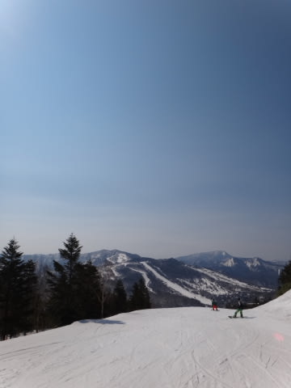

晴天で大変気持ちよかったものの．

ざぶざぶで重い雪と戦う(^^;) 一日でした…．

さて．

今日は早朝に間に合わなかったので，通常営業の8時半に焼額山に飛び込んだわけですが．

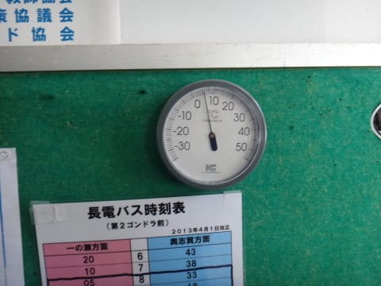

うむ？

な，なんということだ…(悲)．

気温はすでにプラス5度もあるよ…(涙)．

ただ，朝はそこそこ冷え込んだようで，8時半でもまだ表面がうっすら

やわらかくなった程度で…

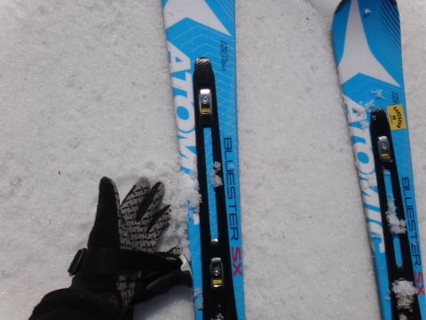

そこそこのシマシマバーンをいただくことができました．

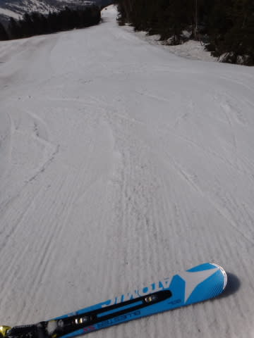

ただーし．

幸せタイムは9時ごろには終了(泣)．

それ以降は，表面がだんだんやわらかくなって，板に粘りつくような感じの，板が滑らない雪になっていき…

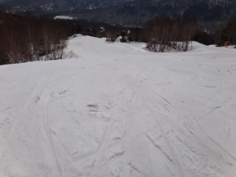

さらに荒れ始めてきました(涙)．

ってことで．

10時ごろに，一の瀬ファミリーへ移動してみたんですが．

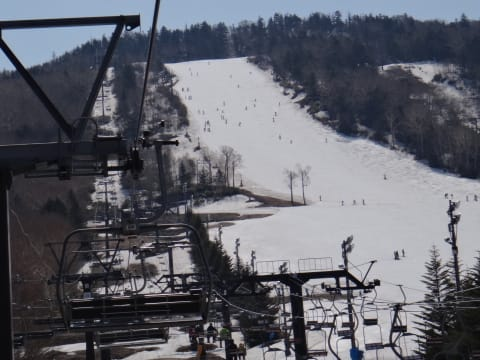

うむ．

ファミリーのメインバーンは，ちょっと荒れだしているものの，

板が粘りつかないので，滑りやすいな．

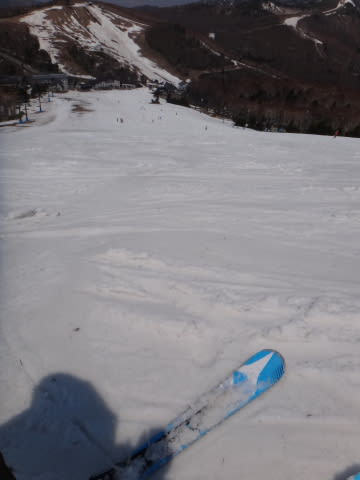

…しかし．

向かいの一の瀬ダイヤモンドはまだ営業しているんだけど，結構きわどい感じ…

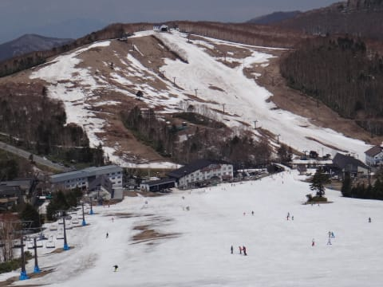

で．

午後になると．

焼額はもう板が走らない，重く疲れる雪で…

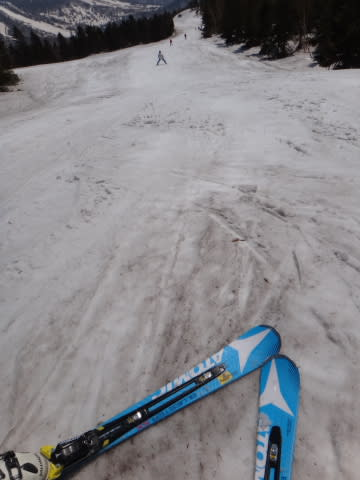

さらに荒れ荒れなので，かなり滑っても楽しくない感じ…(悲)．

一の瀬は，ファミリーメインバーンは重い雪のコブ斜面と化し…

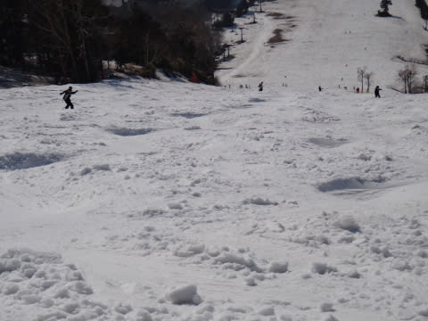

…重い雪を滑り続けても疲れなさそうな，いかにも体力がありますっ！

…って感じの人だけが，ゲレンデに残ってて…

スキーヤーの残体力のバロメータになってました(笑)

で．

夕方には，コブ溝の一部の雪が薄くなり，ちょっと危険な箇所が…

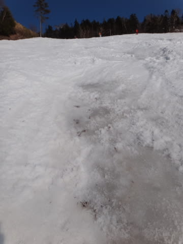

しかし，夕方3時くらいまでは大丈夫だったので，GWとしては上出来，

ということにしておいてあげましょう．←何様のつもりだ

ということで．

本日は．

スカッと晴れて，気温も朝から暑いくらいで．

「ザ・春スキー！」という感じの．

GWにあるべき姿に戻った志賀高原だったのでした…

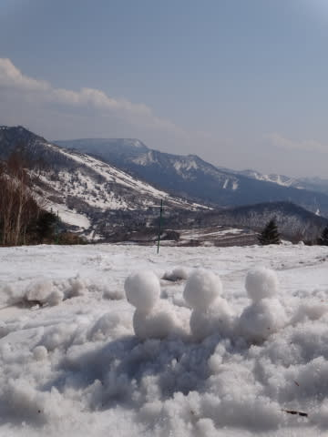

## 💬 コメント一覧

### 💬 コメント by (ゆうこ)
**タイトル**: 一足先に
**投稿日**: 2013-05-06 16:26:55

昨日は二度寝は最小限にして9時ごろには焼額に行けました!!残念ながらSさんにはお会いできませんでしたが。

昨日はどんどん雪が板に張り付いて来て、昼頃には終わって涌井に蕎麦を食べに行ったり、小布施で八重桜見たりしました。

今日は、軽井沢のアウトレットに寄って、もう帰宅しました。

私のスキーシーズンもこれでたぶん終了です。次は夏の趣味の登山、トレッキングになります。結局年中、山にいるみたいです。

### 💬 コメント by (Skier_S)
**タイトル**: ゆうこさま
**投稿日**: 2013-05-07 00:54:34

無事帰宅，お疲れ様でした～！

5日は，朝に滑っておかないと，ほとんどすべることなく

終わっちゃう一日になっちゃったかと思います…

朝から出かけて正解だと思いますよ～！！

でも，今シーズン終了ですね…

また来シーズン，ゲレンデでお会いしましょう！

＃このブログは年中続きますが(笑）．

