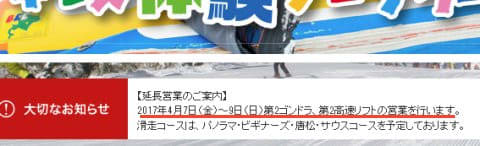
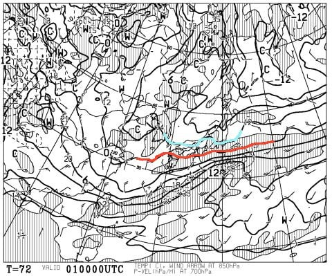
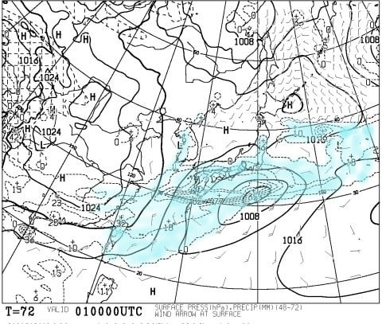
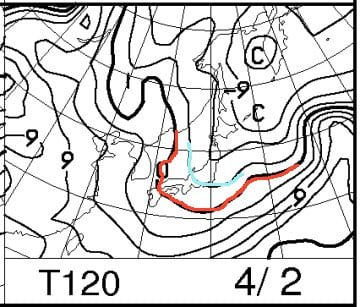
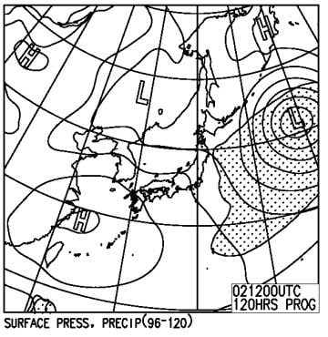
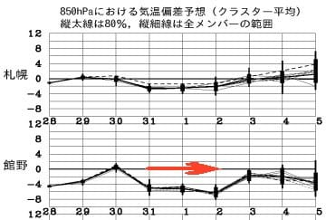

# 4月1，2日の週末の志賀高原スキー場の天気は…土曜は曇りのち雪，日曜は晴れるか…4月と思えない雪！

📅 投稿日時: 2017-03-30 00:58:32

🏷️ カテゴリ: [スキー天気予想](c6554f5c3c106093b511a8daae23757e8.md)

昨日の夜は．

Blog記事も書かずに，倒れるように

寝てしまったわけですが．

…でも．

おかげで，久しぶりに6時間半以上寝れました～！

うむ．

Blogを書かないと，普段より1時間以上

睡眠時間を稼げるのか…

ということに気づいてしまい．←いまになって，やっと気づいたのか？

改めて，何がモチベーションで睡眠時間を削ってまで

Blogを書いているのだろう…

と，自分でも不思議になってきた，Skier_Sです．

というところで．

話題は変わりますが．

かねてより噂は聞いていましたが．

公式に出ましたね～！

この，焼額山HPを見てみると…

（[焼額山HP](http://www.princehotels.co.jp/ski/shiga/)より）

はい．

拡大してみましょう．

…そうです！

焼額の営業，一週間延長が決まりました～！！

4月の7，8，9日の3日間．

いつもの春営業と同じ，2ゴン，2高が営業です！

…ホントはGWまで営業してほしいところではあるけど…

まぁ，1週間伸びただけでもありがたい．

うーむ．8，9日．

早朝営業もやってくれると嬉しいんですが…

そこまではやらないようですね．

ってちょっといいニュースのあとは．

水曜深夜恒例，週末の天気予想を行くのだ！

まず．

4月1日，土曜日の850hpa気温を見てみると…

うはー．

4月というのに，まだ赤くマークした0℃線．

本州太平洋側にありますね～！

そして，志賀高原は水色で塗った

-3℃線が掛かっているので…

4月と思えない冷え冷え気温です．

この日も，かなりいい冷え込みで，

焼額山頂は，昼間もマイナスをキープしそう！

…ってか．

平地でも雪が降る目安である，-3℃線．

こいつが関東まで延びてるんだけど…

そして，地上天気図を見ると…

うーむ．

降水域を示す水色の領域，かなり広い範囲を

覆ってます…

でも，この図では．

降水エリアは志賀高原よりは南．

志賀高原はぎりぎり降水エリアに入ってなさそうに

見えるので．

この天気図が正しければ．

志賀高原は，少なくとも朝9時までは降らないことになります．

…まぁ，実際は昼前には雪がぱらつき始めるとは

思うのですが．

で．

関東も降水域があるエリアにすっぽり囲まれているので．

850hpaにマイナス3℃の寒気が入っているこの日．

明け方は，群馬・山梨方面でも雪がちらつくかも？？？

次に．

4月2日，日曜日の850hpa気温を見てみると…

この日も，赤くマークした0℃線はかなり南．

そして，水色の-3℃線が志賀高原をしっかり覆ってます．

この日も，山頂は，

昼間でも気温はマイナスをキープしそうなんですけど！？？？

もう，4月ですよ！

そして，日曜の地上天気図は…

ふむ．西から高気圧が迫ってくるので．

午前中は雲が残り，朝のうちは多少雪もぱらつく

かもしれないけど．

昼～午後のうちに，晴れてくる感じでしょうか…

ってことで．

まとめると．

4/1 土曜：朝は曇り．-5℃くらいの冷え込みか？

　朝早く，高速道路は群馬県，山梨県から降雪の

　可能性があるので，気を付けた方がよさそうです…

　＃路面積雪にはならない程度の降雪かな…

　朝の雪質は，先日の朝にちょっと降った雪が

　圧雪されて，いい感じの締まり気味冷え冷え雪で．

　4月と考えれば，ありえないレベルの最高級

　圧雪バーンでしょう．

　最高気温もマイナスキープ．山頂では，

　-2～3℃程度までしか上がらず．

　さらに昼ごろから，時折雪がぱらつき始め．

　とても4月と思えない景色になっていくでしょう…

　日が射さない一日だけど，この時期うかつに日が

　射すより，曇りの方が雪が悪くならなくて

　いいかも…

　急斜面ではちょっと下地の固めの雪が出て

　くるかもしれないけど．

　雪質は終日Good！！

4/2 日曜：朝は曇り．小雪がぱらついてるかも…

　気温も冷え冷え．-5℃以下まで冷え込みそう．

　この日も，朝は最高冷え冷え圧雪！

　天気は午後に向かって回復していき．

　昼過ぎには日も射し始めるかな…？

　でも，昼間も気温はマイナスをキープ！

　この日も雪はよさそう…

　昼ごろの早い段階から晴れれば，

　日差しを浴びる南斜面はわずかに雪がゆるむかも

　しれないけど．

　しっとりザラメにはならない．

　この日も雪質は終日Good！

…という感じで．

この図に示すように，赤矢印で示し3月31日，4月1，2日の

3日間．平年比5～6度低いという，かなりの低温の

日々が続くので…

どうやら，この週末も．

4月とは思えない，かなりいい雪質で

楽しめそうな予感！！！

いやーー．

今シーズン．

恵まれてますよ～！！

## 💬 コメント一覧

### 💬 コメント by (れお)
**タイトル**: 良さそうですね～
**投稿日**: 2017-03-30 11:23:25

ホント４月なのにグッドコンディションな感じですね～。昨シーズンとはまったく違いますね！

今週末は、日月と志賀予定です。家族と一緒ですが、こっそり早朝スキーは行きたいな～。

でも、日曜で１ゴンは終わっちゃうんですね…。

ホントもったいなさすぎる～

### 💬 コメント by (yama)
**タイトル**: 20000メートルクラブ
**投稿日**: 2017-03-30 16:52:33

先ほどskilineを確認しました。若杉さんが29日に奥志賀ゴンドラ48本乗って昼間の標高差22000m以上達成しています。今週末もゲレンデは良さそうなので先週の分まで滑りたいと思います。また、ゲレンデで会いましょう。

### 💬 コメント by (Skier_S)
**タイトル**: 今週末の天気は難しい…
**投稿日**: 2017-03-31 02:07:14

＞れおさま

あれ～！

日月ですか？？

月曜は焼額が営業してなくて，

ちょっと残念な感じですね．

後は金，土，日の3日間，2ゴン＋2高が

動いただけで終わりなんて，

ホントにもったいない話です…

＞yamaさま

Skiline確認しました…

ありえない．

奥ゴン48本って…

ありえない．

人間が実現できる数字なのか…

それも，若杉さんの年齢で…

私には不可能です…（驚愕）

土曜は手持ちのゴールドシールを持っていって，

お会いできたらお渡ししようと思います～！

### 💬 コメント by (Goku)
**タイトル**: 神業です。
**投稿日**: 2017-03-31 19:30:01

20000ｍ挑戦中の若杉さんとゴンドラで一緒になりました。

私が先にスタートしましたが、３壁手前で抜かれました(笑)

あの日は朝こそ良かったものの、午後は一旦緩んだ雪が固まり始めていたので、３時以降はけっこう足に来るコンディションだったかと・・・

あの状況で４８本は凄すぎる記録だと思います。

もうほとんど神です。

### 💬 コメント by (Skier_S)
**タイトル**: Gokuさま
**投稿日**: 2017-03-31 23:38:17

えええええええ！

Gokuさんを抜いて行ったんですか！？？？？

それはすごい…

そして，奥ゴン48本．

ありえない．

信じられない…

神を超えてます（笑）

あした，ゴールドシール授与式をやらせてもらう

予定です…

