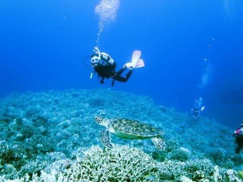

# 2019年8月，座間味で小6の娘と親子ダイビング！エピローグ

📅 投稿日時: 2020-07-16 02:03:32

1年前に[ジュニアオープンウォーターの
Cカードを取得](e236c9494959781d162d4ed151333cd21.md)した，わが娘．

取得した年の8月に，海洋実習を合わせて

[モアルボアル](e308d9a01caec22968e6edff28fd5e5bc.md)・[座間味](e2f2195a857cce248db54e0abce8100e2.md)で計12本ほど潜り．

そして，それから1年後の8月，今回の

慶良間に来たわけですが…

わが娘，Cカード取り立てで，さらに

ほぼ1年潜ってないブランクダイバー

なわけで．

…果たして，ちゃんと潜れるのかな？

大丈夫かな？？

という心配をよそに…

なんだ，この余裕を感じられる，

水中での落ち着きっぷりは？？

とても経験本数10本ちょい，

1年ブランクがある小学生と

思えない，落ち着いたフィンワーク…

…そして．

相変わらず，水中でフィンを微動たりとも

させずに中層を漂う，

安定した中性浮力…

お前，ホントにブランクダイバーの

小学生か！？？？

Cカード取りたての去年も驚いたけど…

貫禄すら思わせる，水中での動きだな…

とりあえず，水中を潜るのが

楽しくて仕方がないらしい，わが娘．

娘がダイビングを始める前は，

ダイビング好きになってくれればいいな…

と，思っていたけど．

ダイビングを始めさせて，

「やっぱり怖い」とか言い出したら

どうしようかと思っていたけど．

…今のところ，そんな様子はみじんも

見せずに，ダイビングを楽しみまくってます…

ってなことで．

子供が小さいころは，

「そんな日が来るのかな…」

と，想像すらつかなかった，

家族3人でのダイビング．

これからもしばらくは楽しめそうです…

まぁ，子供が自立するまでとは

思うんだけど．

それまでの間は，親子3人で一緒に

潜り続けます…！

