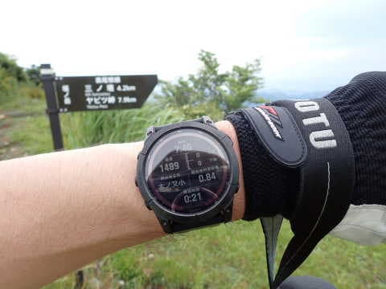
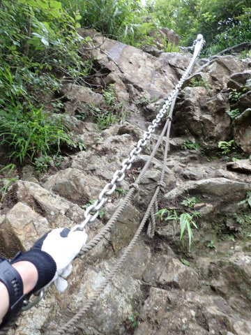

# 菩提峠から塔の岳へ登ってみた，その4…下山

📅 投稿日時: 2022-08-25 02:24:03

ってなことで．

2週間連続の塔の岳山頂へ到着！

先週は通過しただけですが，今日は

ここが目的地です…

残念ながら，雲が多めで視界がよくないのが

ちょっと惜しい感じ…（涙）

とはいえ．

真っ白で何も見えないわけじゃなくて．

富士山のてっぺんが雲から上に顔を出して

いてくれたりして，まぁ良かったかな．

ってなことで．

山頂で軽くおにぎりでカロリー補充をして．

1L準備していたVAAMの最後を飲みきって．

15分ほど休憩したら，7:40に下山開始！！

ピストン行程なので，来た道を三の塔

方向に向かって戻ります…

気温は高めながらも，曇り空なので

強い日差しにやられずに助かる…

最初は見晴らしのいいコースが

続きますが．

やっぱりこのコース，結構アップダウンが

激しいですね…

急な坂を下ったと思ったら，今度は短い

鎖場を登ったりしながら，

行者岳に戻ります…

山頂から約35分で行者岳到着！

ここは立ち止まらず通過！

そして，ここから先は結構コース脇に

草が迫っているところも多く．

またところどころ草をかき分けつつ

歩きますが…

何だかだんだんガスってきました（涙）

ガスった中，鳥尾山荘通過！

通過時刻は山頂から50分．

8:35ですね．

帰りも単純な下りじゃなく，アップダウンが

そこそこあるので．

このルートを通る人は，帰りも結構

登り返しがあるという前提で覚悟しましょう！

帰りは，時々ガスが濃くなるタイミングも

ありましたが…

ガスって視界が悪い時でも，地図が出て

進む方向が時計で確認できるのは，

道迷いの心配が少なくてありがたいな！！

ってなことでさらに歩いて…

9時ちょうどに三の岳到着！

三の岳には小屋がありますが…

ここは中に自由に入って休むことが

できます．

せっかく，見晴らしがいい三の塔．

雲であんまり視界がよくなくて残念だけど…

でも，かすかに雲の上から頭を出している

富士山を眺めつつ，山頂から1時間20分あるいた

ここで小休止．

アミノバイタルをドーピングしつつ，

5分ほど休憩．

ここからは単調な下りになるので，

怒涛のダッシュ！

三の塔から10分ほど，9:18には二の塔へ！

私はもう下山終盤ですが．

ちょうどこのくらいの時間に登ってくる人が多いのか．

二の塔の休憩スペースは結構人がいましたね…

そして，ここからは登りの時と違うルートを

通って，この地図の上側の，林道方向へ抜ける

道を通りましたが…

うん．

林道から抜ける，こっちの道の方が

広くて整備されてて，歩きやすくていいな…！

ってなことで．

最後は林道へ合流して…

三の塔を出てから35分，

9:43に駐車場の林道ゲートへ到着！！

しかし．

13kmで標高差1300mと，

距離や標高差はそれほどではないけど，

標準コースタイムが8時間22分も

かかるだけはある，

軽い鎖場あり岩場ありのバリエーションに

富んだ，意外と侮れないコースでした…

とりあえず，今回は．

登りは約2時間半，

下りは約2時間．

山頂での休憩含め，なんとか4時間50分で

走破！

とりあえず，快調に飛ばせて，

10時前には無事駐車場に戻って

これたので．

昼前には家に到着して．

午後には，

午前中に山に行ってきた

と思えない，いつもの感じで．

泣きながら仕事を続けたのでした…

…で．

今回の本来の目的．

VAAMは効いたのか？？

という点ですが．

今回VAAMを1L，スタート直後から

山頂までに飲みきって，

気温30℃近い中，Tシャツが絞れるほど

汗だくになりながら，計4.5時間を歩き

（一部走り）きった個人的感想を言えば．

・後半戦のバテが少ない．最後まで足が動く．

・血糖値が下がりにくいからか，動き続けた

　時のお腹の減りが少ないような気がする

・結構飲みやすい．糖分が高い飲み物だと

　飲んだ後むしろのどが渇いたりするが，

　ハイポトニックなので，飲んでのどが

　乾くことはない

・これまで，水＋塩タブレットだったけど，

　そこそこナトリウム分があるのか，

　VAAMを飲むと塩タブレットが

　いらなかった

・下山後の疲労感も少ない気が…

・翌日の筋肉痛も無し（これは下山直後に

　いつも飲んでるプロテインの効果なのか，

　アミノバイタルの効果なのか不明）

ってことで．

うーむ．

なんとなく，効果がありそうな感じ…

せいぜい4時間ちょいの軽い登山でのテストでしたが．

いつもなら下山のラストの追い込みで，

足に疲労感を感じるところ．

今回は疲労感が少なく，「まだ行ける！」

と感じました…

うん．

今後は，VAAMを登山のお供にしよう…

PS.VAAMがなぜ効くのか？の濃厚な解説を

　今後記事に書く予定

## 💬 コメント一覧

### 💬 コメント by (かず)
**タイトル**: Unknown
**投稿日**: 2022-08-25 14:16:29

お久しぶりです！元気ですか？

スタッドレス新製品待ってましたがでなそうなので再値上げまえに購入検討中です

今までブリザック一択でしたがサイズがなくてヨコハマG075になりそうです  

かなり不安なのですがSさんヨコハマですよね  来シーズンは豪雪地帯は行かないので志賀だったら問題ないですか？

### 💬 コメント by (Skier_S)
**タイトル**: ＞かずさま
**投稿日**: 2022-08-25 23:13:20

あら！スキーシーズン以外のコメント，珍しいですね…！

ヨコハマは十分効きますよ．アイスガードを履いて，そんな不満は無いです…

私は3回続けてのヨコハマになりますが，志賀高原で困ったことは

ほとんどないです．

