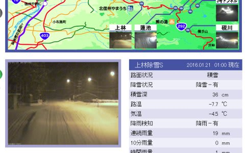
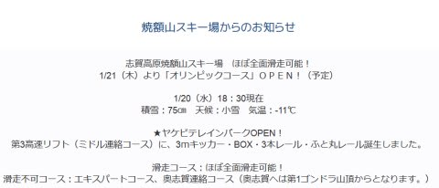

# 予想通り，本日ドサドサ積もったようで…今週末は，志賀高原ほぼ全面オープンだなっ！

📅 投稿日時: 2016-01-21 01:19:55

🏷️ カテゴリ: [日記](cc4b5682fb7b8b144980957a978653fb0.md)

えー．

昨日，予想した通り．

本日の志賀高原．

すごいガッツリ降ったみたいです！！！！

[朝までに30cmくらい積もり](https://www.facebook.com/yakebitaiyama/photos/a.133097176785637.26773.116999658395389/923298497765497/?type=3&theater)，そのあとも降り続いたようで…

予想通り，一日で50cmクラスの積雪になったのだ！！

この雪は，まだ明日の朝まで降り続くのだ！

ふはははははは！

志賀の麓，上林チェーンベースでも，

30cmを超える積雪になってますよ～！

で，今も降り続けてます…

素晴らしいっ！

この積雪のおかげで．

焼額は，明日からオリンピックコースがオープンのようです！

やったー！

（志賀高原索道協会HPより）

いやー．しかし．

3日前まで，こんなだったオリンピックコース．

これがオープンできるレベルで積もったんだから，

かなりの積雪ですね～！！

焼額は，このほかに，白樺コース，ブナコース，

ミドルコースもオープンのようで．

おそらく，今日までクローズだった東館のオリンピックコースや，

一の瀬のパーフェクターコースなんかも，今週末にはオープンするでしょう…

…これで，今週末の志賀高原．

ようやく，全面滑走可能になりそうですねっ！！！

…これもひとえに，

私の願いが神様に通じたからに

違いありませんっ！！←いや，違いありまくりだから．

もしその通りだったとしても，2か月前から祈り続けてたのが今ごろ通じるってのは，遅すぎだから

…とりあえず．

週末の天気の詳細は，また明日予想しますね～！

## 💬 コメント一覧

### 💬 コメント by (れお)
**タイトル**: 本日ソロ日帰りしました♪
**投稿日**: 2016-01-21 22:29:03

Sさんの予想通り、今日午前中に、パウダー楽しめました～。ありがとうございます!!

午後は、太板からSXに履き替えて、ヤケビも滑ってきました。オリンピックコースも良かったです。石の心配も完全に無くなりました～!!

今日は降雪は無かったのですが、気温は低かったので、週末もこの雪がキープされると思います～!!

ぜひ、Sさんも、今週末のスキー楽しんでくださいませ!!

### 💬 コメント by (Skier_S)
**タイトル**: れおさま
**投稿日**: 2016-01-22 01:11:13

先週木曜の段階で，21日のパウダーを

しっかり当てた私，すごい！←自画自賛

＃21日も降る，と言ったのは外れたけど…

パウダーで天気も良く，良かったのではないでしょうか…

オリンピックコースも，ブッシュの心配は全く無いんですね！

今週末，楽しんできますね～！

