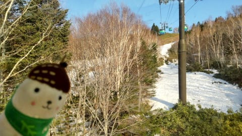
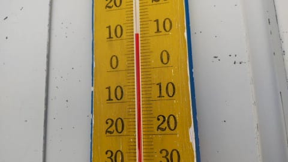
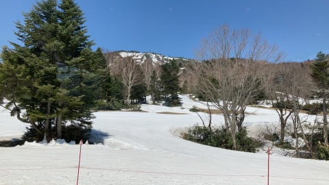
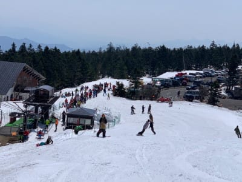
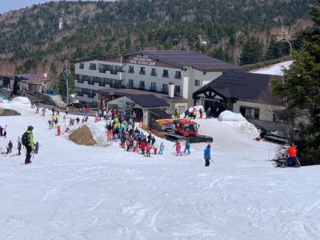

# 今日は家でいろいろと…明日から志賀高原へ復活！

📅 投稿日時: 2022-05-04 22:05:58

ってなわけで．

本日，GWの家族サービスのために

一旦帰宅したのに．

娘の宿題が終わらず，家族サービスが

流れてしまったSkier_Sです…（涙）

昨日夕方まで滑ってから，

慌てて帰宅したのに．

一体何しに帰ってきたんだろう…

そして，また明日深夜2時過ぎ出発なので．

結局往復運転で睡眠時間を削るために

帰ってきた感じになっちゃいました…（泣）

でも，せっかくの自宅での時間を

無駄にしないように．

タイヤを夏タイヤに交換したり，

板のワクシングをしたりで，バタバタと

一日が終わってしまいました…

ちなみに，本日の志賀高原ですが，

朝から晴天で…

気温がぐんぐん上がった一日だった

ようで．

昼間はプラス10℃を超えたようですね（泣）

あぁ…前半は気温が結構低めだったのに…（涙）

で．

終日晴天で，強烈な日差しが降り注いだ

ため，昼間は板の滑りが悪かったようです…

そして．

さすが3連休の中日．

志賀高原の宿の人曰く，本日が

このGWの人出のピークとの

ことだったんですが．

さすがピークの日らしく，渋峠や…

熊の湯は，すごい混んだようです．

ただ，焼額は昨日とそれほど変わらない

混雑具合だったようなので…

焼額が一番マシだったのかな？

ってなことで．

明日5日，明後日6日とも晴天で気温が

上がる一日になりそうで．

朝から+5℃を大きく超えて，朝から

雪は柔らかく，昼間は，板の滑りが

悪くなりそうです…

明後日7日も晴れかな．

8日は曇りか…

7，8日も気温が高く，朝から+5℃を

超えて，朝からザブザブ雪っぽい

感じ…

ってなことで，GW後半は前半のように

冷え冷え＆雪降りは望めなさそうですが．

GWは，明日から残り4日．

私は残り4日，志賀で滑ってます～！！

## 💬 コメント一覧

### 💬 コメント by (アツシ)
**タイトル**: Unknown
**投稿日**: 2022-05-05 02:22:37

5/3,4は志賀高原で滑りましたが、Sさまと入れ替わりに、家族サービスのため帰宅しました。

今日は暑かったですね。気温も高いですが、陽射しも強く、たまらずジャケットを脱いで滑りましたが、それでも汗だくでした💦

私は今日で今季終了となりますが、Sさまのシーズンはようやく終盤に入ったところ？かと思います。お仕事の方も年々ご無体っぷりがエスカレートしているように見えますが、寝不足で居眠りスキーをしてコース外への転落事故などされませぬよう、くれぐれもお気をつけくださいまし。これからもブログ応援しています📣

### 💬 コメント by (Skier_S)
**タイトル**: ＞アツシさま
**投稿日**: 2022-05-05 22:00:24

シーズン終了お疲れさまでした～！！

こちらはまだ月山まで滑るので，シーズンは1か月半から2か月ほど続きます．

とはいえ，もう本戦は終わり，延長戦って感じですが．

また来シーズンお会いしましょう～！！

