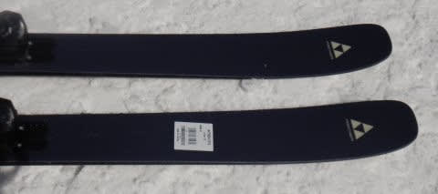

# 2023シーズンモデルのスキー板，試乗レポートその7…FISCHER RANGER 96

📅 投稿日時: 2022-05-31 02:21:15

🏷️ カテゴリ: [スキー板試乗](c0bd8048615710cee890e403a36cc9a2b.md)

えー．

志賀高原の渋峠スキー場ですが．

どうやら昨日の日曜でゲミュートコースが

終了したようで．

本日月曜からは，ウエイバーコースのみに

なったようです…（涙）

果たして，今週末までゲレンデがもつのか？？

めちゃくちゃ気になるところ…

ちなみに私はこの土日はスキーには

行きませんでしたが…

だのに，なぜか睡眠時間2時間で土曜

朝3時に家を出て，片道500km離れた

志賀高原仲間の住み家に突撃．

そして，昼間っからひたすら酒を

飲み続けるという．

平和なんだか激しいんだか分からない

土日を過ごしてきました…

スキーには行かないんだから，

家でゆっくり寝ていようか？とも思ったけど…

やっぱりじっとしてられなかった（笑）．

ってなことで．

今日も2023モデルのスキー板試乗レポート．

本日はフィッシャーのセミファット板です．

では，どうぞ～！

○FISCHER RANGER96 173cm 

セミファット

ゲレンデでも使える強さをもったファット板として

シリーズされているRANGERシリーズ．

来シーズンはフルモデルチェンジと同時に

ラインナップが新しくなり，

センター幅116，108，102，96，90という5種類が

シリーズ化されるみたいですが．

今回試乗したのはセンター幅96mmの，

細いほうから2番目のモデル．

トップ幅128－センター幅96ーテール幅119mm，

サイドカーブ17mでメタルが入っていて，

そこそこ張りがあって，パウダー以外の

整地でも使えそうなスペックの板です．

…この板を試乗したのは，晴天の圧雪

コンディションだったので，新雪での

性能は分かりませんが…

整地を滑っていくと，サイドカーブが

そこそこ小さいので，サイドカーブに乗って

板が曲がろうとしてきます．

ただ，スピードを出していくと，しっかり角を

立てて行かないとズルズル逃げていく感じで，

エッジグリップはかなりやさしめ．

板がかなり軽いのもあって，ずらして

動かしやすいのもあり，そんなにガッツリ

カービングしていく板では無い感じ．

グリップ自体はそこまで強くないけど，

板自体はフレックスもそこそこあり，

スピードを出して行っても板がぶれるとか

叩かれることもないので，

たわませて弧を描いていくより，

縦目にサイドカーブなりに落として

スピードを出していく板に感じます．

おそらく，パウダーの柔らかめの雪での

板の動かしやすさは高そうだけど…

試乗した日みたいな，硬めにパックされた

圧雪で履く板ではないかな～…

やっぱり，パウダーやパウダーが踏まれた

柔らかい荒れ雪なんかで実力を発揮する板で．

新雪がそのまま踏まれて圧雪になってきても，

この板で行けるなぁ…という感じで．

この板1セットだけであらゆるシチュエーションを

楽しむという板ではない感じ．

一応，ゲレンデも滑れるけど，やはり

整地用の板は別に準備しておいて，

新雪が降った日に使う板だよなぁ…

だったら．

96mmなんて中途半端なセンター幅じゃなく，

もっと太いモデルを買った方が良さそう…

と思った，Skier_Sだったのでした．
