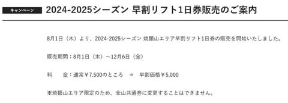
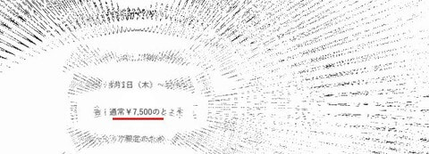
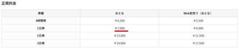
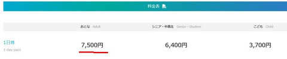

# 志賀高原，焼額山スキー場の2025シーズン早割リフト券の情報が出たよ！

📅 投稿日時: 2024-08-11 08:01:33

ってなことで．

何度も言うように，このBlogは山歩きBlogじゃなく，

スキーBlogなので．

スキーネタを必死に入れていく必要がある

わけですが…

先日，[志賀高原全山のシーズン券の情報を
お送りしましたが．](e556ddb84e47ad6607f4d464fa36ba4a7.md)

今度は焼額山スキー場のホームページで，

焼額山スキー場の2025シーズンの

早割リフト券情報が公開されたので，

今回はその情報をお送りします…！！

えー．今回の情報は，

シーズン券じゃなく早割一日券

の情報です．

ってなことで．

2025シーズンに使える，焼額山スキー場限定の

早割リフト券．

案内を見ると，販売されるのは1日券のみ．

時間券や，2日以上の日数券の早割はなく．

料金も，大人料金のみみたいですね～…

（[焼額山スキー場ホームページ](https://www.princehotels.co.jp/ski/shiga/informations/yakebitickitweb2024/)より）

販売期間はもう始まってます！！

12月6日までWebで早割料金5000円で買えるのか～…

と，フムフムと案内をみていたところ．

え？なに？？

ちょっと待て…

来シーズンの焼額限定1日券，7500円になるの！！

えええええ！！

確か，今シーズンの料金は…

うん．1日券は窓口販売は7000円（Web前売りで6000円）

だったはず…！500円値上げ！？？

来年も値上げが続くのか…！！

（[焼額山スキー場ホームページ](https://www.princehotels.co.jp/ski/shiga/winter/lift/)より）

7500円って…2024シーズンの全山共通券と

同じ値段じゃないですか…！

まさか，全山券と焼額限定券を同じ値段に

するとは思えないので．

来シーズン，全山共通の一日券も値上がり

するってこと？？

↓これが2024シーズンの志賀高原全山共通の

価格ですが…

（[志賀高原索道協会ホームページ](https://www.shigakogen-ski.or.jp/winter/ticket/index.html)より）

うーーーーむ．

物価が上がっていくのはわかるけど．

正規料金で，焼額限定の1日券が

7500円になる時代が来るとは．

3-4年前には想像だにしなかったなぁ…

いや．

一日券がこれだと，焼額限定シーズン券も

かなり値上がりするのかな…（涙）

全山共通シーズン券がかなり値上がりしたので，

ナイターと早朝に使える焼額山限定シーズン券の

魅力がかなりアップしてきているので，

お値段によっては全山券じゃなく，焼額山

限定券にしようかな，と思ってたんですが…

とりあえず．

リフト券がこれだけ高くなったというからには．

今まで以上に休憩時間を削って，滑るスピードも

さらにアップして．

1本でも多く滑って元を取らねば…

と，貧乏人的発想が抜けきらない，

Skier_Sだったのでした…←これ以上休憩時間削るとたぶん身体を壊すよ
