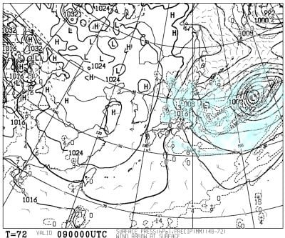

# 3月9，10日の週末の志賀高原スキー場の天気は…土曜は終日小雪がぱらつく天気，日曜は小雪のち午後は晴れるか？2日間とも冷えて雪質は良さそう…！！

📅 投稿日時: 2024-03-07 04:59:02

🏷️ カテゴリ: [スキー天気予想](c6554f5c3c106093b511a8daae23757e8.md)

えー．

本日，夕方6時まで，都内某所で打合せがあり．

その後，夜7時から都内の別の会社で打合せ

だったので，都内を移動したのですが．

帰宅ラッシュというものに巻き込まれて

しまい，混んでる電車に乗った後，

駅に向かうものすごい人の波に逆らって

駅から打合せ先に向かったわけですが…

世の中，6時過ぎという平和な時間に

帰宅できる人がこんなにいるんだ…

と．

こんな時間に帰れる人がまったく

別世界の人間としか思えなかった，

Skier_Sです．

そして，今日もとんでもない時間に更新…(泣)

ってなことで．

今日は特派員からの写真はありませんでしたが，

特派員報告によると…

3月6日(水)の志賀高原は，昨晩からの積雪が

10～15cmほどで．

さらに午前中だけで，10cmくらい積雪が

あったようです…！

予想通り，午前中に降った雪はかなり

重めの雪だったようですが…

とりあえず，ぎりぎりで危険な予想だった

6日が雨にならず乗り切れたので…

これから冷えてくれることもあり，

今週末もいい雪質で滑れそうです！！

ということで．

水曜深夜恒例の天気予想に行くわけですが．

まず，木曜7日の850hPa図を見ると．

志賀高原には‐6℃線がかかり，

この時期としてはまぁまぁの冷え．

そしてこの日の地上天気図は…

わずかに志賀の近辺に降水域が

かかっているので．

ちらちら雪が降る…って程度かな？

続いて金曜8日の850hPa図を見ると．

この日は，水色の‐6℃線は志賀より

ちょい北．

前日より気温がわずかに上がりそうだけど，

そこそこ冷えた，3月上旬とすれば

平均的な気温．

で．この日の地上天気図は…

うーん．微妙…

志賀高原にはぎりぎり降水域が

かかっているので．

まぁ，この日もぱらぱら雪が

ぱらつくタイミングがあるかも…

という程度かな．

そして肝心な土曜日，9日の850hPa

図を見ると…

この日は，志賀にかかっている水色の

線は‐9℃！

トップシーズン並みの冷え冷え具合です！

この日の地上天気図は…

うーん．微妙…

降水域は志賀にかかっているけど，

そんな強い降水量は予想されていない

ので．

朝までの積雪はそれほどないけど…

志賀付近は縦じまになる気圧配置なので，

昼間に降るパターンかな？

ただ，個々の赤丸で囲んだ部分に

プチ低気圧がありますが．

こいつの形次第で，風向きが大きく

変わりそうで…

どのくらい雪が降るかは今の段階で

正確に予測するのは難しいです…

で．日曜10日の850hPa図を見ると…

この日は志賀にかかる水色の線は‐6℃．

土曜ほどではないけど，そこそこの冷えが

続いてくれてます．

日曜の地上天気図は…

高気圧に覆われているので，

まぁ午前中は雲が残るけど，

午後は晴れそう！！

ってなことで．

まとめると…

7日(木)：朝までの積雪は1－2cm．

　あさイチの気温は－10℃ほど．

　冷えて曇り空の一日．

　いい感じのシマシマ雪を楽しめそう！

8日(金)：この日も朝に1㎝ほどうっすら

　積雪があるか…

　あさイチの気温は－7℃程度．

　曇り時折雪がぱらつく天気．

　この日も冷え冷えで，いい感じの

　圧雪で楽しめそう．

9日(土)：プチ低気圧がどうなるかで

　朝までの積雪量が読みにくい…

　運が良ければ10cm，悪ければ1－2cm．

　あさイチの気温は－10℃を下回る．

　－12℃くらい行くかも．冷え冷え！！

　あさイチバーンは圧雪の上にうっすら

　軽い雪が乗っている感じで，

　トップシーズンらしい，いい感じの

　シマシマ！

　朝は小雪，昼に向けて雪が強くなり，

　昼間はそこそこ積もる感じの雪に．

　昼間だけで10～20cm積もるかも？？

　寒いよ！！

　午後は新雪が蹴散らされてバーンが

　荒れていきそう…

　でも，終日冷え冷えなので雪質は

　いいままキープ！　

10日(日)：この日も運が良ければ朝までに

　10cmくらい積もっている．

　あさイチの気温は‐8℃程度かな？

　朝は雪降り．

　あさイチは柔らかめのトップシーズン

　っぽいシマシマ圧雪の上にわずかに

　新雪が乗った，3月としては恵まれた

　雪質になるはず．

　昼に向かって雪が弱まり，

　午後は晴れ間も…

　午後はちょっと雪が荒れ気味かも

　しれないけど，この日も冷えるので

　夕方まで最高雪質で楽しめそう．

ってな感じでしょうか…

週末はすっきり1日晴れとはいかないけど，

土日とも冷えて，いい雪質で楽しめそう

です～！！

## 💬 コメント一覧

### 💬 コメント by (レインボー76)
**タイトル**: Unknown
**投稿日**: 2024-03-07 15:45:30

木曜日の志賀高原情報

昨日スキーを休場したので今朝は元気いっぱい。朝の上林-2℃　蓮池-7℃。エス様予想通りニゴンPで新雪1~2センチ。

ニゴンを降りると、なんと3~4センチ。きっ持ちいい。パノラマから唐松はまさにベスト。今日は友人のプロに撮影してもらうので(無料)緊張。

待ち合わせてから、パノラマ、唐松、GS、ダウンヒル、三高で撮ってもらいましたが、後で観るのが怖い。

そのあと焼額山頂2009mを初制覇して、ヘロヘロ。車で銀嶺ざるそば。やっぱり美味しいです。

明日は横手で撮影。天気もよくて気持ち良さそうです。でも富士山は無理かも？

### 💬 コメント by (地元民)
**タイトル**: Unknown
**投稿日**: 2024-03-07 18:34:27

9日〜10日にかけて、冬型が強まり中野、飯山地域は大雪警報が出る可能性が・・・。

24時間降雪量50㌢みたいです。

志賀高原、猛吹雪でリフトとまるのでは・・・。

### 💬 コメント by (あきたか)
**タイトル**: Unknown
**投稿日**: 2024-03-08 01:42:39

コンディション回復で3高復活だそうです！！

### 💬 コメント by (Skier_S)
**タイトル**: 今週末もいい雪になりそう！
**投稿日**: 2024-03-08 02:36:55

＞レインボー76さま

今日は雪もよかったけど，昼頃は天気も良かったみたいですね…

いい映像が撮れたんじゃないでしょうか．

明日も朝は雪がいいし，朝のうちは晴れそうな感じです！！

＞地元民さま

うーん．

私の予想ではそこまで積もらなさそうなんですけど…

土曜の昼間に10~20cm，土曜から日曜にかけてさらに10~20cmってところじゃないかと思ってます．

運が良ければ，土曜夜から日曜にかけて30㎝くらい積もるかも？

＞あきたかさま

そうなんですよ．

月曜だったか火曜だったかにアナウンスされてますが，

3高が動き，SGS，イースト，ミドル，ミドル連絡が金曜から日曜まで3日間だけ復活です！

ありがたや…

