# 2017年8月，小学生の子連れでパラオ再訪！ファイナル…パラオラストデーの夕食＆帰国

📅 投稿日時: 2018-11-08 01:08:29

🏷️ カテゴリ: [ダイビング日記](ce3a7a8d424d112fce83ee85c81a0e344.md)

ということで．

昨日までの，引っ越しスペシャルモードが終了して．

このBlogもようやく通常モードに復活です！

…なのに．

仕事が…

今日もまだ仕事が終わりません（涙）

とりあえず．

今日はお持ち帰り宿題なので．

まずBlogを更新してから仕事します…（泣）．

一体，自分の部屋が完璧に片付け終わるのは

いつになるのやら…

ってことで．

通常モード復帰一発目は←そんな記事を書いているどころではない気がするのだが…

不人気の，ダイビング日記です！

では，どうぞ～！

--

ってな感じで．

最後のイベントのカヤックツアーが終わったら．

明日…というか．

今晩の夜2時にホテルピックアップで帰国なので．

ホテルに戻って，シャワーを浴びて．

外に干してあったダイビング器材を部屋に

回収したら．

今日は早めに寝ておきたいし．

早めの夕食に繰り出しましょうか…．

…で．

夕食を食べに，ホテルをでて，

パラオのメインストリートを歩きます…

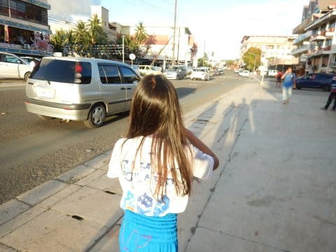

そこにあった中古車屋さんを見ると．

大体，パラオの自動車は，日本からの

中古車が多いんですけど．

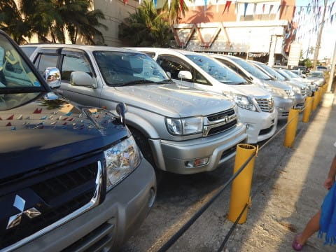

このお店も日本車の中古車がずらっと

並んでいるわけで…

で．

なに？

放射線量測定済み？？

…まだ，日本からの輸入品はこういうものが

必要なのか…

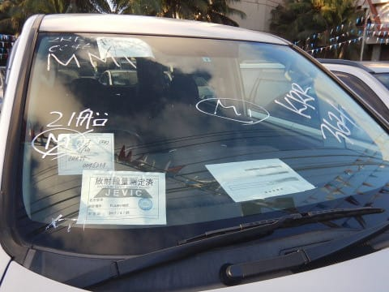

ってことに驚きながら．

夜ご飯を食べにやってきたのは．

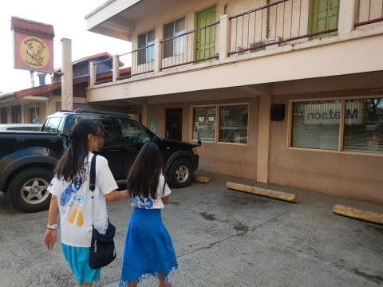

去年もお世話になった，WCTCショッピングセンターの

すぐ裏にあるお店．

「EMAIMELEI」

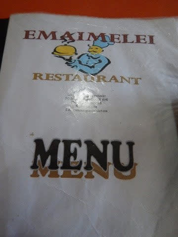

ここは，観光客向けのお店でなく．

現地の人向けなので，お安くて

さらにボリュームもたっぷりという…

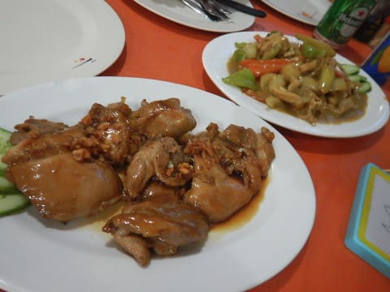

このチャーハンの量の多さ…

これだけでおなか一杯になっちゃう！

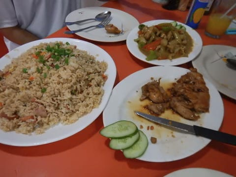

パラオは，観光客向けのお店に入ると，

食事のお値段が日本よりも高いくらいなので．

こういうお店はありがたい…

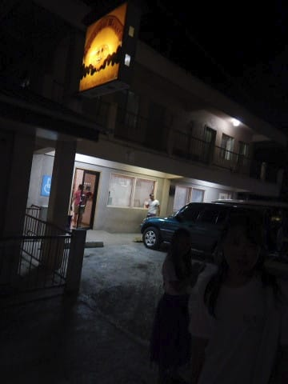

で．

食事を終えてホテルに帰ると．

まだ夜8時過ぎという，早めの時間ですが．

夜中2時ピックアップなので．

1時半には起きないと…

ということで．

早めに就寝…

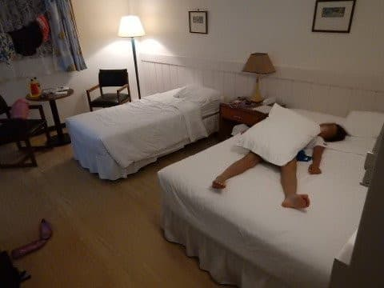

そして．

睡眠4時間半ほどで起きて．

部屋の中に干していたダイビング器材を

パッキングしたら．

夜中の2時にホテルのロビー集合で．

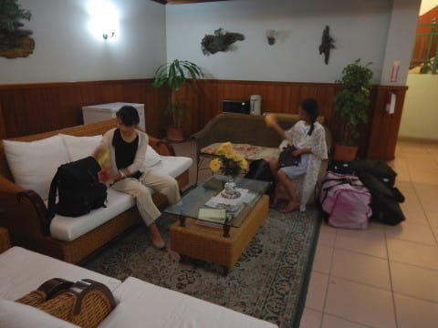

空港行きのバスが迎えに来ます…

眠い…

バスはいくつかのホテルを経由して，

午前3時に空港へ到着．

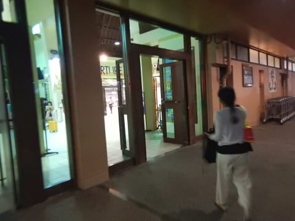

そして，チェックイン．

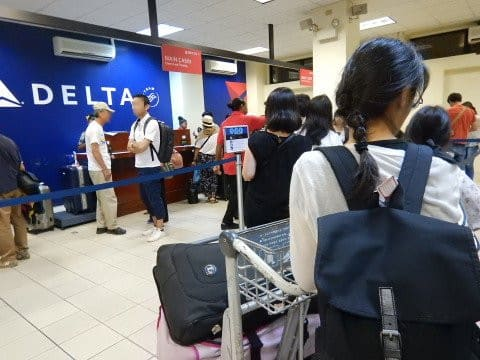

その後，パラオの出国税$50を払います…

子供も同額取られるので，3人で$150．

た，高いよ…（涙）

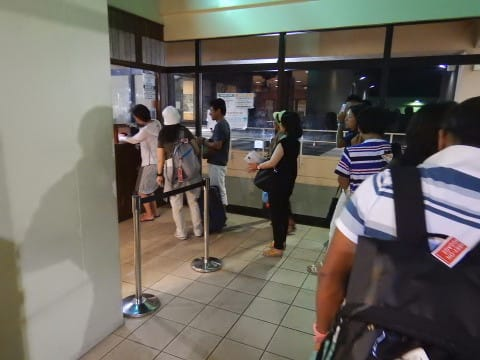

ちなみに．

2018年1月より，このカウンターで$50を払うのは

廃止になり．

チケット購入時に$100上乗せされる形になったようで…

しかし，一人$100とは…！！

ってな感じで．

空港待合室で，搭乗時間の4時過ぎまで

待つわけですが．

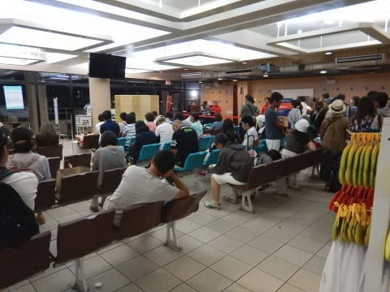

…パラオ．

どの航空会社を使っても，移動が深夜になるのが

辛いんですよね…

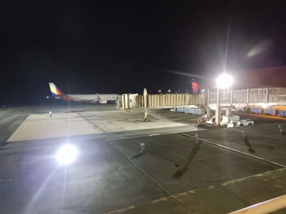

そして．朝4時過ぎ．

眠い目をこすって，飛行機に搭乗．

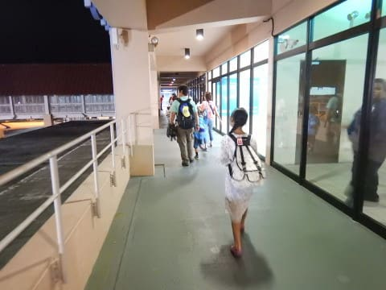

返りも，飛行機はB757ですね．

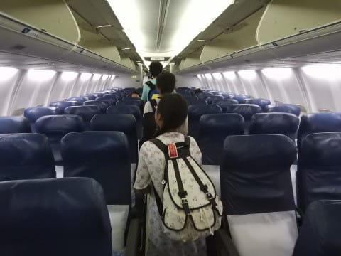

搭乗して，椅子に座ると．

眠いので，ただちに熟睡…

離陸したのも気づかないくらいでしたが．

でも，配られた機内食は食べる！

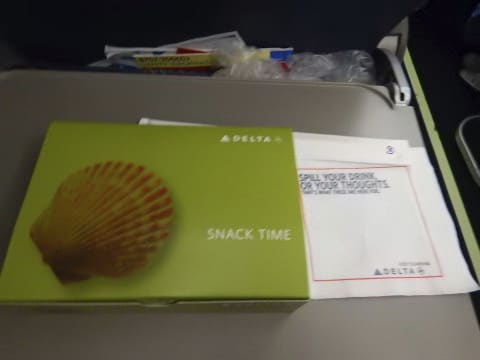

行きとは違って，帰りはかなり

簡単な軽食でしたね…

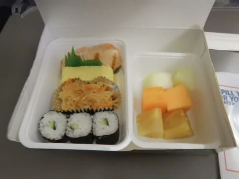

外が明るくなってくるのを眺めつつ，

軽食をとったあと．

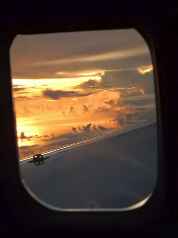

そして，もうひと眠りすると．

到着1時間ほど前に．

今度は，また朝食代わりなのか，

大きなビスケットみたいなのが配られて．

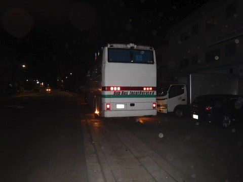

機内で配られたものはしっかり食べるという

私のポリシーを引き継いだ娘ですから．

しっかり起きて，食べてますね…

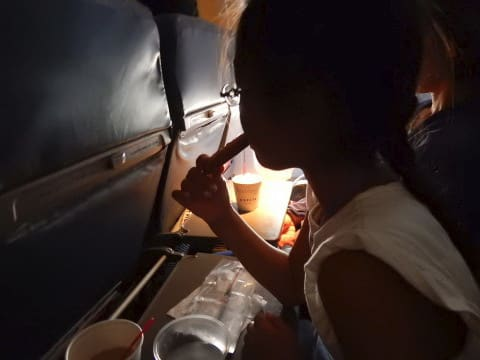

ってな感じで．

朝9時ごろ．

成田に到着…！

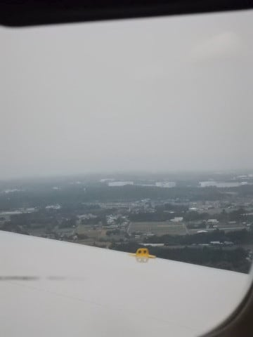

無事，5泊6日（と言っておきながら，実質6日目の朝9時に帰国してるけど…）の

旅行を終えたのでした…

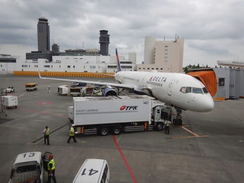

お疲れさま～！！

が．

成田到着後，すぐに帰らずに．

[以前報告したように](e4b942826f9b231b0e2e25d2b0349d5be.md)．

なぜかこんなところを観光して帰ったのでした…

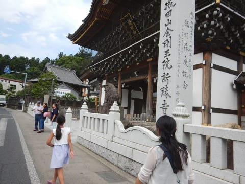

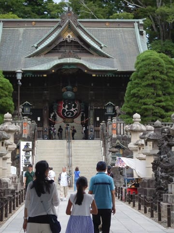

いや．

疲れた．

長い一日だった…
