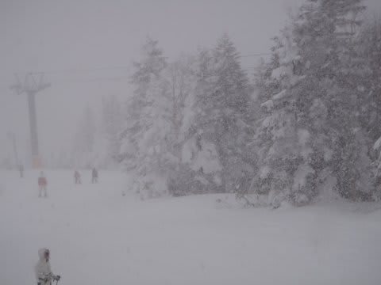
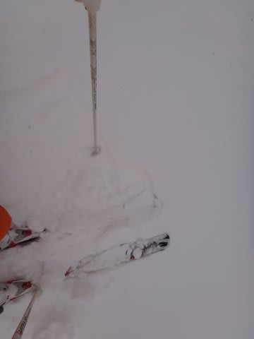
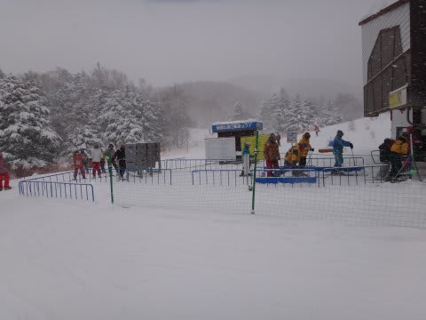
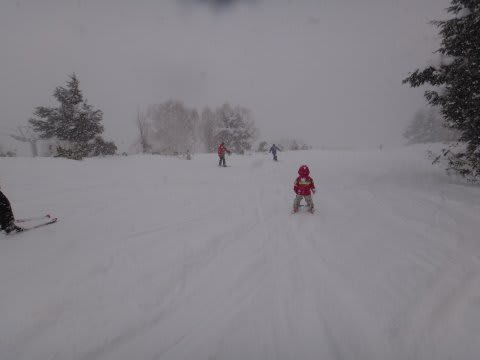
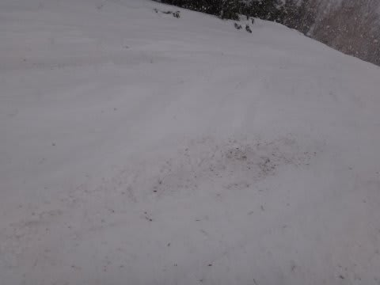
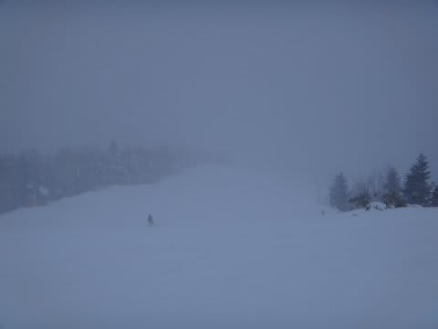

# 正月3が日の志賀高原焼額…1月2日の詳細

📅 投稿日時: 2012-01-05 23:00:55

🏷️ カテゴリ: [2012スキー滑走日記](cca3a0e9524e0203150f790b1fc3c71ad.md)

さてさて．

1月2日の志賀高原は…

元日と違ってかなりの雪と風．

昨日，全く食事をとることが出来なかったという，

問題の体調はどうなったかというとですね…

朝起きたところは，回復基調ではあったけれど，

まだ固形物は食べらんない状態．

だが．

まともな食事は無理にもかかわらず，かなりの降りっぷりを見て

「これはゲレンデは新雪パフパフに違いない！」

と，おかゆだけなんとか摂取し，ゲレンデに出てみると…

うむ？？

…ものすごい雪が降ってるにもかかわらず，非圧雪ゲレンデでも

ブーツが隠れないほどの積雪深さ．

夜は全く降らず，リフトが動き出してから降雪という

最悪のパターンだったようで…

新雪も滑れず，視界だけが悪い状況．

こ，これは…

昨日と違って．最低ではないかっ…！

さらに．ゴンドラ待ちはそこそこあったなぁ．

(まぁ，平均3分程度ですが)

リフトが寒すぎて乗ってる人が少なく，それがゴンドラに流れたか？？

(あまりにも寒すぎてがらがらの第2高速リフト)

結局，この日はほぼ1日雪は降り続いたかな．

おかげで昼前には積もった雪でコースはぼこぼこ．

かなりバンピーになっちゃった…

…だのに．

昼間に降った雪ってスキーヤーに蹴散らされ

あんまり積もらないんだよなぁ．

コース上の浮石やブッシュは隠れなかったという．

とりあえず，視界の悪いバンピーなコースは

あまり食事をとっていない体に響く…

でも．体調は徐々に回復傾向．

昼にはうどんくらいなら食べられるようになってきたよ．

とりあえず．

そのおかげで何とか一日滑りきった…．

(夕方までこんな視界の悪い状態．ゲレンデの凸凹が見えない!)

…しかし．

リフト停止と共に，雪が止んじゃったんだけど(涙)

このペースで一晩積もれば，結構良い感じだったのに…．

嫌がらせとしか思えない…

で．

雪が止んだので，昨日フルに滑れなかった憂さを晴らすべく，

ナイターに出動してしまった私．

ナイターは雪が締まって，人も少なく最高でしたね～．

＃2日間，うどんとおかゆしか食べてないのにこんなに滑っちゃだめだって

とりあえず．夜には頭痛や節々の痛みも治まり，体調もほぼ回復．

まだ消化吸収能力は低下中だけど，何とか明日は普通に滑れるかな～
