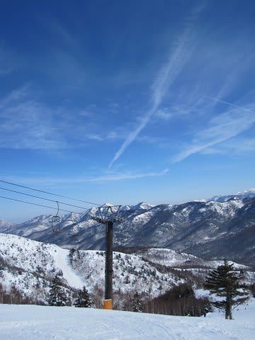
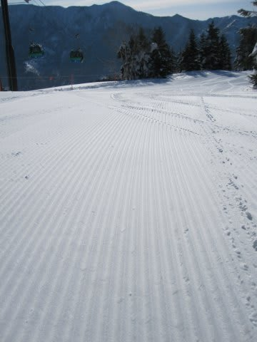
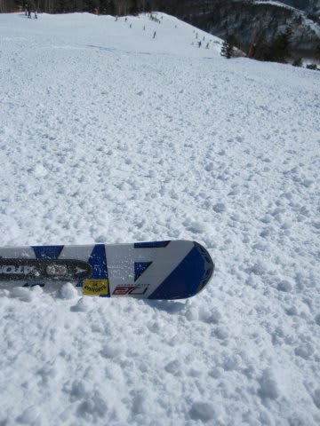
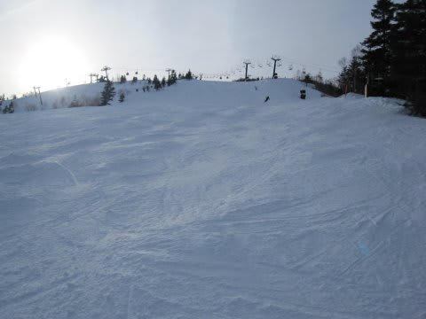

# 日曜も志賀高原は快晴

📅 投稿日時: 2011-02-21 00:23:15

さてさて．

今日…っていうか，いつものパターンで．

もう日が変わってるので，昨日ですね．

日曜は．

朝から晴れ．

くっきり晴れ．

昨日からの積雪は1mmも無いです…

朝の気温はマイナス5度と，これまでに比べると高め．

朝イチのゲレンデは，予想以上にやわらかくGood!

ただ，予想通り，一部は氷のころころが大量にばら撒かれた

じゃがいも畑になってましたが…

午前中のうちに，急斜面は上の柔らかい雪が取れて，

下のアイスバーンがコンニチハし始めました．

昼には気温が0度くらいまで上がったんですが，

意外と雪は緩まず，アイスバーンとじゃがいも畑は

やわらかくなることなく午後に突入．

午後には，ゲレンデはアイスバーンとじゃがいも畑と

コブが入り混じった，数10m滑るとグリップが全く

変化してしまう，なかなか手ごわい状況に…

ただ，ゲレンデ全面がそうなっちゃったわけではなく，

一部やわらかい雪のままのコースもありましたし，

なんにしろ天気がよく，視界が良かったので，

まぁ許容範囲内かな．

…でも，ハイシーズンのコンディションの良い時期はもう

終わりですかね…

これから，雪が溶けて固くなって…を繰り返していく

時期に突入でしょうか．

これから1週間，あったかい日々が続くみたいですし．

うーーーん．寂しいなぁ…
