# 2018/12/16(日)の志賀高原焼額山スキー場，詳細モード…今シーズン最高の朝！でも，昼ごろには人工雪コースは硬めで天然雪コースはブッシュだらけ（涙）

📅 投稿日時: 2018-12-18 00:32:14

うーーーむ．

何ということか．

人工雪を着けていない，焼額の

第2ゴンドラ上部のパノラマコース．

昨日も速報したように．結構雪が

はがれちゃって，盛大にブッシュが出て

きてたんですが…

ついに本日は，雪が薄くて圧雪できない

レベルになり．

…そして明日，火曜からは．

雪不足のため，ゴンドラ営業中止

となったようです（涙）

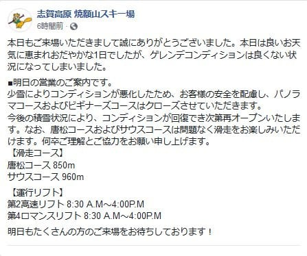

（[焼額山スキー場FB](https://www.facebook.com/yakebitaiyama/posts/1956729721089031)より）

…なんということだ…

焼額のゴンドラ．

土曜日から月曜まで，わずか3日間の

オープンでした（泣）．

ダメだ．

今シーズンはよろしくない感じ…

でも，ゴンドラが滑れた3日間がちょうど週末

だったのが，まだ救いか…

ということで．

ちょいと悲しいニュースのあとは．

昨日速報した，日曜の志賀高原．

本日は詳細レポートです！

えー．

まず．

青空で始まった，朝．

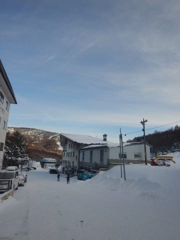

宿の周りは真っ白な冬の景色ですが．

…昨晩からの積雪はほんの数mm．

このフロントガラスに積もっているのが，

昨晩からの積雪量になります…

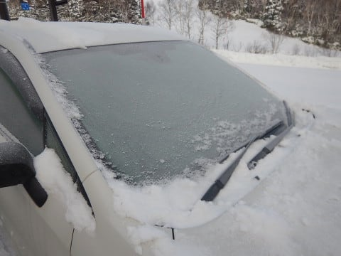

この朝は，水曜に予想した

　この日は朝は積雪なし．

　朝は晴れて，気温はそこそこ冷えそう．

という通りだったようで．

さすがわが予想，正確だなぁ…っ！←前日の，『土曜の夕方には

雪が止む』という予想は外しているけど…？（厳しいツッコミ）

でも．

ピカピカ晴天．

気温も冷え冷えとくれば…

あさイチのシマシマ圧雪が期待できるところ！

と，朝8:30のゴンドラスタートに並ぶと．

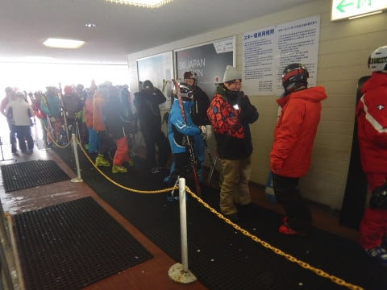

同じ考えの人が多いのか．

あさイチのゴンドラオープン待ちの人，今日は

ちょっと多めですね．

ってことで．

ゴンドラ山頂にやってくると．

気温は-5℃．

ここも予想通り，そこそこの冷えこみ

ですね～．

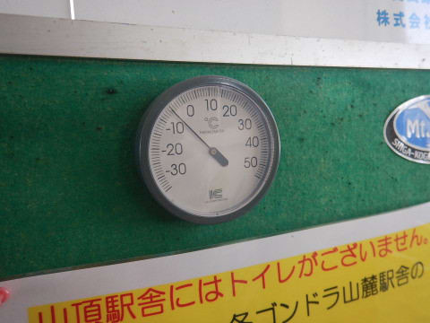

これは，朝イチの，冷え冷えシマシマが期待

できるところ…

と，第2ゴンドラ山頂ゲレンデに出てみると．

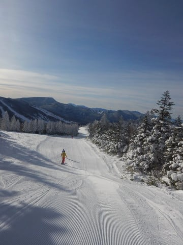

うはっはははっはは！！

最高のシマシマ圧雪じゃないですかっ！

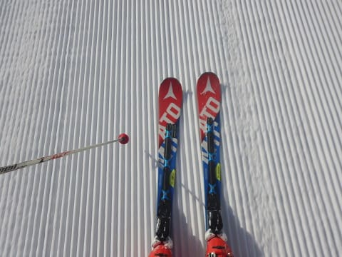

では，シマシマバーン，いただきまーす！！

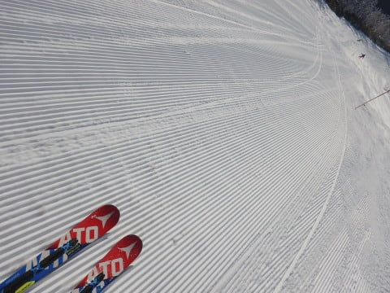

うひょひょひょひょひょ！！

予想より柔らかい，極上のシマシマバーン！！！！

最高っ！！

最高だよっ！！

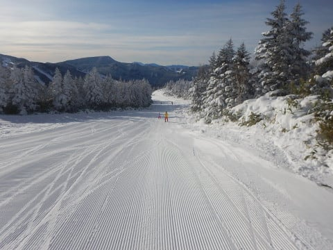

あぁ…

昨シーズンに最後に，こんな柔らかい

極上シマシマを滑ったのは，いつの

ことだったか…

おそらく3月以降，9か月ぶりの

柔らかフワフワシマシマじゃなかろうか…

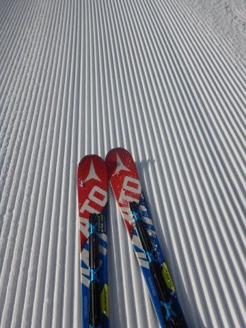

9か月間，夢に見てきたゲレンデが，

今ここにっ！！

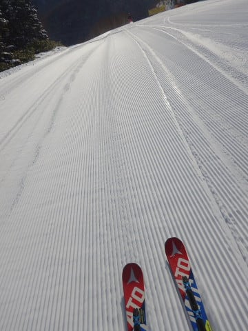

と，朝イチ1本は．

9か月ぶりのやわらかシマシマ

圧雪を堪能し．

その後も1時間ほどは，冷え冷え最高の

雪質をキープ！

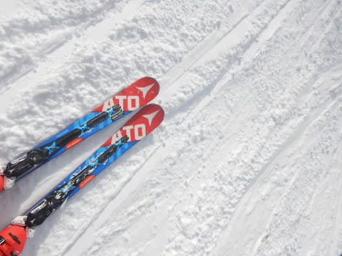

今シーズンピカイチのコンディションを

堪能すべく，ゴンドラをグルグル

してましたが…

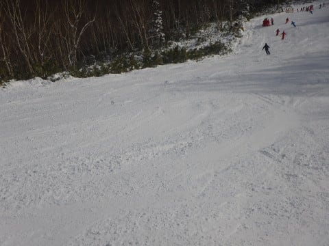

ゴンドラを数本滑ると．

某都道府県連の指導員研修会の皆さんで，

ちょっと混み始めてきましたね…

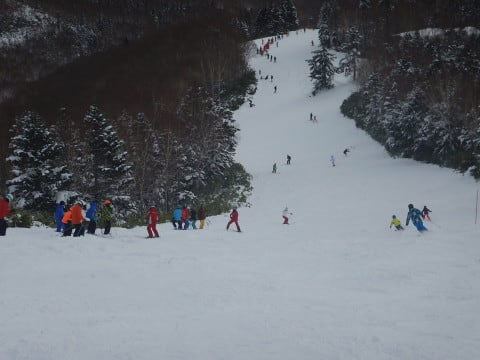

そして．

人が増えてくると．

人工雪を着けていない第2ゴンドラ上部の

パノラマコースは…

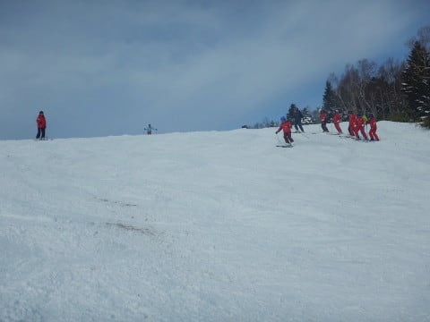

うーむ．

まだ午前中というのに．

もうブッシュが出てきてるんですが…（涙）

ブッシュを避けて，人工雪をしっかり

着けている，第2高速リフト側，

唐松コースに行ってみると…

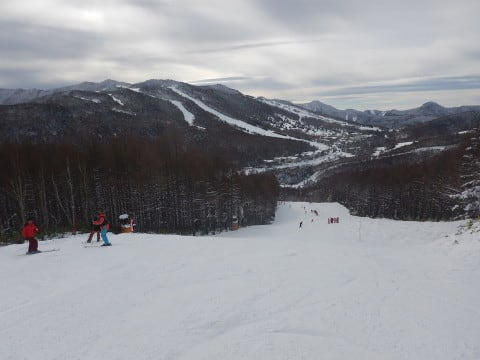

こちらでも某都道府県連の研修会を

やってますけど，それほど混んでなくて．

「お，いいんじゃない？？」

と思いましたが…

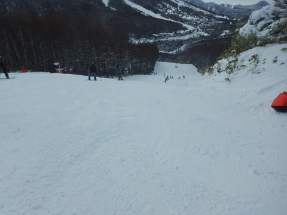

でも．

コース上には，人工雪が固まったのか．

大量のコロコロが…（涙）

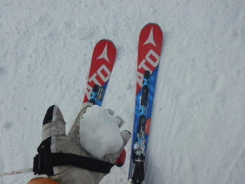

ふわふわ雪だったゴンドラから

やってくると，これは微妙に悲しい感じ…

で．

コロコロを避けて，ゴンドラに戻ると．

ゴンドラ側の方が，コース上の人口密度が

高くて．

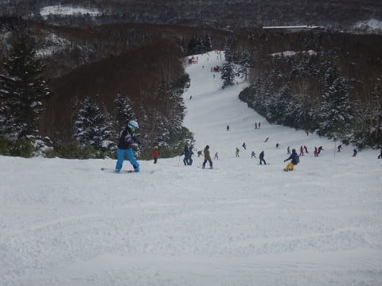

大勢の人が雪を削るせいで，

ブッシュエリアがかなり広がってきた

感じ…（涙）

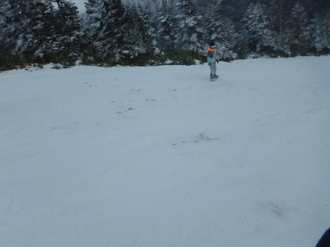

まぁ，人口密度がこんな感じで高くても．

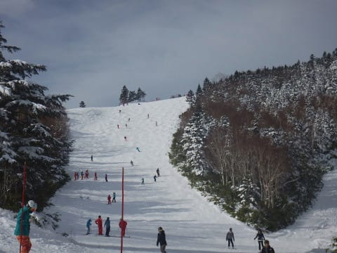

ゴンドラ待ちはそれほどなくて．

ゲートから人があふれることは

ほとんどなかったのが救いでしょうか…

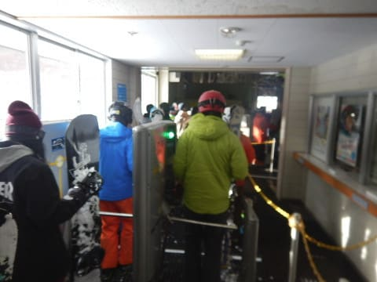

ただ．

昼前に某都道府県連の研修会が終わると．

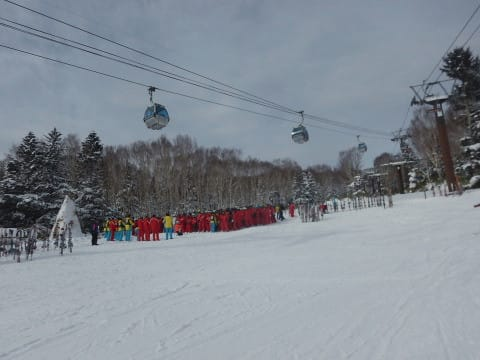

ゲレンデは一気に人が減りましたよ～！

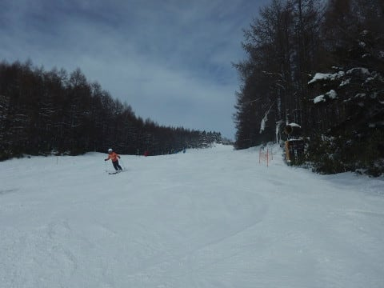

しかし．

午後になると，第2高速リフト側の唐松コースは，

ところどころ，かなりツルツルになってきた

所もあり…

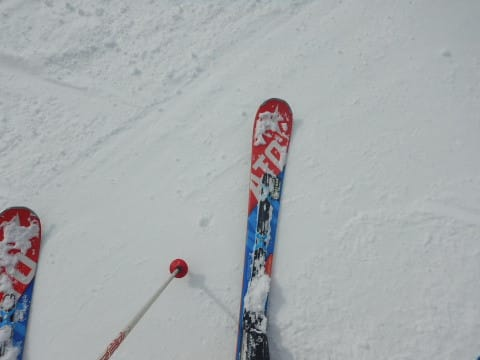

そして，第2ゴンドラ上部の，人工雪を

着けていないパノラマコース．

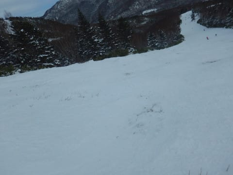

なんだか．

ブッシュがかなりひどくなってきて．

石やブッシュを踏まずに滑るのが

むずかしくなってきたんですが…（涙）

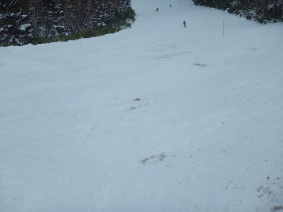

ってな感じで．

最高シマシマの朝に比べて．

午後はちょっと固めのバーンか

ブッシュだらけのバーンという，

ちょっと残念な感じの2者択一

ゲレンデでしたが．

それでも昼間の気温は-2度と冷え冷え

だったので．

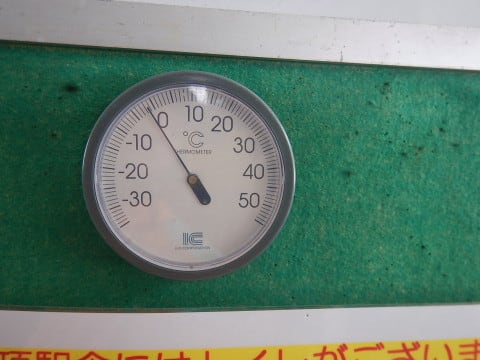

雪が解けていくのに比べれば，

ナンボかマシなはず…

と，自分に言い聞かせながら．

午後3時ごろには誰もいなくなり，

貸し切り状態になったゲレンデを．

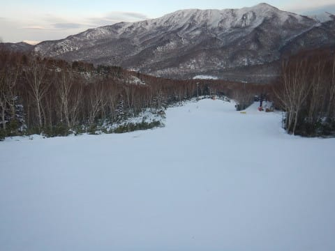

夕日が沈み，薄暗くなっていく中．

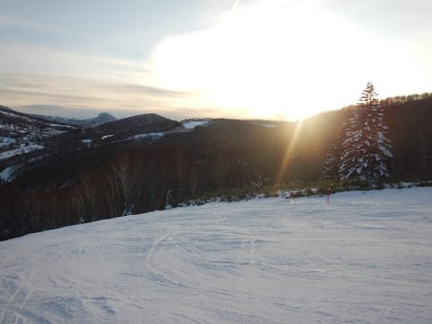

本日も，いつも通りのリフトストップまで．

思いっきりかっ飛ばして．

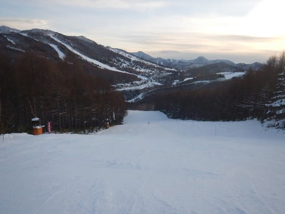

定番の，営業終了ギリギリのラストリフトに

飛び乗って，この週末を終えたのでした…

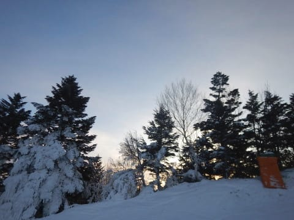

うーむ．

明日はゴンドラが動かないみたいだけど．

今晩から20日朝までは，雪が降りそうなので．

なんとかまたゴンドラ動いてくれないかな…

…でも．19日から20日まで，かなりの

西風なんだよな…

日本海側はすごい積もりそうだけど．

志賀高原も積もってくれるかな～…

## 💬 コメント一覧

### 💬 コメント by (葛飾のS)
**タイトル**: 焼額山で
**投稿日**: 2018-12-18 06:03:07

日曜日朝から焼額山で滑っていました。

GOKU夫妻発見して、奥様の滑り綺麗でした。

夫妻と一緒に唐松コースをボーゲンでとんでもないスピードで滑り降りていく男の子見たんですが関係者だったんですね〜。

また声かけられずじまいでした。

もうかなりの有名人になりましたねー(^^)

白馬も雪降ってくれないかな〜😘

### 💬 コメント by (Skier_S)
**タイトル**: 葛飾のSさま
**投稿日**: 2018-12-19 03:26:12

あれ！

焼額にいらしてたんですね…

おそらく，ご覧になったのは関係者…というか，

わたしと一緒に滑っていたお子さんだと思います．

…また，次の機会には声をかけてください～！

