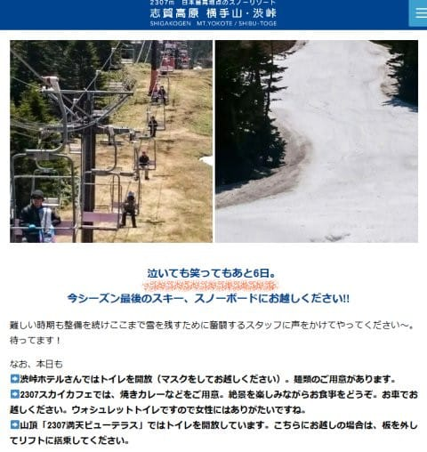
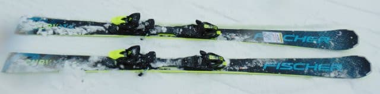
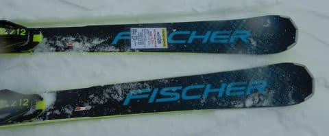
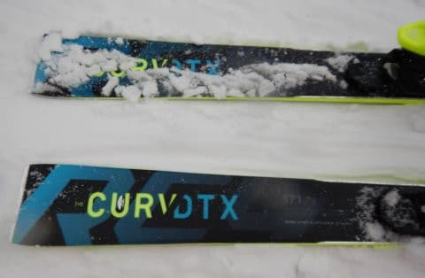
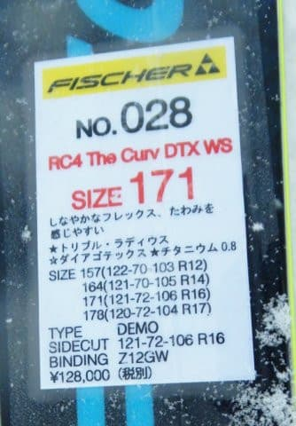
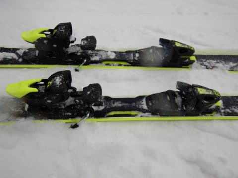

# 2021シーズンモデルのスキー板，試乗レポート…FISCHER RC4 The Curv DTX

📅 投稿日時: 2020-05-28 00:53:13

🏷️ カテゴリ: [スキー板試乗](c0bd8048615710cee890e403a36cc9a2b.md)

横手山スキー場のHPに，

泣いても笑ってもあと6日

と出ていて．

（[横手山スキー場HP](https://yokoteyama2307.com/news/9168/)より）

あぁ…渋峠ももう終わっちゃうんだと

思った今日この頃．

皆様いかがお過ごしでしょうか．

ということで．

5月最後の週末で，渋峠もついに終わるようですが．

いろいろ調べてみると，

私の住むK奈川県は，6月19日まで，県境をまたぐ

移動は控える必要があるようなので．

うーむ．

私がスキーに行けるのは，最短でも6月20日の週末か…

それまで，月山はもってくれるのか…？？

…ちなみに，月山は今週末の30，31日も

山形県民のみへの開放で，[リフト券売り場で
身分証明書が必要となる](https://gassankanko.jp/information/5-30-31%e6%9c%88%e5%b1%b1%e3%83%9a%e3%82%a2%e3%83%aa%e3%83%95%e3%83%88%e5%8f%8a%e3%81%b3%e3%82%b9%e3%82%ad%e3%83%bc%e5%a0%b4%e3%81%ae%e5%96%b6%e6%a5%ad%e3%81%ab%e3%81%a4%e3%81%84%e3%81%a6/)ようです…

で，

6月1日からは，毎日の営業となるようです…

ってなことで．

本題へ．

本日も，2021シーズンモデルスキー板の試乗レポート．

フィッシャー編です．

では，どうぞ～！

○FISCHER RC4 The Curv DTX 171cm

基礎オールラウンド

どちらかと言うと長さ164cmのモデルではR=14と，

小回りベースっぽい感じがするサイドカーブ

ですが，長さ171cmでR=16なので，まぁ

どちらも行けるオールラウンド板ですかね…

The CURVの「DTX」が着くこのモデルは，

RC4 SCのPROじゃない方と同じ，

優し目のM-TRACKプレートが着くので，

フレックスはガッツリ固めというより，

適度なしなやかさがある感じ．

そのため，R=16の171cmという感じよりも，

ぐっとたわんで小さく回ってきてくれて，

レールターン的に切って行っても

かなりの旋回性で板が回ってきます．

感覚的に，やはり小回りベースの板に

感じますね…

フレックスは柔らかめだけど，トーションが

そこそこ強いのか，しっかりいい感じで

グリップしてくれるので，たわみに乗った

小さめの半径で切れていくカービングが

楽しめます．

低速からたわんでくれるので，

かなり低めのスピードから，半径が

小さめのカービングに入れることができます．

ただ，低速からたわむから，高速だと

たわみすぎてどうしようもなくなるか…

というと，そうではなく．

スピードを出してもたわみきって窒息

するような感じは受けず，高速になるほど

サイドカーブが大きくなるように感じる，

かなり不思議な感じの板です…

板の返りはそんなに早くないので，

小回り強制マシーンではありません．

この板を履いて，奥志賀のエキスパートコースを

かなりのスピードで落ちてみましたが…

スピードに負けることなくガッツリトップから

テールまでエッジがグリップし，

板が回りすぎることもなく，いい感じの

キレキレで滑っていくことができました…

ズラシのコントロール性も悪くないです．

どうしようもなくグリップが強すぎて

エッジが外せない板では無いので，

ずらしても問題なく滑って行けます．

でも，この板は，低速からすっとたわんで，

しっかりエッジが効いたカービングで

滑って行けて．

トップスピードでも，トップからテールまで

エッジが食い込んで，きれいに楽に回って

くれるので．

サイドカーブとたわみに乗って，気持ちよく

カービングしていくのが気持ちいい，

まさに「The CURV」という名前に

ふさわしい板だなぁ…と思いました．

ゲレンデの中で，ゆっくり目のスピードでも，

楽にしっかりエッジに乗ったカービングで

小回りから大回りまで自在にこなせるし．

スピードを出しても板が逃げていくような

弱さはないし．

いい板ですね～！

…でも．

何でもできる優等生過ぎて，

刺激が足りない…

と思ってしまった私は，SXとかの

過激な板に慣れすぎてしまっている

のかもしれない…
