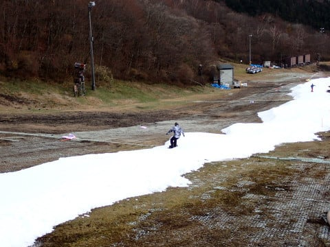
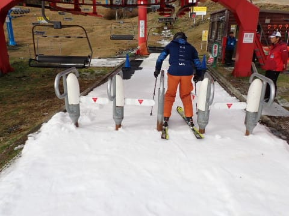

# 2023/11/12(日)のイエティ詳細レポート！…ゲレンデは激狭．リフトは平日並みのガラガラだけど，人を抜くのがほぼ不可能のコース幅

📅 投稿日時: 2023-11-14 02:23:10

えー．

[先週水曜の記事](e83e81374a9349a70d8a034286fe537c8.md)で，

13日月曜は雪が積もりそう…

と書きましたが．

予想通り，志賀高原では雪が積もった

みたいですね～…！！

志賀高原のライブカメラを見ると．

一ノ瀬ファミリーも真っ白だし…

熊の湯も大体真っ白になってます…！！

（[志賀高原スキー場ライブカメラ](https://www.shigakogen.gr.jp/live/index.html)より）

いやーーー．

ゲレンデが白くなってくると，テンションが

上がってきますね！！

…ただ．

積雪量はそれほど多くなく…

せいぜい3-5㎝ってところで，まだ

スキー場オープンには程遠い感じ…（涙）

頑張れ，人工降雪機っ！！！

…ってなことで．

11月7日の涙の土砂降りゲレンデ壊滅から

復活，11月12日の日曜に，再オープンした

イエティで滑ってきた，詳細レポートです…！

えー．

まず．

前日の11日の18時ごろ．

「12日の9時から営業開始予定！」

と案内されたので．

営業開始の9時前にゲートにやってきますが…

やはりゲレンデ状況が悪化しているからか，

ゲート前に並んでいる人は先週までより

ずっと少ないですね…

ちなみに，17日まではゲレンデ状況の

悪化を受けて一日券が土日・平日ともに

通常料金から1000円引きとなっていますが．

メルマガ割引は通常価格からの割引で，

1000円引きからの割引じゃないので

ご注意を…！

で．

予定通り9時にゲートがオープンし，

今日から営業再開のゲレンデに向かう

わけですが…

ゲレンデに到着すると…

…うわ，狭っ！！！！

覚悟はしてたけど…

これは狭いよ…っ！

ゲレンデはピステンかけたてのシマシマ

だけど…

そして，硫安が効いていてかなり硬い，

板が走る良い雪だけど…

この狭さでスピードが出ると，ワンミスで

狭いコースからはみ出しそうなので，

ちょっと怖いかも…！

昨日の夜まで必死に造雪して，雪山を

コース上に並べていたゲレンデ．

今朝から圧雪して，コースにしたわけ

ですが．

雪山をきれいに平らにつぶし切れていない

感じで，凸凹してるし．

コース全面，凸凹が残ったまま，硫安で

結構ガチガチに固まっているので…

これだと，この狭いコースから飛び出す

人が続出するだろうなぁ…

（実際その通りだった）

必死に造雪して作った雪山を，いかにも

つぶしてコースにしたばかりという感じ

だけど．

…でも，よくも4日間だけで，ここまで

コースを作ったものよ…

そして，

リフト乗り場も雪はしっかりつけられて

いて．

降り場もちゃんと雪が入れてあるので．

リフトの乗り降りも支障がないくらいに

整備されています！

すごい！

でも…

遠くから見ると，まさに紐ゲレンデ．

コース幅は，狭いところだとボーダーが

横に向くと，左右の残りがそんなにない

感じに見える狭さで．

あさイチは人が少なかったからいいけど…

これ，人が出てくると絶対コース上で

人を抜けない幅だよね？？

まぁ，人の出足がかなり鈍かった感じの

この日は，朝はしばらく人が少なくて

良かったけど…

10時近くになると，危惧した通り

コース上の人が増えてきて…

これ，前の人についていって滑るしか

ないですよね…

車間距離ならぬ安全な人間距離を取って，

相手が予想外の動きをしてもぶつからない

ように注意して滑らないと，

コース上でビリヤード状態になって，

人をはじき出すかはじき出されるかの

勝負（？）になっちゃいそう…

いや…

十分注意して滑りましょう…！！

ただ．

コース上はこのくらいの人口密度に

なっているのですごい人がいるように

感じるかもしれませんが…

単にコースのキャパシティーが低い

だけで．

コース上はこれだけ混雑しても，リフト

待ちは最大で待ってもこの程度．

午前10時から11時半くらいまでは

ちょっと待ったけど，それ以降は

コース上の混雑に懲りたのか，

人が減っていき…

午後になったほうが混むイエティとしては

珍しいことに，午後のリフト待ちは

平均的にこの程度とガラガラで．

タイミングによっては飛び乗り状態と，

リフト待ちに関しては，ノーストレス

でした…

でも．

コース上は…

ボーダーのビン着け場は，幅が狭い

のもあって，通り抜けるのもつらい

タイミングがあったり…

リフトがガラガラでも，

コース上の人口密度は相変わらずで．

1車線道路を前の車の流れについて

走っていくような．

そんな感じで，リフトを降りてから

リフト乗り場まで，一列でつながって

移動していく感じ…（ちょい涙）

まぁ，雪の厚みは十分あったし，

気温もかなり低く，曇り空で日差しも

なかったので，雪が融けて地面が

出てくることもなく．

その点はよかったけど…

午後になってもコース上は

相変わらずの人口密度で．

さらにコース上にところどころ

造雪機の雪で雪山を作っているの

ですが…

コース幅が狭いので，ほぼ幅いっぱいの

小山になり，午後はさらに滑りにくさ

アップ！

いや…

なかなか厳しい感じ…

さすがにこれだけの人が狭いコースを

通るので，午後はちょっと雪が凸凹

してきましたが…

でも，雪の厚みは十分あるので．

ちょっと茶色くなった部分が数か所

できたくらいで，コースに穴が開いたりは

しなかったのはよかったかな…

と，思っていたら．

午後2時過ぎには，なぜかいきなり

ガスが出始め…

うぎゃーー！！

コース幅が狭いうえに，凸凹が

見にくくなってきて…

これは危ない．

この状況では，さすがの私も

楽しめる

というレベルではなくなってきて．

人と衝突しないように冷や汗をかきながら

何とかリフト乗り場にたどり着く…

という感じになってきたので．

リフト待ちが少なかったおかげで，

午後3時ごろまでで，先週の朝からナイター

1時間滑ったよりも多くの本数を滑れたので．

とりあえず今日は満足したことにして，

珍しく早めにきりあげたのでした…

いやー…

エキサイティングな一日だった…

かなりいろんな意味で，

スリルを味わえた一日

でした．

まぁ，これから1週間でさらにコース幅が

広がってくれるとは思いますが．

17日，イエティではまたヤバそうな雨に

なりそうなので，ちょっと心配…

来週はコース幅がまともになってます

ように！（祈）
