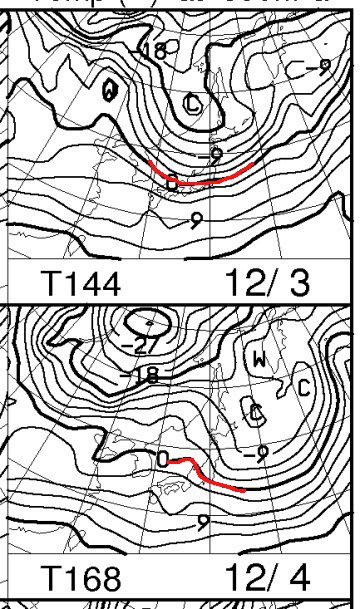
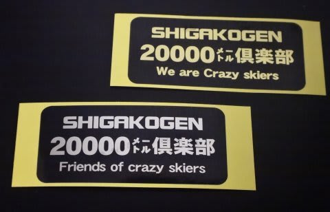

# 今シーズンも，20000mクラブ準会員募集っ！志賀高原でSkier_Sを見つけてください（笑）

📅 投稿日時: 2016-11-30 02:18:13

🏷️ カテゴリ: [日記](cc4b5682fb7b8b144980957a978653fb0.md)

えー．

今日は冷えて，スキー場はそこそこ積もったようですね．

かぐらは20cmほど積雪の積み増しがあったようです！

（[かぐらスキー場FB](https://www.facebook.com/snowkagura/posts/1034225206704799)より）

この雪で，ゲレンデ状況は一気に改善している

ようですが…

…しかし．

やっぱり．12月1日は雨になりそうです（涙）

…でも，昨日の予想通り．

それほどひどい降りにならずに，ぱらぱら程度で

済みそうな感じ…

で．

昨日の余談に書いた，850hpaの気温偏差予想．

今日の予想では，こんな感じになりました…

…やっぱり，水色で示した点線のGSM予想も，

赤色で示した太線のアンサンブル平均に

近づき，それほど冷えない予想に

変わってきました…

赤線のアンサンブル平均は，

この，昨日の図と比べると…

4，5日の気温がちょいと高くなりましたが．

3日までの予想は大きく変化していませんね～．

ということで．

やはり，GSMとアンサンブル平均が離れている

場合は，アンサンブル平均に予想が近づいていく

パターンが多いのかと．

だもんで．

GSMに基づく850hpa気温図．

昨日の予想ではGSMは3，4日は冷え冷え

パターンだったので，

こんな感じで冷える予想だったのが…

今日の予想では，GSMに基づく

850hpaの3，4日予想は

あうーーーん（涙）．

やっぱり，冷えない予想に変わってます…（泣）．

4日の日曜に至っては，0℃線は北海道まで上がってます…

まぁ，雨は降らなさそうなので．

気温の高めで晴れた，ちょっと春っぽい天気に

なるのかも…

こんな感じで．

スプレッドが大きく，GSMとアンサンブル平均が大きく異なる

局面では．

FZCX50の850hpa気温図は，あまりあてに

しない方が良いでしょう…←誰に向かって言ってるんだ？これは？？

とりあえず，

この週末，12月3，4日の詳細天気予想はまた明日の夜に

やりますので，お待ちください…．

…という．

かなりマニアックな前フリのあとは，

本題へ．←ここまでが本題だったのでは？？？

[20000mクラブ](ea8a953c4b60b5eec845669ca5ba7bf0f.md)…

…それは．

志賀高原のSkilineで．

一日滑走標高差20000m以上の記録を残したことがある，

それはそれはおかしい素晴らしい人たちを指す，

私が勝手に作った呼び名．←自分もおかしい人たちの仲間入りをしたのでは？？

昨シーズン．

20000mクラブの大親分である，

2016シーズン滑走標高差ぶっちぎりトップの

Kon Sukeさんが，[20000mクラブのシールを
作ってくれて．](ea21258d98d51b7d389af7b21d2ad3dc4.md)

終わった人の印20000m突破者の印であるゴールドシールと．

スキーを愛し，志賀高原を愛する人．

そして，[Skiline](eb2a0029115b8205c8168295e2d9d49ef.md)に登録してガンガン滑ってやろう！

…という人なら，誰でも権利がある．

20000mクラブの準会員の印，シルバーシール．

この2種類のシールがあるわけですが．

そうです．

今シーズンも引き続き，シルバーシールを

配布します！

20000mクラブの準会員になりたい…

という大変奇特な方がいらっしゃいましたら．

志賀高原でSkier_Sを発見してください．

シールをお渡ししますよ～！
