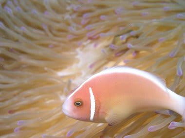
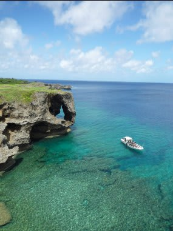
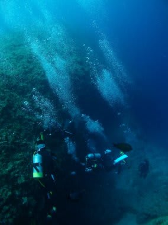

# 初の子連れダイビング旅行記＠2009年　プロローグ1

📅 投稿日時: 2012-07-10 00:10:13

🏷️ カテゴリ: [ダイビング日記](ce3a7a8d424d112fce83ee85c81a0e344.md)

というわけで．

子供ももう1歳を超え．

この冬はスキー場にもデビューさせました(注：このレポートを書いたのは2009年です…)

この夏は，なんとかダイビングデビューもさせなくては．

…あ，子供は潜れませんからね．子供は．

両親のダイビング旅行に連れて行く，って意味合いで．

なんにしろ，子供は3歳になるまで飛行機代がタダ．宿泊費もタダのところが多い．

この時期にがんがん行っておかないと…

＃何か基準がおかしい気がするけど

しかし．

妻は出産前後，まる3年近く潜ってないわけで．

もう，スキーのゴーグルと勘違いしてマスクから鼻をだしてたり，

レギュレータを上下逆につけたりしかねない，完全なブランクダイバー．

…事実，「BCにタンクつけるとき，バルブがどっち向きになるように

つけるんだったっけ？」

と，寝ぼけたことを言っている状態．

寝言は寝てから言いましょうね．

ホントは去年ダイバーとして復活の予定が，

やはり1歳に満たない子供を連れてダイビングに行くのは

ちとつらいということで，流れてしまったもので．

今年はもう子供も1歳8ヶ月．

大人の食事を取り分ければ食べられるので，全日程，

全食事の離乳食を持っていくという必要もなくなったし，

夜中もある程度寝てくれるようになったし．

何より，自ら歩いて移動するようになったので，ベビーカーも不要．

さらに，一緒に海辺やプールで遊べるようになったので，

ダイビング中に子守をする人間が，ずーっと部屋にこもったり，

屋外に出てもただ寝転がってるだけの子供を見てるだけ，

ということもなくなりました．

…となると．

子連れダイビング計画，実行しましょうか．

今回の目的地はいきなりの沖縄です．

目的地の条件としては，

・ダイビング1本終了ごとに，港に帰ってくるスタイル

　…このスタイルじゃないと，母親が朝ダイビングに出たっきり

　夕方まで帰ってこないということになるので，ちょっと無理．

・港とショップ・ホテルが近い

　ダイビング中，子供＆子供番が，ショップあるいはホテルで

　待機できる

・宿はそこそこのホテル

　今回，祖父母も招くので，民宿はNG…

　うーん．私は国内では民宿が好きなんですが…

この条件を満たすのは…

まず，そこそこのホテルがあるという条件で，

久米島，本島，宮古，石垣程度に絞られます．

うーん．慶良間が落ちてしまうのが痛い…

さて，何処へ行こうか？？？
