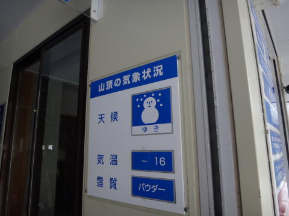
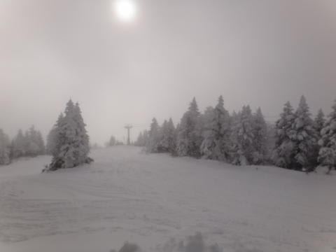
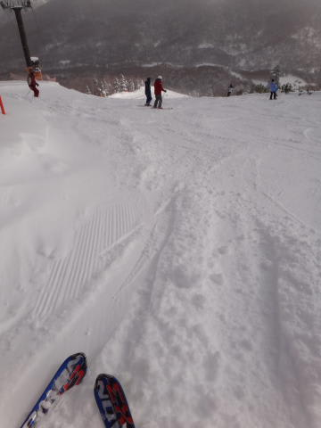
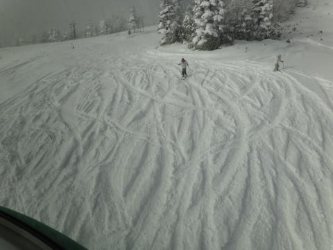
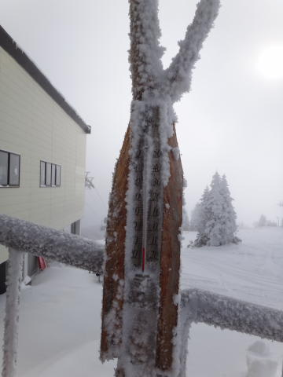
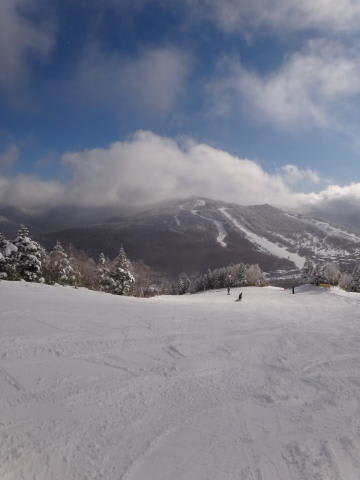
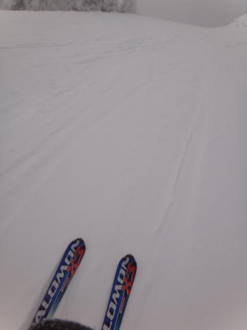
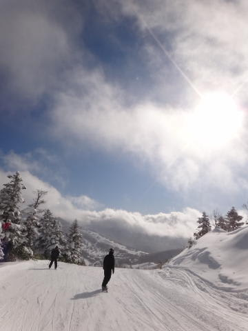
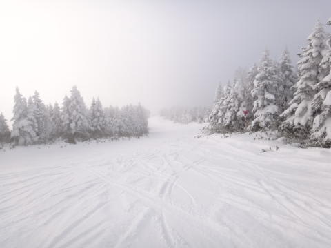

# 12月23日の志賀高原　焼額は…

📅 投稿日時: 2011-12-23 22:14:19

うーむ．

吹雪くはずの天気図だったけど．

微妙に低気圧が北に外れ，そして先日書いたように，

プチ低気圧やプチ高気圧が本州上空でできて，大きな低気圧の

影響を緩和してしまったため．

思ったほど大荒れにならず…

昨日書いたように，「意外と積もらなさそう」といった

ところは当たってしまったけど，大荒れの天気予報は

大はずれ．

今日の焼額，多少風はあったものの，うす曇，

時々小雪が舞ったり日が射したり，というところで

それほど荒れませんでした…

…すいません．天気予報，外しました(涙)．

昨晩からの志賀高原の積雪は10cm弱でしょうか．

あー．

でも．

志賀高原の上り坂はつるつるでした．

雪道初心者の方はご注意ください．

登れなくなってる車が4-5台はあったかな．

んで．

本日から．

ついに．

焼額第1ゴンドラ運転開始～（ぱちぱち）

第3高速や山の神も動きました．

朝の気温はマイナス16度．

天気もよそうより良く，ゲレンデもかなりがらがら．

雪は，午前中は最高．きれいなやわらかーーーい圧雪の上に

5cm程度の軽い新雪という，最高のバーン．

昼ごろからちょっとでこぼこ荒れだし，

ごく一部にブッシュも見えましたけど…

昼間も気温はマイナス8度程度までしか上がらず，

かなりの冷え込み．

ゴンドラの待ち時間は最高2-3分が1-2回あったかな，

って感じで，あとはほとんど待ちなし．

天気そこそこ，

雪よし，

人少なし．

なんにしろ，ここまでがらがらで飛ばせるコンディションは

そうそうないでしょう…

という感じで．

第1ゴンドラ営業日初日は楽しめましたよ～

明日から，菅平へ行ってきます．
