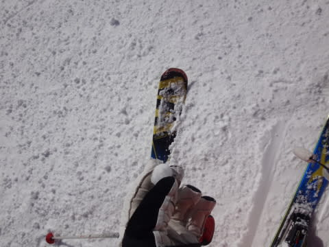

# 12月31日，大晦日の志賀高原は…晴れ時々曇り．朝イチ最高！…でも，結構混んだよ

📅 投稿日時: 2016-12-31 22:36:17

🏷️ カテゴリ: [2017スキー滑走日記](c7d777cecfc91bdf0fa464ad62c6d49ab.md)

…今日は大晦日ということで．

結構飲んでます．

だもんで．

今年最後のスキー場レポート．

ちょっとショートバージョンで…

本日の朝．

…曇りの予想を外し（涙）．

山麓は晴れで始まった本日．

山頂に出ると…

気温はマイナス7度と，

昨日よりはちょいと高めの気温で．

山頂は予想通り，雲がかかって曇りになってますが…

山頂の雪は，シマシマっ！

ふもと近くに来ると，日が差すシマシマ！

そして．

すぐに山頂の雲も取れて，

晴天になってきましたよ～！

北アルプスもすっきり見える，晴天！

オリンピックコースも朝イチは

ピカピカ圧雪のシマシマ，

晴天圧雪で気持ちよかったよ～！！

…しかし．

しかし．

年末休みの晴天．

ゴンドラ待ちは5分くらいまで延び…

普段混まない第3高速リフトも混んだし…

ゲレンデの人口密度も高めでした…

まぁ，混雑してたとはいえ．

すっきり晴天，さらに気温も低めで，

雪質も一日中比較的よいほうでしたが…

ところどころ，わずかに硬いコロコロが出てる

部分があったり．

固い下地が出てるところもあったり…

…そして．

人が多かった本日．

人の多い午後の定番．

あら．

やっぱり来るのね，凸凹さん…

夕方ラスト近くは，かなりの凸凹になりましたが．

でも．

時々雲が流れて，日が陰ったタイミングも

あったものの．

今日は終日，天気には恵まれて，良かったですね～！

…しかし．

岩菅山より北は，終日雲をかぶっていたので．

もうわずか，風向きが北に回ったら，

志賀も終日曇り～小雪の一日でしたね…

＃天気予想を外した言い訳をしている(^^;

ということで．

本日も，16:30のラストリフトまで

滑り続けたのでした…

…ってなわけで．

2016年もラストになりましたが．

読者のみなさん，今年もお世話になりました…

またこれからも，懲りずに読み続けてください（笑）

では，来年もよろしく～！！！

伝言：本日3時頃にお会いした方，志賀高原常連さんとの

　ことでしたが，ステッカーを持ち合わせていなかったので

　お渡しできませんでした…すいません．

　もし，希望でしたら．

　また次お会いの際に，お渡しします～

　ごめんなさい！

## 💬 コメント一覧

### 💬 コメント by (Goku)
**タイトル**: 良いお年を
**投稿日**: 2016-12-31 23:47:26

昨日のナイターから想像すると今日の朝イチはさぞかし最高だったことでしょう。

いいな～。

さて今年も残すところあとわずか。

来年も宜しくお願い致します。

では、良いお年を！

### 💬 コメント by (KENKEN)
**タイトル**: あけましておめでとうございます。
**投稿日**: 2017-01-01 01:24:01

昨年は本当にお世話になりました。

先ほど北海道より帰ってきました。(本当に疲れた)

色々大変なことも楽しいこともありました。

ニセコより札幌(テイネ)の雪質が良くショックでした。

今年も宜しくお願いします。

### 💬 コメント by (komu)
**タイトル**: おめでとうございます
**投稿日**: 2017-01-01 01:29:34

今年もよろしくお願いします。

今日は横手山で滑って熊の湯松明年越やってきました。明日も滑りますよ〜

### 💬 コメント by (Unknown)
**タイトル**: Unknown
**投稿日**: 2017-01-01 06:40:15

夕方3時頃にお会いした者です。

夫婦で拝見させて頂いています。

今日も会えたらよろしくお願いいたします。

### 💬 コメント by (はなげ親分)
**タイトル**: あけましておめでとうございます
**投稿日**: 2017-01-01 10:42:15

今年もよろしくお願いいたします。

いいコンディションでの年越しうらやましいです！

かみさんの手術の経過がよければ、９～１０日に行けそうです～

### 💬 コメント by (こじろう)
**タイトル**: 明けましておめでとうございます
**投稿日**: 2017-01-01 15:38:54

2017年 初シマシマをお楽しみになったことと思います。今年もスキー場レポートを楽しみにしております。

### 💬 コメント by (Skier_S)
**タイトル**: みなさん，あけましておめでとうございます．
**投稿日**: 2017-01-02 01:32:46

＞Gokuさま

昨日の朝イチシマシマは最高でしたよ～！

今日も早朝は最高でした…

あと，ナイターも(笑)

また今年もよろしくお願いします！

＞KENKENさま

あら？

あれだけ冷えまくったニセコ，雪が悪かったんですか？

また3連休は志賀ですね～

よろしくお願いします！

＞Komuさま

あけましておめでとうございます～．

たいまつ滑走やったんですか．

今日も熊の湯ですか？

今年もよろしくお願いします～

＞Unknownさま

お二人ともすごい滑りのレベルが高かったので

感動してました…私のような単なる

レジャースキーヤーと違いそうな雰囲気を

感じたのですが…

ぜひまた志賀高原で一緒に滑りましょう！

PS．今日は衝撃のうちの妻との出会いでしたね(笑)

　コンタクトの件など，いろいろお気遣い

　ありがとうございました．

＞はなげ親分さま

え？3連休に復帰ですか？？

まさか，奥様は3連休は滑られませんよね…

しかし，手術ですか…

手術の経過が良くなることを祈ってます！！

＞こじろうさま

あけましておめでとうございます．

また，シマシマ写真をいっぱい載せますので，

今年もご愛読のほど，よろしくお願いします～！

