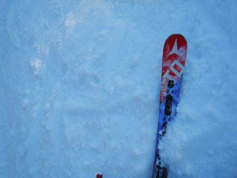

# 2020/12/6(日)志賀高原，焼額山スキー場詳細レポート！…ガラガラ土曜と違って午前リフト待ち10分．でも午後は待ち少なく雪はまぁまぁ，結構楽しめたよ

📅 投稿日時: 2020-12-10 02:25:19

🏷️ カテゴリ: [2021スキー滑走日記](c2b0fc073d6357d3b786f6ca655147f7d.md)

えー．

最近ちょっとヤバいくらいヤバい感じの

今日この頃，皆様いかがお過ごしでしょうか…

って感じで．

昨日も更新が無く．

Skier_Sは生きているのか？？

…と心配してくれた心優しい人が，地球上に

3人くらいはいてほしい…と願っているわけですが．

はい．

昨日も死んでました

…いや．今日もBlog書いてる場合じゃない

気がするんだけど…と，自己ツッコミを

入れたいのですが．

でも，書く！

昨日更新しなかったから，今日ちゃんと

更新する！

えらい！偉いぞ！！自分！！←自分を誉めないとモチベーションが上がらない

…というか．

なぜここまでしてBlogを書いているんだろう？？

と，自分でも疑問に思ってるけど．

でも，更新！

本来なら，水曜なので週末の予想をするところですが．

本日は軽く週末予想をして，

その後，いまさら感がある日曜の焼額詳細レポートを

お送りします！

えー．

ってなことで．

この木・金は．ほぼ積雪が無く．

金曜は日本海側の標高が低いスキー場で，

パラパラと雨がぱらつくことも

あるかも…？

という感じながら．

とりあえず，標高が高い志賀なら人工雪が

打てそうな気温が続くので．

まぁ，この土日までに，志賀では人工降雪で

滑れるエリア・コース幅はちょっとだけ

広がりそうな感じ…！

で．

土曜12日は…

うーむ．赤い0℃線はギリギリ

志賀高原の南．

まぁ，標高が高い志賀なら，

降れば雪の気温．

で．地上天気図は…

ギリギリ志賀に降水域がかかっているので．

これは，土曜の夕方あたりから志賀高原も

雪がぱらつきそうかな？？

で．日曜13日．

前回の予想では，+6℃線が志賀高原に

近づき，降れば液体という，

デンジャラスな気温でしたが…

今回の予想では改善してます！

0℃線はギリギリ志賀高原付近に

留まってくれているので，かなり湿っぽい

雪かもしれないけど，降っても雨には

ならなさそう…！！

そして，日曜の地上天気図は…

これも，ギリギリ志賀に降水域が

かかっているので．

日曜も時折雪がぱらつくくらいの

天気かな…

ってなことで．

12日土曜：曇り⇒午後は雪がぱらつくが，積もるほどではない．

　人工降雪機が動かせる気温で，オープンしているのは

　人工降雪コースのみなので，コースコンディションは

　そんなにひどくないはず．

13日日曜：曇り時々雪がぱらつく．

　朝は数cm天然雪の積雪があるかも．

　あさイチは人工雪にうっすら天然雪が

　混ざったいいコンディションかも．

って感じでしょうか…

また明日，詳細な予想をやります！

…で．

その後．来週月曜の14日以降は…

やっぱり冷えます！！

やっと冷えます！

激烈に冷えます！

志賀高原には，ずっと水色の-9℃線が

かかっているので，朝は-10℃以下，

昼間も-5℃を超えない激冷え！！

この3日間は天然雪，積もります．

降ります．

16日か17日あたりは，かなりのスキー場＆

コースがオープンできるのではないかな～…

と，天気予想をした後は．

今さらながらの日曜の焼額レポート！

えー．

まず，すっきり晴天で始まった朝．

8:30オープンの時点で，昨日より

並んでいる人は結構多く…

これは，混みそうな気配…

…でも．

1本目のリフトから見えるゲレンデは…

うおおおお！

焼額クオリティの，継ぎ目のない

きれいなシマシマっ！！

リフトを降りると…

そこで待っていたのは…

昨晩打ち立ての人工雪に圧雪をかけた，

しっかり締まりながらもエッジが

ぎっちり食い込む，激烈美味バーン！

やはり…

そばも人工雪も，打ち立てが一番！←そうなの？？

打ち立ての人工雪，おいしくいただきました！

ってな感じで．

あさイチは，リフト待ちもなく．

美味しいフラットバーンをガッツリ

いただいてましたが…

数本滑ると，人工雪特有のコロコロが

ちょっとところどころ出てきちゃって…

そして．

営業開始から1時間もたたない9時過ぎには…

え？？

何だ？？

このリフトの列は…！？？

昨日はガラガラだったのに，

なぜ今日はこんなに並んでいるんだ！？？

…ただ，秩序良く並んでいるので

列は長く感じるものの．

先週の熊の湯に比べればそれほどひどい

待ちではなく．

9時半から11時頃までの1時間半，

リフト待ちが最大10分ちょいに伸びた程度．

そして，リフトは混んでも，ゲレンデには

ペアリフト1本で送れる人数しかおらず．

コース幅も十分広かったため，

コース上はそんなにひどい混雑じゃなく…

まぁ，我慢できるレベルかな．

で．

雪質は，朝のうちは冷え冷えフラット

だったものの．

天気が良かったので，日差しを

浴びたゲレンデの雪はちょいと緩み始め…

昼ごろには，ちょいと柔らかめの雪質に．

そのせいで，午後は斜度のある部分は

ちょっと荒れ気味のバーンになって

来ましたが…

でも，

11時を過ぎるとリフト待ちはぐんぐん

減っていき，昼にはリフトは飛び乗り！

昼休みが終わるころには，またちょっと

人が増えたけど，待ちは最大でも

この程度で…

午後はリフト待ちもなく，快適に

グルグル滑れました～！

ただ，午後3時に近くなってくると，

コースも結構荒れ気味になってきて…

急斜面部分はちょっとモサモサした

雪と…

落ち込み部分の数10mほど，

一部硬い下地が出てきた，小回りレーン

みたいなところも出てきたけど…

でも，斜度のある部分以外は

ラストまで結構フラットなままで．

営業終了の16時まで，コース幅いっぱい

気持ちよく滑ることができたのでした…

とりあえず．

明日からは熊の湯も山頂から滑れるようですし．

人工雪バーンのみとはいえ，

ここ数日は壊滅的な高温も雨もないので．

意外と志賀高原，コンディションいいですよ～！

## 💬 コメント一覧

### 💬 コメント by (レインボー73)
**タイトル**: Unknown
**投稿日**: 2020-12-10 08:08:01

訂正です。

木曜日朝、唐松の雪がかなりなくなっています。

昨日は完全にうまつていたのに。週末は???

それぞれご確認をお願いいたします。

### 💬 コメント by (アリス)
**タイトル**: 連日の焼額山快適な滑走良かったですね
**投稿日**: 2020-12-10 18:01:34

Skier_S様

お世話になっております。

日曜日も整備されたシマシマの美味しいバーンを堪能できて羨ましい限りです。

次週は唐松がオープンし、次にゴンドラが営業していることを祈っています。

投稿された作品画像の20枚目のリフト乗り場の風景なのですが、リフト通路で転倒しているかたは怪我などしていませんでしょうか？

### 💬 コメント by (Skier_S)
**タイトル**: 今日も朝に更新
**投稿日**: 2020-12-11 08:01:37

＞レインボー73さま

うげげげ．

唐松，ダメですか…（泣）

今日も人工雪が積まれてない感じですか？？

＞アリスさま

日曜は朝は良かったですよ～！

今週末の唐松は厳しそうな感じ…

リフト通路で転倒しているように見えてる方は，ボードのビンディングを

外しているだけで，大丈夫ですよ！

