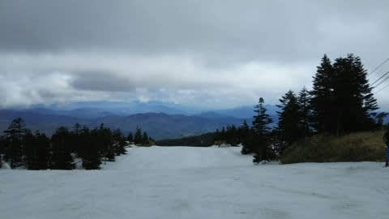
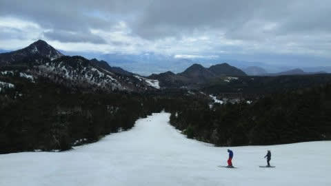
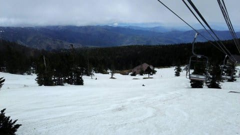
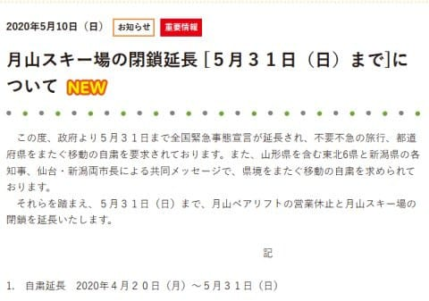

# 志賀高原スキー場，横手山はこの週末まで，渋峠は月末くらいまでかな？…そして，月山は5月末まで営業休止を延長（涙）

📅 投稿日時: 2020-05-11 01:10:59

🏷️ カテゴリ: [日記](cc4b5682fb7b8b144980957a978653fb0.md)

えー．

相変わらず，自宅待機の週末だったSkier_Sです．

今週も，日曜の更新は休もうかと思いましたが，

某特派員からの写真があるので，ちょっと掲載…

本日は，営業前に小雨が降り，

朝のうちは山頂付近がガスったようですが．

じきにガスも上がり，曇り空になったようです…

横手山もまだ雪はありますが，

やっぱり次の週末，24日くらいで終わりかな…

とのこと．

でも，渋峠はまだまだ雪の厚みが十分あるようです！

おそらく，今月いっぱい行けるんじゃないか…

ということで．

志賀高原は，もうしばらく滑れそうです…！

って，私が書くよりも．

この日の志賀高原がどうだったか．

詳しくは，[長野在住のこの方のレポート](https://red.ap.teacup.com/gokurakuskier/1224.html)を

お読みいただいた方がよく分かります…

で．

5月10日まで営業休止を宣言していた月山ですが．

昨日になっても，何も発表がなく，

「どうなるんだろう…」

と，ドキドキしながら待ってましたが．

こちらは残念ながら，5月31日まで閉鎖を延長

することが決まりました…（涙）

（[月山旭観光協会公式サイト](https://www.gassan-info.com/news/669)より）

でも．

まだ，6月1日以降の営業の可能性が残っている！

6月以降，まだ滑れる可能性が残っていることに，

これからのわずかな期待を残しましょう…っ！

「まだだ…まだ2020シーズンは終わってないよ…！！」
