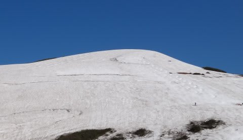
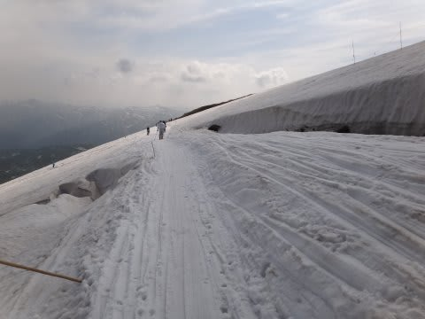
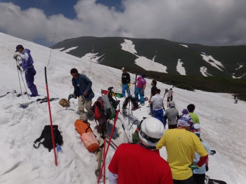
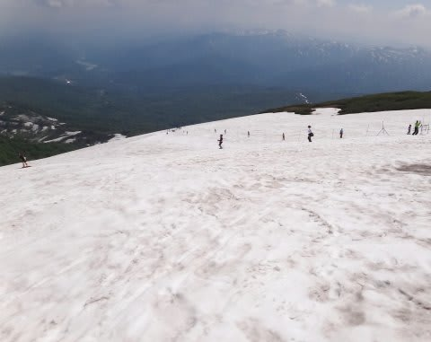

# 6月19日の月山スキー場の詳細情報

📅 投稿日時: 2011-06-22 01:52:15

🏷️ カテゴリ: [2011スキー滑走日記](ca488c98cfb9169941c3e73770dcefb56.md)

というわけで．

遅くなりましたが．

この週末の月山の詳細情報を．

残念ながら，スキーを履いたままリフトに乗り降りできなくなったので．

かなり人は減りましたね～．

前回は雪に埋もれていた姥沢小屋前の道も，今回は除雪されてます．

リフト待ち20分の2週間前に比べると，今週は駐車場もがらがらだし，

リフト待ちも全くありませんね～．

リフトに乗って山頂に向かいます．

リフトは，夏用の低い位置に掛け変わってました．

…これ，低すぎて足が地面にこするんですけど…

リフト降り場も，先週まであった雪はいずこへ？？

という感じ．

こうなると…

リフトを降りてから．

ゲレンデに出るまでが修行です．

木の歩道を数10m歩いて…

その後，足場の悪い石の上を数10m．

リフトを降りてから，ゲレンデに出るまで．

重い板を担いで，5分ほどかかっちゃいます．

これだけで疲れるんですけど．．．

で，これだけ歩いてゲレンデに出ると．

目の前にはまだまだ雪がたっぷり！

しかし．

目の前のTバーには向かわず．

とりあえず，下りてみましょうか．

リフトのコースの雪は…

あららら～．

かなり減った感じですね…

でも，沢コースがまだ滑れるので，この時期としては，

雪は多いほうですね～．

沢コース，真ん中にコブラインが1本できてます．

沢コースの下の方は，もうそろそろやばい感じですかね～

今週末には，もう途切れそう．

で，ふもとまで降りると…

うーん．先週は，ここを通ってリフト乗り場に滑り込めたんですが．

スキーを履いてリフトまでいけなくなった今．

リフトに乗るまでが一苦労，

リフト乗り場の建物の下に出るので．

こんなところを登って，リフト乗り場の建物の入り口へ向かって．

そこからさらに登って，やっとリフトに乗れるという…

滑り終わってからリフトに乗るまでも，5分かかります（涙）．

滑るのは一瞬で，乗り降りに10分以上歩くという…

こんな状況でも滑ろうって奴は．はっきり行ってアホですな．

もう，救いようが無いアホのような気が…

で．

次は大斜面を滑ってみますか．

なんか．

大斜面のトラバースライン．

そろそろ，一部危険な場所が…

あと数日で，ここは通れなくなるなぁ．

そうしたら，大斜面に出るのが大変だ．

で．トラバースラインの最後の部分．

2週間前，こんな感じで…

クレバスの間のわずかな隙間を通っていた

部分は…

こんな感じに．

クレバスって感じじゃないなぁ．これはもう．

2週間でここまで溶けちゃったのか…

で．

今シーズンの大斜面．

クレバスで，上半分と下半分に分かれちゃってるんですが．

上半分は，基本的に前回と変わらず．

幅100m程度の広い雪原に，そこそこ深めのコブラインが数本．

コブの無い部分もあるので，コブを回避して滑ることもできます．

で，クレバスの隙間を通って…

大斜面の下半分に出ると．

ありゃりゃりゃー．

ちょっと，雪が解けましたね…

幅が狭くなり，コブラインも途中で藪に消えるものが．

まっすぐ最後までいけるのは，1-2本．

まぁ，でもまだ1週間は問題なく滑れそうですね．

6月中は問題ないでしょう．

7月に入ると，もうだめかな～．

という感じで．

午前券が使える間はリフトを滑り．

午後になると，Tバーへ移動！

Tバー乗り場，結構上に上がったのか．

リフト降り場からTバー乗り場まで，結構登ります…

Tバーは2本．

Tバー沿いに，一部わずかに土が出てる部分もありますが．

それ以外は，完全に見渡す限りの雪原．

好きなところ滑りたい放題．

下のTバー沿いは，コブラインが2本ありますね～

上のTバー沿いも，コブラインがあります．

ポールも数セット張ってありました．（この写真を撮ったときにはもう撤去されていましたが）

ここでは，大回りOK.

大回りOK.

大回りOKっ！！！！

いやー．

楽しいんですが．

一回200円かかるTバー，一瞬で滑り終わっちゃう．

お金のことを考えると，あんまり回数乗れないよ…

で．

数回Tバーを回して．

お世話になった月山に感謝しつつ，下山．

というわけで．

長きに渡った，でも短く感じた2011/12シーズンも．

怪我をすることなく．

無事にラストデーを終了することができたのでした．

スキーの神様に，感謝！

