# Amazfitのスマートウォッチネタ，まだ続く…スマホアプリアップデートで，Amazfit GTRもGPSデータをGPXファイル化できるようになったよ！

📅 投稿日時: 2020-05-31 00:05:21

えー．

志賀高原の渋峠スキー場．

ラストの週末の営業を迎えているわけですが…

土曜の今朝は，いい天気だったようですね…

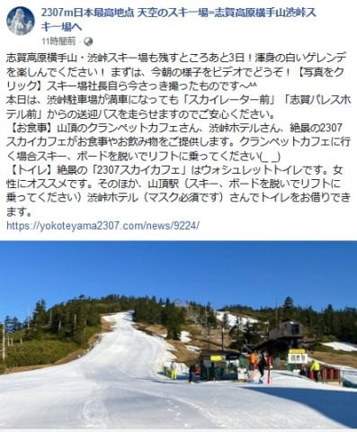

（[横手山スキー場ホームページ](https://yokoteyama2307.com/news/9224/)より）

そして，特派員の方から，

金曜の渋峠の写真をいただきましたが．

リフト乗り場近辺は，まだ雪がたっぷり

あるように見えますね～！

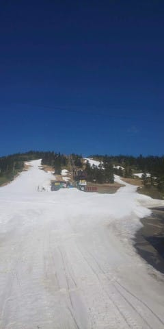

そして，あさイチは，いい感じのシマシマに

見えますね～！！

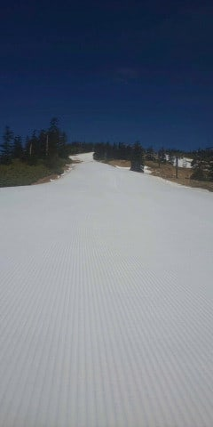

…でも，実態は，結構コース幅が狭い

ところもあるようで．

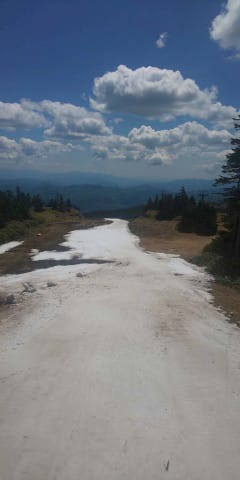

シーズンオープンのYetiに近い

何かを感じますね…

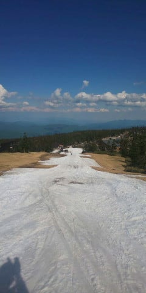

残念ながら，6月1日で営業が終了して

しまいますが．

この時期まで雪をもたせてくれた

横手スタッフの執念を感じずには

いられないゲレンデ状況です…

これまで営業した渋峠，すばらしい！

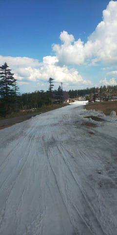

しかし，今シーズン．

コロナで中断して以降，結局私は

志賀高原に滑りに行けなかったですね…

うーーん．

シーズン券，いくらか払い戻してほしい…（涙）

…ってなことで，本題へ．

長々とAmazfit PACEのネタを続けてきましたが．

記事を書いていた，この5月19日．

実にタイムリーに，

Amazfitのスマホアプリのアップデート

があって…

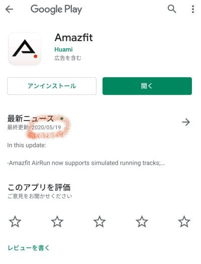

なんと．

スマートウォッチからスマホアプリに取り込んだ

GPSデータを，

スマホアプリでGPXファイルに書き出せるように

なりました…！！！

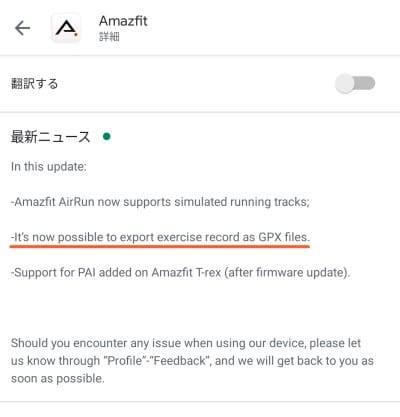

…これで．

時計本体ではGPXデータ化ができなかった

Amazfit GTRでも．

スマホアプリを通じてGPSデータをGPX

ファイルに書き出せるようになりました！！！

これで，いろんなアプリで，Amazfit GTRの

GPSデータを詳しく見ることができる…（感激）

GPXデータの作成方法ですが．

Amazfitアプリのこの画面から，右上の

矢印にある「共有」アイコンをタップすれば…

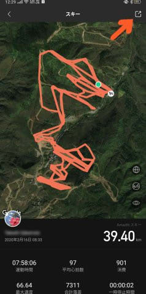

こんな感じの選択肢が出てくるので．

一番右の緑のボタン，

「トラックをエクスポート」を

選びましょう…

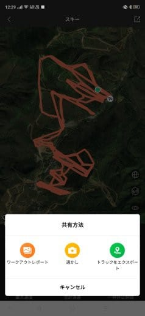

そうすると，こんな画面が出てきますが…

この画面の

「GPX形式」

ボタンを押しても，

何も反応がなく，「？」と思いますが…

ファイルの書き出しにすごい時間がかかるので，

この画面をぼーっと眺めつつ10秒ちょい

待つと…

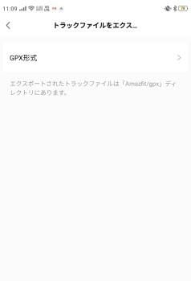

こんな画面に切り替わり，

ファイルの書き出しが完了します！

ここで，「シェア」ボタンを押して，

Google Driveでも何でも使って

PCに持ってくれば，[Google Mapや
いろんな方法で見ることができます](ef027dd244e860f24105fa098fbeedce4.md)…

Androidスマホだと，[GPXviewer](https://play.google.com/store/apps/details?id=com.vecturagames.android.app.gpxviewer&hl=ja)っていう

アプリが便利です．

で．

Amazfitアプリで書きだしたAmazfit GTRの

GPXファイル．

ファイルサイズが異常に大きいんですよ…

Amazfit PACEのGPXファイルは，

一日滑ったデータでも

ファイルサイズが1MB以下ですが…

Amazfit GTRのGPXファイルは，

一日滑ったデータのファイルサイズが

7MBとか8MBになっちゃってます…

これだと，Google Mapで読み込める

ファイルサイズの上限，5MBを超えて

しまうので．

Amazfit GTRのGPXファイル，

Google Mapで読み込めませんでした…（涙）

なんでこんなことが起こるのかな？

と，GPXファイルの中身を覗いてみると．

Amazfit PACEは，滑っている時間以外，

静止している時やリフトに乗って登っている時は，

GPSデータの更新を止めています…

こんな感じで，赤矢印の部分は

時間が1秒ごとに記録されてますが．

赤丸で囲った部分，時間がとびとびに

なってます．

特に，23:49:04から00:00:44（グリニッジ標準時…日本時間は+9時間）

までリフトに乗っていたようで，

12分弱飛んでますね．

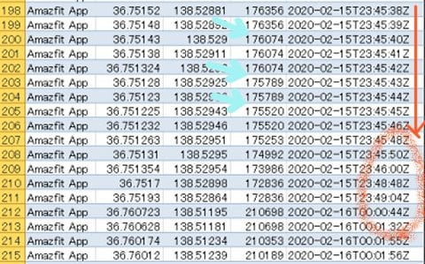

そして，水色矢印の部分が標高なんですが．

矢印の先のところで，ちょっと不連続に

飛んでますね…

Amazfit PACEでは，2～3秒ごとにしか

高度が更新されないのか…

そして，今度はAmazfit GTRの

GPXファイルを見てみますが．

赤矢印で示した時間の部分，完全に

抜けることなく1秒ごとに記録されいて．

さらに赤丸部分の高度も，1609mから

1mずつの精度で変化しています…！

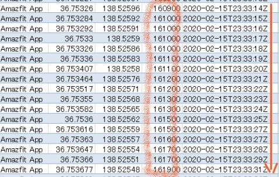

ちなみに，このおかげで，同じ日の

GPSレコード数を調べてみると．

Amazfit GTR：約24000ポイント．

Amazfit PACE：約4000ポイントと，

Amazfit GTRの方が，データの記録

ポイント数が，6倍多くなってます…

…以前報告したように，Amazfit GTRの

GPS記録をスマホアプリで見ると，

20～30秒間隔で記録されてるのでは？？

という感じの軌跡だったんですが．

8Mという巨大ファイルを処理するのが

大変なので，スマホアプリ側でかなり間引いて

表示していたみたいです…！

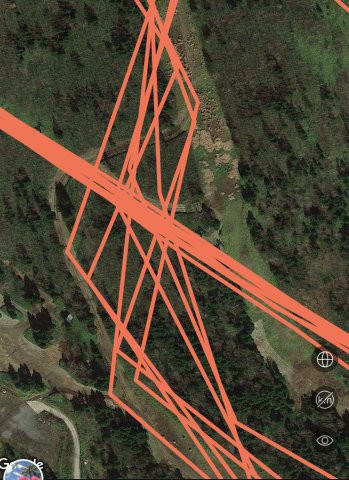

…どうやら実際は，ちゃんと1秒間隔で

記録されていました……！

（今明かされる衝撃の事実）

…でも，これ，GPXファイルに吐き出したから

分かったけど．

間引き表示しかしてくれないスマホアプリで

しか見れないのなら，1秒ごとの記録は完全に

無駄で，勿体ない話でした…

ってことなので．

果たして，Amazfit GTRのGPS記録は

どのくらい正確なのか？？？

GPXファイルを漏れなく表示させて，

じっくり見てみましょう…

今回，5MBのファイルサイズ上限に引っ掛かり，

Google mapを使えなかったので．

[ブラウザ版GPX viewer](http://gpxviewer.1bestlink.net/)で，GPXファイルを見てみました…

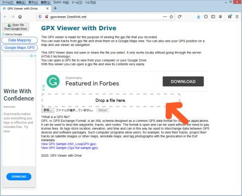

この矢印部分にGPXファイルを

ドラッグ＆ドロップすれば，すぐ

表示されるお手軽さ！

で，表示されたGPS軌跡を見てみると…

ふーん．

移動速度で，軌跡が色づけされるのね…

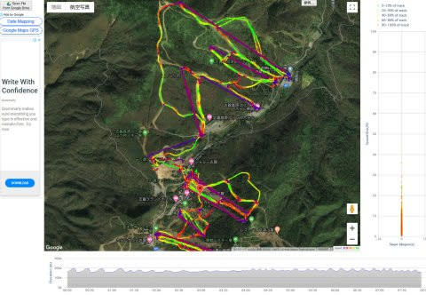

赤が20km/h，オレンジが30km，黄色が40km，緑が60kmね…

ってなことで．

スマホアプリでは，こんな感じで

軌跡が角ばってしまい，水色で

示すコースから外れたように見えていた

この部分も…

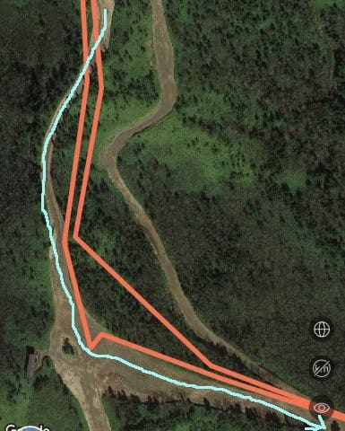

GPXファイルで見てみると．

多少コースからずれてるところは

あるけど，そんなにひどくずれては

いないことが分かります…！

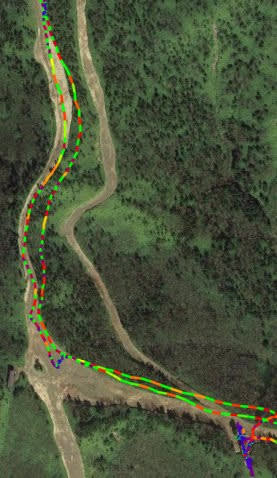

うむ…

これ，もしかすると，Amazfit GTR．

GPS精度，そこまで悪くないのかも…！？？

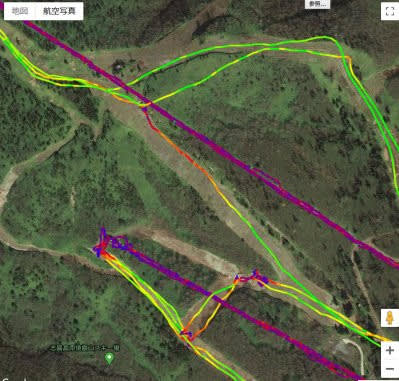

とりあえず．

Amazfit PACEのGPXファイルと

Amazfit GTRのGPXファイルを

じっくり地図で見比べて．

両者のGPS精度のを比較してみましょう…！

（続く）

## 💬 コメント一覧

### 💬 コメント by (西館)
**タイトル**: Unknown
**投稿日**: 2020-06-01 12:27:12

矢印にある「共有」アイコンをタップすれば…

の下に添付された画像の下の方の数字

07:58:06が【通勤時間】と読めてしまって笑えました。

【運動時間】ですかね、Sさんなら通勤時間でもいいかな、

8時頃には到着してそうだし。

約8時間運動してるって凄いですね、1ゴン運転時間と変わらんのでは。

### 💬 コメント by (Skier_S)
**タイトル**: ＞西館さま
**投稿日**: 2020-06-01 23:58:34

通勤時間約8時間…

一日の1/3が通勤時間ですね（笑）

運動時間8時間って，8時半のイチゴン開始から焼額終了の

4時15分のラストリフトまで滑れば，8時間滑っちゃいますよ…！

私はお昼休みもとらない人ですし（笑）．

