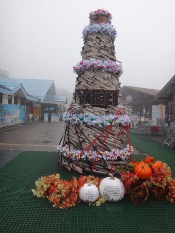
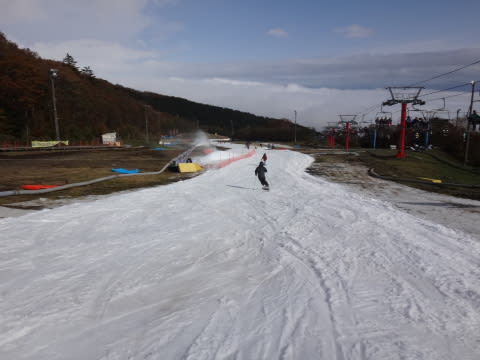
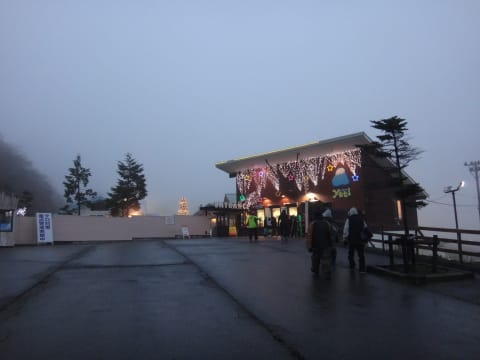
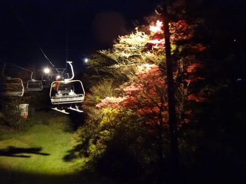

# 2017シーズンに突入したわけだが…シーズンオフに滑り方を忘れない効果的な方法！

📅 投稿日時: 2016-11-02 03:00:17

🏷️ カテゴリ: [日記](cc4b5682fb7b8b144980957a978653fb0.md)

ということで．

この週末のYetiにて，

ついに．

ついに，4か月半の雌伏のオフシーズンが終わり．

私のスキーシーズンが始まったわけですが…

…でも．

雪不足で月山ラストが例年より3週間ほど早まり．

さらに，6シーズンぶりにYetiオープンの週末に滑れず．

オープン翌週に初滑りが持ち越された影響で．

…なんと．

昨シーズンより1か月近く，オフシーズンが伸びてる

じゃないですか！

…昨年が3か月半だったオフシーズンが．

今年は4か月半なので…

昨年より1.5割ほど長いオフシーズンだったのかっ！

だけど．

なんだか．

このオフシーズン．

仕事が激烈に忙しすぎたおかげで．

引っ越した4月からこの10月は，ホントに

あっという間だったなぁ…（遠くを見る目）

だもんで．

今シーズンは．

例年の

「あうーーーー！

　スキーシーズンはまだか？？

　早く滑らないと死んじゃうっ！！」

っていう飢餓感がなく．

「あれ？もうスキーシーズン？？？」

って感じで．

淡々とスキーシーズンに突入しちゃった感じが

あるんですよ…

そのせいかどうか．

初滑りの1本で，ゲレンデに立っても．

4か月半もブランクがあったことは

全く感じず．

「あれ？2-3週間ほどぶりのスキーだったっけか？」

くらいの感じで．

全くシーズン途中と同じ感じで滑り出せて．

なんだか，1本目から全くこれぽっちもちっとも

違和感なく滑っていた自分がいたのでした…

もう，プルークやら低速やらの確認をすることなく，

1本目からトップスピード（笑）．

シーズン1本目から，完全に普段の滑りに

戻ってました…

…というわけで．

私は思ったわけですよ．

オフシーズンに仕事を死ぬほど忙しくすれば，

オフトレしなくてもシーズン初日から

しっかり滑れるんじゃないか？…と．

ということで，

スキー上達を目指す皆さん！

皆さんも，来シーズンオフから．

土日も休まず，深夜まで働いてみてくださいっ！！←結論がおかしい

## 💬 コメント一覧

### 💬 コメント by (yama)
**タイトル**: 明日は
**投稿日**: 2016-11-02 14:16:21

明日は予定通り行きたいと思います。土日ではないので少しは空いていることを期待しています。mae様の言う通りです。シーズンインの時期だから行くけれど後は志賀高原通いがほとんどです。C、Dコースがオープンすると印象も変わります。近ければメリットがありますが、遠くからだと魅力はないと思います。ただ今なら狭山や軽井沢より良いです。

### 💬 コメント by (Skier_S)
**タイトル**: yamaさま
**投稿日**: 2016-11-03 02:11:00

明日，予定通りでお願いします～！

朝早くは雨が残りそうですが…

午後は晴れそうです！

