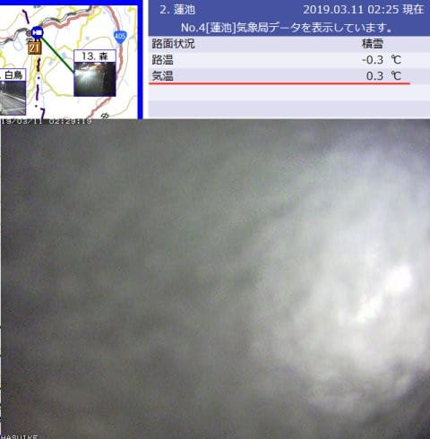
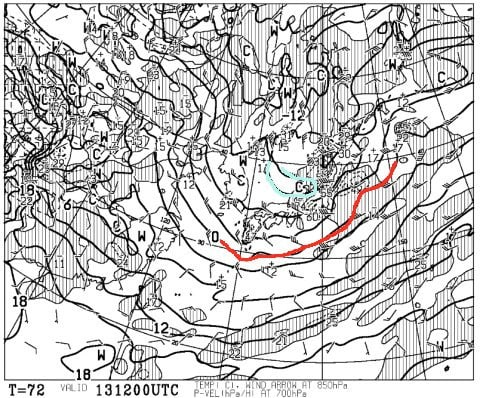
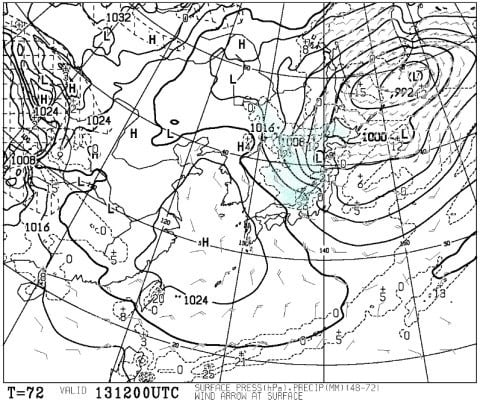

# 2019/3/10(日)の志賀高原，速報モード…午前晴天！午後は曇り空ながらもいいコンディションの一日！そして，11日月曜午前中は雨っぽいけど…そのあとは冷えるよ！

📅 投稿日時: 2019-03-11 03:42:29

🏷️ カテゴリ: [2019スキー滑走日記](c3e4496fc0fb7f9c17ff21214a35b1ace.md)

えー．

いつものお約束通り．

日曜はラストまで滑り，

帰宅後の板の手入れなど，

いつもの営みをやっていると．

今日はとんでもない時間になってしまった

ので（涙）

超速報モードで行こうかと思ったけど…

これから明日一日中，

どしゃ降りの雨でゲレンデは

壊滅しそう

と思っていたところ．

もう少しマシな状況になりそうな

気配になってきたので．

臨時天気予想をば…

まず．

現時点の志賀高原．

標高が低めの蓮池では．

気温もプラスで，

すごい雨っぽいんですが（涙）

（もう，カメラに水滴が大量について

　何が写ってるのか良く分からない…）

…でも．

一の瀬付近の，3号トンネルの

画像を見ると…

うむ？？

気温もわずかにマイナスで…

これは，雪っぽい…！！

（上記2枚，[北信建設事務所HP](http://hokushin-camera.org/)より）

うーむ．

現在，志賀高原．

雨と雪の境目の，微妙なところにいるようです．

…このまま，明日の朝まで．

志賀高原の標高が高いところは湿っぽい雪，

標高が低いところは雨…

という感じで推移しそう．

そして．

11日月曜の朝は，0℃線が志賀より

北に行ってしまっており．

そして，降水域も志賀にかかっているので…

これは，雨か…？

と思うところですが．

志賀高原は850hpa図の+3℃線より

北にあり．

0℃線と+3℃線に囲まれています．

…大体，志賀高原は，+1℃前後と

考えると．

山頂付近は，ギリギリ雪で

いてくれるかも…？？？

おそらく，雪と言っても

ウェアに着くとすぐ融けて

びしょ濡れになる雪でしょうが．

ザーザーぶりの雨でゲレンデの雪が

解けていくよりマシです！！

…これは．

ゲレンデが雨ではなく．

雪になってくれそうな予想に

変わったのは，当然，

私の全身全霊の冷え冷え踊り

の結果ですから！！←違う．断じて違う

金曜段階での予想の．

「11日は850hpaの+6℃線が近づいてくる」

という予想に比べると，ずっと気温が

冷えてきてます！

（先週金曜段階での，11日月曜の850hpa気温予想．水色は+6℃）

そして．

11日の夜9時になると…

850hpaの0℃線は志賀より南に

下がってます！

そして，地上天気図で，

志賀高原に降水気がかかっているので…

うむ．

11日は，昼頃から雪に変わってくれそうかな…

ただ．

赤く印したように，低気圧が984hpa

以下と，台風並みに発達するので．

…11日は，かなり荒れそうです…

翌12日火曜は．

850hpaの0℃線は志賀より南なので．

雨の危険性はありませんが…

降水域の水色が志賀にかかっていないので．

この日はほとんど雪が

積もらなさそうです…

そして，その次の日．

13日水曜日は．

そこそこの雪の目安，500hpaの

-30℃線が，志賀にかかってますよ！？？？

これは完全真冬の冷え込み！

で．850hpa気温は．

…赤い0℃線は本州よりかなり

南まで下がっていて．

そして，志賀高原には水色の-9℃線が

かかっているので．

この日も，-10℃以下に冷え込みそう…！

地上天気図は，日本海側に降水量が

かかる，冬っぽいパターン…

でも，西風なので，志賀はそれほど

ドサドサ降らないでしょうが．

しかし，冷え冷えの雪が終日

降ってくれそう…！

とりあえず．

1週間の850hpa気温推移予想を見てみると．

水色矢印で書いて，13日から19日まで．

ほぼ毎日，平年より気温が低い日が

続きそうです！

この期間では．

雨の心配はなさそう…

ってことで．

まとめると．

月曜：朝は山頂は重い雪，麓は雨（涙）

　正確な雨⇒雪に変わるタイミングは

　予想が難しいが，昼ごろには気温が

　下がりはじめ，　山麓でもマイナス気温へ．

火曜：そこそこの冷え込みながらも，

　雪がぱらつく～曇り程度の天気で，

　すっきり晴れず，雪もほとんど

　積もらず

水曜：降る．雪がそこそこ積もりそう

という感じでしょうか…

ということで．

前フリが長くなりましたが．

というより，こっちの記事が

メインのはずが．

前フリの方がメインになった

感がありますが．

一応お約束の，日曜の志賀高原レポートです！

…本日は超簡易バージョンにて．

まず．

今日は日が昇り切らない，

朝6:30からの早朝営業に参戦！

早朝最高っ！

もう，シーズン最高のゲレンデコンディションを

いただきっ！！

午前中は，すっきり快晴！

いやーー．

シアワセ…

…強い日差しで雪が

ザブザブになることもなく．

しっとりした感じにはなったものの，

かなり滑りいいバーン状況！

ゲレンデも，人が少なかったよ！

午後になると，予想通り

雲が増えていきましたが…

そのおかげか，強い日差しで

雪が一気に緩むようなことが

無かったので．

夕方まで，比較的良好なゲレンデ状況で

滑れたかな～．

とりあえず．

また明日詳細レポートします～！

## 💬 コメント一覧

### 💬 コメント by (Hide)
**タイトル**: さすがです・・・・
**投稿日**: 2019-03-11 09:46:23

S 様

先週3/2（土）の朝一1ゴンで降りられ、気温計の写真を撮られている時に久々にごあいさつさせて頂くことができました！

相変わらずSさんは超人的な体力ですね。

やはりサイボーグ？

3/9（土）は私もラスゴンまでおりましたが、それから横浜までたどり着くと毎回22:30位になってしまいヘトヘトになってます。

今週は出陣できませんが、来週は出陣予定です。

ぜひゲレンデでご一緒できればよろしくです。

連れが一緒ですのでなかなか難しいですが・・・。

### 💬 コメント by (若杉勲71)
**タイトル**: Unknown
**投稿日**: 2019-03-11 11:54:40

志賀高原情報

某レインボークラブ員Aが、いつものように朝一、二ゴンからイチゴンに向かうと、いない、誰も。駐車場に15積雪があったのでオリンピックは20ー30はあるな、だけどブレーキには気をつけようと、ワクワクしながら飛び込むと、あれっ？ひさびさにゲットしたポールポジションですが感動ゼロに終わりました。聞けば雪が重いせいか朝圧雪したとのこと。

でも、ヤケビ全体に滑りやすい雪でしたよ。

今チウホテルでビーフシチューと一番絞り500ml310円を楽しんでいます。ファミリーは非圧雪なうえコーグルにベタユキが張りついて視界不良。2回も途中で止まりました。でも雪は良かったです。そうこうしているうちに降り止みました。もう一本飲もうかと思ってましたが滑ろかな。

### 💬 コメント by (いか)
**タイトル**: Unknown
**投稿日**: 2019-03-11 23:15:20

土曜日は終礼にておせわになりました〜

いいオチもありまして、3月の志賀も楽しい1日でした。

また、来シーズン？もよろしくお願いします！

日曜日は予定通り、栂池に行ってまいりました。チャンピオンでひたすら練習でしたが、ガラガラ過ぎて寂しい感じでした。3本目にやっと、自分+仲間以外のシュプールができたくらいです(笑) お天気も1日持ったので、よかったですね〜

### 💬 コメント by (ほっぽ)
**タイトル**: この週末
**投稿日**: 2019-03-11 23:21:46

Ｓさん

２日間お疲れ様でした。

昼間は全く見かけませんでしたが、

お会い出来たのでヨシとします。

土日の日記を上げておきました。

東館山からサンバレー方面は、かなり重く滑走性の悪い雪でした。

http://www2.tokai.or.jp/nana_hoppo/

### 💬 コメント by (今回は平日特派員m&t)
**タイトル**: Unknown
**投稿日**: 2019-03-11 23:27:34

約11ヶ月振りのコメントのm&tです。

若杉夫妻からの報告にもありましたが、焼額は一日中雪(湿雪でしたが)だったのでまあまあGOKURU度が高かったです。

P.S.若杉様、チウーホテルで隣の隣の席でビーフシチューを食べていたのは私達です。いつもとスキーウェアが違っていたので分かりませんでした。ご挨拶できず失礼しました。

奥志賀はGOKURAKU度高いもの強風で2高3高が途中で運休。　

一ノ瀬は若杉夫妻の報告あり。

パーフェクターはポールを張る団体がいて半面規制あり、その上、湿雪非圧雪で凸凹だったのでGOKURAKU度は最低です。

西館にも行ってみましたが、ここも湿雪非圧雪で凸凹だったのでGOKURAKU度は低かったです。

2ゴンも強風で3時半頃急遽運休しましたが、1ゴンストップまで滑り倒しました。

以上、3月中に有休消化のm&tでした。

### 💬 コメント by (しんちゃん)
**タイトル**: 神様のおかげ
**投稿日**: 2019-03-11 23:47:17

週末土日両方いい天気に恵まれ、とても楽しかったです。

今シーズン土日連続晴天だったのは記憶にないほど。やっぱりお日様の下で滑るのは最高です。すべて神様の例の踊りのおかげかと感謝しています(笑)

また、注連縄や貢ぎ物の効果で、踊りのパワーが増している感じもしています。

ＧＷまで雪がもちますように（祈）

### 💬 コメント by (Skier_S)
**タイトル**: 冷え冷え踊りの効果，絶大です！！
**投稿日**: 2019-03-12 01:33:59

＞Hideさま

あれ！

土曜も焼額ラスゴンまでいらっしゃったんですね…

来週もまた志賀高原ですか．

こちらは飛び石4連休の間を埋めて

滑っている予定です…

またゲレンデでお会いできたら，

一緒に滑りましょう～！

＞若杉さま

スキー場は20cm近い積雪があったんですね…

びしょびしょ雪だから，そんなに積もらないかと

思っていたんですが…

昼間も雨にならず済んだんですね．

いや．

良かったです…

この雪のあと，明日のゲレンデがどうなるか

気になります…

湿っぽい雪だったので，冷えてガリガリした

感じにならなければいいのですが．

またレポートお願いします！

＞いかさま

土曜はお世話になりました～！

って，ほとんど一緒に滑れませんでしたが．

そして，終礼参加お疲れ様でした．

また来シーズンと言わずに，4月以降も志賀に

お越しください（笑）．

しかし，日曜の栂池はそんなにガラガラだったんですね…

＞ほっぽさま

いや，昼間は全くお会いできませんでしたね…

日曜昼間は，スーパーキッズたちと一日中爆走

してました．

あれは見ものでしたよ…

でも，標高の低いゲレンデはやっぱり緩んだんですね．

焼額はそれほど緩みませんでしたよ～！

＞平日特派員m&tさま

久しぶりのコメントありがとうございます～！

そうですか．

本日の焼額，意外と良かったんですね…

いや．

本来なら，月曜は暴風雨で最悪の一日のはずだったんですが．

雨にならず．

2ゴンは夕方に止まったようですが．

暴風がその程度で済んだのは，奇跡だと思います…

有給の日が，暴風雨の最悪天気にならずに良かったですね～！

＞しんちゃんさま

土日は，予想以上にいいコンディションでしたね～！

もう，私の全身全霊の冷え冷え踊りの効果ですから！

さらに，水，木と真冬並みの寒気が来て雪が降りそうで．

そのうえ，気温が高い１週間のはずが，そのまま

週末まで冷えてくれそうなので．

このまま冷え続けて，GWまでもってほしいところです…

