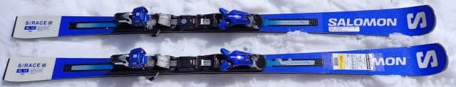
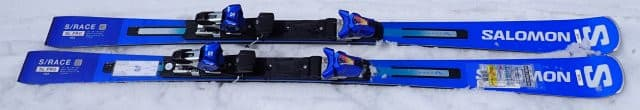
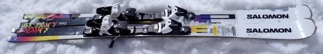

# 2025シーズンモデルのスキー板の試乗レポート速報…SALOMON編　SL12，SL Pro, ADDIKT PRO

📅 投稿日時: 2024-04-13 00:07:34

えー．

今週末も志賀高原へ滑りに行くわけですが．

やはり土日とも，悲しいくらいの

高温になりそう（涙）

そして，こんな日には晴れなくても

いいのに土日ともすっきり晴れそうで，

強い日差しで朝からかなりザブザブの

ゲレンデになりそうです…（泣）

土日とも，早朝の初めの一瞬だけ

ちょっと下地がしっかりした雪を

楽しめるかもしれませんが．

早朝営業の時間のうちに，もう

ザブザブ雪になり，

午前中には荒れ荒れバーンに

なることを覚悟した方が

いい感じです（泣）

まぁ，すっきり晴れそうなので．

のんびり日向ぼっこがてら

春スキーを楽しむにはいい天気なのかも…

で．

焼額山は今週末が第2高速リフト＆唐松

コースの最終営業です！！

そして…

焼額は昼ごはんのレストラン営業を

どこもやっていないので，お昼ご飯は

持ち込むかどこかに食べに行かないと

いけないことにご注意を…

ちなみに．

明日の土曜も，焼額は朝6時から第1ゴンドラの

早朝営業をやりますが．

オリンピックコースが滑れなくなったからか．

今週末は早朝から，GSコースだけじゃなく，

パノラマ・サウスコースも滑れます！！

さすが早朝2時間券が4000円なだけあって，

1コースってわけにいかないよね…

ということか，パノラマ・サウスも早朝から

滑れるってのはいいですね…！

でも，私は今日も仕事が終わったのが夜遅い

ので．早朝に間に合うように焼額に着くのは

不可能（泣），

今日はいつもより早めに終わったとはいえ，

もう夜11時（泣）

朝3時半発でも，今から4時間弱しか

寝られません（涙）

だもんで，明日も通常営業から参加予定です…

…というのに．

本日も来シーズンモデルのスキー板の

速報レポートを書くという←こんな記事書いてるなら早く寝ればいいのに…

今回はSALOMON編です…！！

〇SALOMON SL 12 165cm

優しめのTLビンディングがついている

このSL12ですが．

ものすごく履きやすい板です！！

キレとズレのどっちをやっても気持ちいい．

ずらしをやりやすい板は，グリップが

弱くて攻められないし，

攻められる板はグリップが強すぎて

ずらしがやりにくい…

というのが普通なのに．

この板は，気持ちよく切っていけるのに

ずらしもしやすい．

キレとズレのどっちも気持ちよく滑れます．

スピード域は，私がホントのトップスピードを

出すと，ちょっとだけ弱いかな…

と感じるけど，そんなスピードはゲレンデでは

出す人はそんなにいないだろうから．

おそらくゲレンデ小回り用としては

かなり無敵な感じ．

ガツガツトップスピードで攻め続ける

ひとでなければ，これ一つで何でもできるような

万能板だと思いました．

〇SALOMON SL PRO 165cm

よく見たら…

ICONビンディングだよ！！

SALOMON板にマーカーのビンディ…

（これ以上言うと消されるので自主規制）

ってなことで．今年まではXビンディング

だったけど，来年からICONビンディングに

なるらしいこの板．

いや．

これもいい板！！SL12より足元がしっかり

して，反応も早い！

SL12と同様，キレもズレも滑りやすいのに，

しっかりキレキレの滑りができて，

板全体がきれいにたわんでグリップも強い！

板が最後まで回りきってスッと抜けていく

抜けも気持ちいい！！！

ICONビンディング，Xビンディングより

いいよ！！

これは，ATOMICのビンディングより，

マーカーのビンディ…（以下自主規制）

とりあえず，ハイスピード域でも快感度が

高い脳内麻薬系のキレかたをする板なのに，

ズレのコントロールもできるという，

恐ろしい万能板．

〇SALOMON ADDIKT PRO　163cm

昨シーズンから誕生したADDIKTシリーズの

最高モデル．

163cmは短いかと思ったけど，

しっかり走って意外と安定性もある．

でも，この板の特徴は，ものすごい低速域

でもしっかり角付けしてきれいなカービングが

できること！！

ふつうならもう少しスピード出さないと

板がたわまないのでカービングできないよね…

という低速でも板がたわんでカービングできる！

スピードを出すとたわみすぎるけど，グリップが

抜け抜けになっちゃう中級者板みたいな

軟弱さはなく，グリップした中でたわんでいく

感じ．

そして，この板もズレのコントロール性が

すごくよく．

低速でズレからカービングまで見事に

演じ分けられます．

あまりスピードを出さなくなったけど，

かなりスキーに心得がある上級者が

履くとすごくいいかも．

スキー教師にも向いてそうな板でした．
