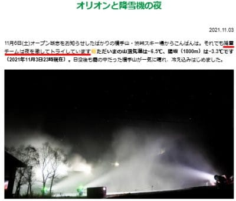
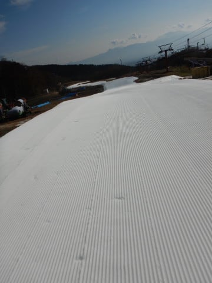
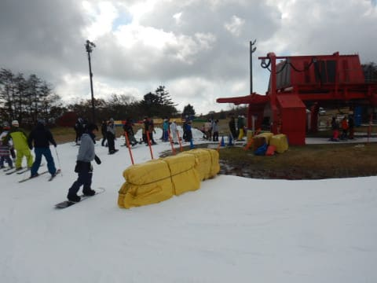

# 2021/11/3(水・祝)のイエティ詳細レポート！…オープンから1週間半，リフト待ちはそれほどでもなかったけど，コースはちょっと混雑

📅 投稿日時: 2021-11-05 05:39:16

🏷️ カテゴリ: [2022スキー滑走日記](cc9cb73e4320f6a97af6fccc37587a61a.md)

えー．

昨日，

　少なくとも4日の早朝と5日の早朝は

　人工雪が打てるんじゃないかな？

と書いた通り，4日朝の横手山，

スノーマシンがフル稼働したようです…！

（[横手山ホームページ](https://yokoteyama2307.com/news/16429/)より）

4日，5日と氷点下の予想…ということで．

横手山の降雪チームの方々は，全力で

頑張っているようですが．

（[横手山ホームページ](https://yokoteyama2307.com/news/16429/)より）

…でも．

たぶん．

昨日書いたように．

今，一生懸命打った人工雪．

8日から9日にかけての高温

どしゃ降りの雨で，全部

消えちゃうのだ…（涙）

そういう目で見ると．

この人工降雪作業が

全くの無駄

に見えますが．

…私としては，8，9日の雨の

予想が外れて．

この人工降雪が無駄にならず，

滑走可能になってくれることを

祈って踊るしかできません…

あぁ…8，9日の高温＆雨．

なにか奇跡が起きて，雪になったり

しないかな？？？←残念ながら，きわめて望み薄です…

ということで．

本日の本題．

水曜祭日のイエティ滑走レポートです～！！

まず．

あさイチは，ゲートオープンを待って

かなりの列がゲート前に並んでますが…

列自体は土曜より短かったので．

土曜ほど混まないかな？

とりあえず，今日も10分前くらいに

ゲートオープン，ゲレンデ前で

コースオープンを待ちます…

そして，ほぼ9時ぴったりに

ゲレンデオープン！！！

オープン直後の1本目が，前に誰も

いなくて好き勝手に滑れる，唯一の

チャンス！！

ふははは！！

シマシマだ！

誰もいないシマシマバーンだ！！！

…ってなことで．

今日も朝の1本目は，目の前に誰もいない

シマシマをおいしくいただきました…

そして．

オープンから2本目までは人も少なく，

ガラガラコースを気持ちよく滑れた

のですが…

やはり，営業開始から30分も経つと，

コース上の人口密度も上がり始め…

リフト待ちもちょっと伸びてきま

した（涙）

…でも，まだ[激混みだった土曜](e0ac1990bc8b4d4ce5502ea421d427ac0.md)より

マシかな？

お客さんがそれほど多く無かったにも

かかわらず，朝10時にはクワッドと

並行してかかるペアリフトも運転が

始まり…

クワッドのリフト待ちは，せいぜい

この程度にまで短くなりました．

そして，コース幅も，先週末の

土曜よりは広がっている感じで．

そのせいか，コース上もがら空きと

言えないまでも．土曜ほど人口密度は

高くなく．

リフト待ちも平均的にこの程度．

平均3分前後の待ちだったので．

少なくとも，土曜よりは快適かな！

ちなみに，ペアリフトは終日待ち時間０で

飛び乗り可能した！

天気も，曇ったり晴れたり．

むしろ，太陽が雲に隠れてることの

方が多いくらいだったので．

直射日光で雪が激しく解ける

という悲劇は起きず．

雪の滑りもそれほど悪くならず．

コースもそれほどひどく荒れることは

無くて，穴が開いて土が出ている

場所もなく．

16時のコース整備タイムまで，

バーンコンディションは比較的

良かったですね～！

今シーズンは，オープン後に一度も

大雨が降っておらず，雪がひどく

解けることが無かったので．

幅もそこそこ広いし，コースの状況は

比較的いいんじゃないかな？

さらに，コース上の人は多めだったとは

いえ，土曜よりは人が少なく．

ごくたまに人が少なくて割と

クリアなタイミングがあったり…

さらに，リフト待ちも最後まで土曜より

少なかったので．

意外と楽しめた一日だったかも！？？

ってなことで，16時のコース整備タイムで

一旦コースクローズとなりますが…

これだけ楽しめれば．

行かねばなるまい，ナイターへ！！

17時のコースオープンと同時に，

コースになだれ込み…

朝と同じく，整備直後のシマシマを

いただきま～す！！！！

ふっははははは！！！

シマシマ！

前に誰もいないシマシマ，いただき！！！

いやーー．

やっぱり誰もいない1本目は最高だ…

と，1-2本は気持ちよく滑れましたが．

3本目あたりからコース上の人が

増えていき…

ナイターオープンから30分後，

5時半ごろになると…

えええ！？？

何だか昼間よりリフト待ちが

伸びちゃってるんですけど！？？

そして，6時ごろになると．

なぜかリフト10分待ちと．

明らかに昼間より長いリフト待ちと

なってしまったので．

睡眠3時間でやってきて，さらに翌日

朝7時から仕事が控えているご無体な

状況を考えて．

泣く泣く午後6時に撤退したのでした…

ってな感じで．

やはり週半ばの祭日ということもあり．

土曜よりは混まず，さらにオープン後

ひどい雨が降ってないので，コース幅も

順調に広がり，雪の厚さも十分で．

結構楽しめた，一日でした～！←あなたは雪があれば

どんな環境でも楽しめるからいいけど，普通の人が楽しめるかどうかは疑問…

## 💬 コメント一覧

### 💬 コメント by (ikkun)
**タイトル**: Unknown
**投稿日**: 2021-11-05 10:26:04

えー しかしさすがです(・・;) そこまで好きであることは素晴らしいです   ちなみにseasonticketの発送がされたみたいで楽しみです？って雪はまだまだだけど

### 💬 コメント by (Skier_S)
**タイトル**: ＞ikkunさま
**投稿日**: 2021-11-06 01:45:50

え？シーズン券もう発送されたんですね…

志賀のシーズン券は11月下旬発送なのでまだまだです…

### 💬 コメント by (ikkun)
**タイトル**: Unknown
**投稿日**: 2021-11-10 09:29:53

おはようございます

 昨日seasonticket届きましたよ

 まだまだ時間がありますが心は白いゲレンデの上です

仕事もなかなか…なので切り替えのきっかけにするつもりです

あ一昨日スキー学校の講師仲間のパパと久しぶりに居酒屋でした 久しぶりのお刺身旨かったです  あSAJの会費も集める季節ではあります

もう少し安いとなあ(笑)

### 💬 コメント by (Skier_S)
**タイトル**: ＞ikkunさま
**投稿日**: 2021-11-11 06:24:46

シーズン券届きましたか！

志賀は11月下旬発送予定なので，もう少しかかりそうです…

そういやSA○会費も払ったけど，最近は一切行事に参加してないなぁ…

資格も何も持ってないから入ってるメリットもないし．退会しようかな…？

