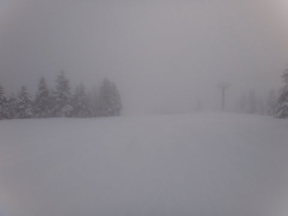

# そして正月休み終了…1月6日の志賀高原は？

📅 投稿日時: 2013-01-07 01:46:31

🏷️ カテゴリ: [2013スキー滑走日記](c91dbe557f9a69230b1600e48622fdd61.md)

ホントにいつまで続くんだ…？

…と，多くの読者が疑問に思っていた志賀高原レポートも．

ようやく．

本日をもって，一区切りです…．

んでは，

1月6日の志賀高原，焼額山のゲレンデ状況をば…

天気は，曇り＆雪＆薄日がさす天気がめまぐるしく入れ替わる天気．

晴れたり…

降ったり．

昨日からの積雪はほとんどなかったけど．

朝の気温は-13度とそこそこ冷え込んだので．

朝イチはしっかりと圧雪されたひえひえのシマシマバーン！

気持ちよ～くエッジが咬んでくれる，ちょうどいいやわらかさ．

朝のうちは，脳内麻薬を放出しまくりの悦楽の大回りを堪能できる，

快楽バーンでした…

んで，新しい積雪がなく，しっかり圧雪されていたから．

午後になっても，昨日ほど荒れることはなく．

夕方は多少凹凸したところもあったけど．

基本的に，夕方まで気持ちい～い大回りができる，

ぐっどコンディションでした

混雑具合は…

午前中は多少人が多めでしたが．

これまでに比べれば少なく，ゴンドラ待ちもほとんどなし．

午後はかなりすいてましたよ～．

ってことで．

連続8日間志賀高原という．

自分でもありえないと思ったこの正月休みでしたが．

ついに終わってしまいました．

終わってしまうと短かったな～．

＃読者にとっては長かったかもしれないけど
