# なんと！ひん曲げた石ころ踏み板の代わりの板をもらったよ！2012モデルのBLIZZARD SL RACE SUSPENSION

📅 投稿日時: 2025-05-16 03:18:43

🏷️ カテゴリ: [スキー雑談](c1f9d2cb7478308da16419928ea3945e9.md)

うーん．

昨日の予想では，土日はそこまで降らなさそうな

天気図だったけど．

最新の天気図を見ると，土日とも雨にやられそうな

天気図になってきました…（泣）

それも，土曜はヘタすると朝のうち風が強くて，

またロープウェーの運転が遅れたりするかも

しれない可能性も出てきて…

あぁ…なぜ2週連続で週末の天気が悲惨なことに

なるのか…（涙）

ってな感じで．

週末はあんまりよくない感じですが．

おこみん特派員は今日も渋・横手で滑って

きたようです！！

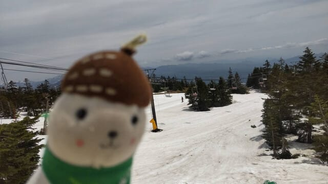

本日は終日晴天で．

朝イチはちょいと硬めの雪でスタート

だったようですね…

ただ，営業開始から2時間は，まだ滑る

雪で良かったようですけど．

2時間を越えると板の滑りが悪くなってきた

ようで…

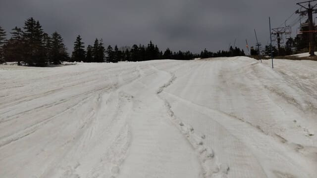

うーん．

雪も汚れてるし，この時期だし．仕方が

ないのかな～．

で，渋峠．

まだ雪がいっぱいあるように見えるけど，

一部雪が薄いところも出てきたみたい

ですね…（泣）

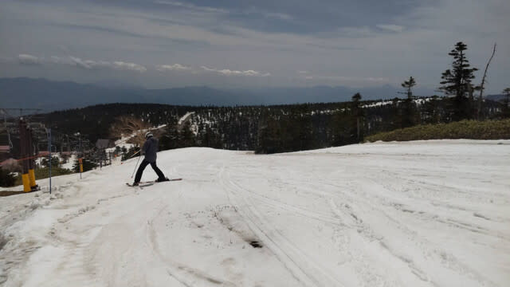

でも，残り営業は1週間ちょい．

それくらいなら問題なくもちそうな

雪が十分ありますよ～！！

そして．

横手に戻る第3側もまだ雪が十分に

あるようですが…

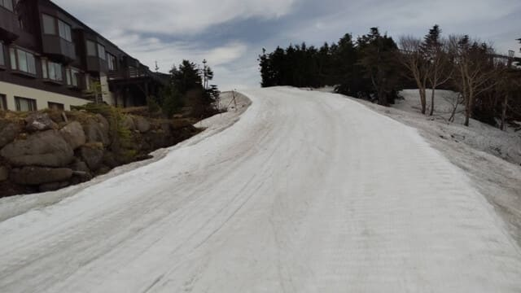

ただ，第2ゲレンデは，かなり土の露出が

ひどくなってきて．

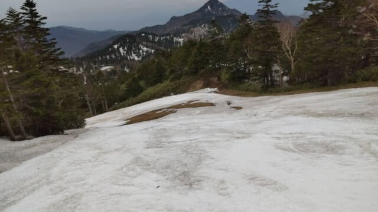

コース幅もかなり狭くなってきたうえに．

妖怪板つかみがかなり凶暴に進化した，

豪快わしづかみが大量発生し，

緩いところは歩いたほうがずっと速いカモ

というコメントでした…（泣）

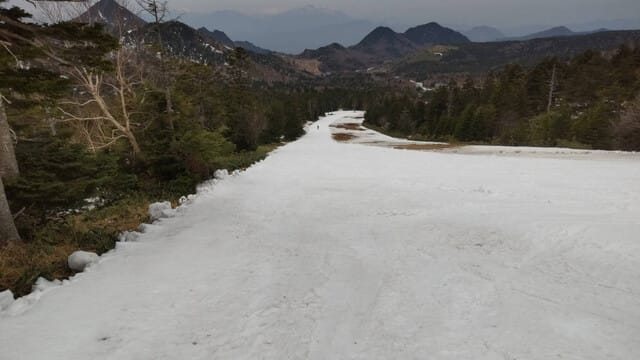

横手はあと3日間，今週末で終わりなので．

まぁ，ちょうどいい感じで終わるのかな…

うーん．

先週末に熊の湯からの帰り道で見たときは，

もう1週間以上は十分もちそうに見えたけど…

気温が高いからか，雪が解けるのが早い…（涙）

ってなことで，本題へ．

今年のシーズンインの際に，イエティの

リフト乗り場で板をひっかけてしまい，

イエティや月山で履くための石ころふみ用の

FISCER RC4 SC PROを見事にひん曲げて

しまったのは，[過去の記事](e39bec1eeb068119ed5b757ec613f827b.md)に書いたので

覚えている方もいると思います…

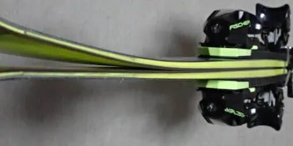

うーん…

何度見ても悲惨な曲がり方（泣）

しかし．

今，私の手元には石ころふみにしてもいい

ほど使い古した小回り板はなく．

[剥離した大回り用のFISCHER RC4 RC](ec1bf893ca5d3fe95fb46d2dca4a57a26.md)は

あるものの．そもそもショップで修理可能か

見てもらったとき，剥離してるので履かない

方がいいと言われてるうえ，185cmの板で

イエティやら月山を滑るのはちょいと

無謀というもの．

（185cmの板で6月の月山を滑っていたら，

目立つだろうなぁ…）

ってなことで．

石ころ踏み板をどうしようか．

臨時物欲選手権で手に入れた，まだ数日しか

使ってないほぼ新品のFISCHERのSC PRO，

こいつを石ころふみにするしかないのか…！？

…と，戦慄していた時．

心優しい人からの

「古い板があるからあげるよ～」

という，救いの声が！！

ありがたや！！！

もらった板は，かなり懐かしい2012シーズン

モデルのBLIZZARD SL RACE SUSPENSION！

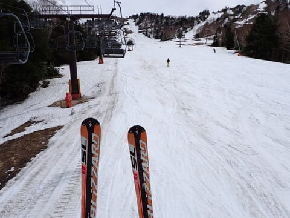

この板．

もともとは小回り用というより，競技用の

SL板ですね…

ピストンプレートが着いていて，ビンディングも

開放値17のレース用が着いているという，

結構しっかりした，重い板です…

滑ってみると…

をを！！

そんなにヘタってない！

ピストンプレートの効果か，まだしっかり

張りがあって返りがあるように感じる！

さすがにエッジはかなりダレてるけど，

板自体はまだしっかりしてるよ！！

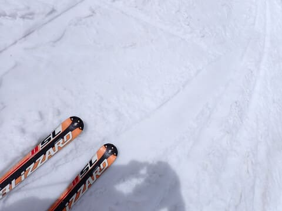

小回り板だけど，板の重さがあり．

春の荒れた雪には，ちょっと重めくらいの

板の方が，板が雪に叩かれずに安定感が

でるので…

これ，意外と春の雪に合うよ！！

今から13年以上前のかなり古い板なので，

今の板と操作性が違ったりするんじゃないか…

と，ちょっと心配したけど．

構造はオーソドックスなサンドイッチ板って

こともあり，何の違和感もなく乗れて．

うーん．

今は完全に廃れてしまったロッカー板の

ブームが来る，さらにその前の板で，

世代的には数世代古い感じなのに，

今の板と全く違和感なく乗れる…！！

むしろ，これより新しいロッカーブーム

時代の，かなりロッカーが効いた板を履いた

ほうが違和感を感じるかも…

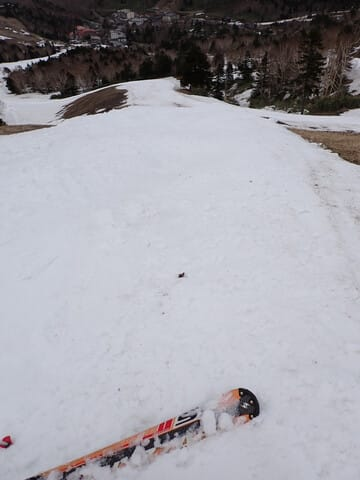

エッジは垂れてるけど，どっしり感が

あって，ピストンプレートで結構強めの

張りと返りがしっかり感じられて，

古いヘタった板の，踏んでも踏んでも

返ってこないヘタヘタ感がないよ！

バネ感のある返りに乗って，スパスパ

切り換えられるのに安定感がある，

春雪のもってこいの板じゃないですか…！！

まさか13年前の板で，こんなに楽しめる

と思わなかった…！！

…ってな感じで．

先週の熊の湯で，お試しのつもりで初めて

この板を履いたけど，思ったより楽しくて

結局ずっとこの板で滑ってしまい．

これから先，月山とかに行くとき，

どの板を履いていこうか…という問題が

あっさり解決したのでした…

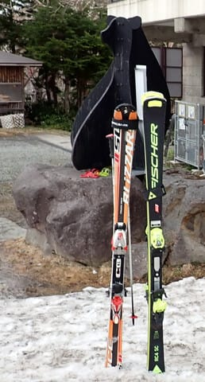

板を譲ってくれた心優しい某氏，

ありがとうございました～！！
