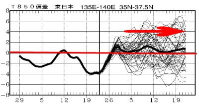
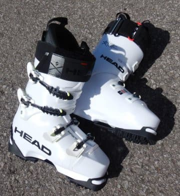

# 今シーズン本格デビューのスキーブーツ，HEAD Raptor WCR3を今シーズン履いてみて…その１

📅 投稿日時: 2022-02-25 02:25:03

🏷️ カテゴリ: [スキー雑談](c1f9d2cb7478308da16419928ea3945e9.md)

というわけで．

本日も志賀高原で滑っている特派員から

写真が送られてきました～！

本日の朝イチは，晴れの予想を裏切って

曇り空でスタート．

　時折雲が飛んできて曇るかも

　しれないけど，基本的に晴れ．

…っていう予想，外したか？？

と思ったところですが…

すぐに雲が切れて，ゲレンデに

日が射し始め…

午前の早いうちに，太陽が顔を

出してきたようです！

午後は，雲が多めなものの，青空が

広がる天気になったようで．

まぁ，時折雲が飛んでくるものの

基本的に晴れ，という予想は当たりでしょうか．

そして，昼間の気温も-6℃程度までしか

上がらず．

冷え冷えで，雪も終日良かったようです…

いいなぁ…

明日もたぶん，基本的には晴れの

結構いいコンディションに

なりそうです…！

で．

3月はかなり高温になりそう…という

気象庁の予報が出てましたが．

本日木曜発表の1か月予想図を見てみると．

これから1か月の気温傾向．

先週段階の，3月に入るとかなりの

高温傾向が続く…という予想から，

大体平年並みの予想に変わってます！

うむ…

せめて平年並みでいてくれれば，

雪も解けず，バーンもそれほど緩まず

済みそうなので…

現段階の予想がそのまま当たって

ほしい…（切なる願い）

ってなことで．

本題へ．

[昨シーズンのGWに開催された物欲選手権](ed9f378aafcc4eb8620e941a8c06dd4a7.md)で

大敗した際に購入したブーツ，

HEAD Raptor WC3．

フレックス140~150という，

（アキレス腱部分のビス1本で140，2本にすると150）

我が人生で履いたブーツの中で，

最高に硬いスキーブーツ．

昨シーズン前に，初めて[長岡のエキップさんで
買って調整してもらった](e84a3c4f3e87605ea154c49f2e9927b90.md)ブーツの

[REXXAM REVO 130M](e3075b660005b16ea867e1a7cfa899be0.md)

を履くようになってからというもの，

板がしっかり踏めるようになり．

「これだけ板がしっかり踏めるなら，

　もっと硬めのブーツでもいいかも…」

と思ったのと，エキップさんで作った

ブーツのあまりもの出来の良さに，

「エキップさんブーツの二郎君が必要だ…！」

ということで，エキップさんの最近のおススメの

HEADブーツを購入したわけですが．

今シーズンになって本格的に履き始めたので，

このブーツのレポートをば…

ラスト93mmと，数字上はかなり幅が狭い

ブーツですが，つま先部分の幅がかなり広い

ので，そんなにタイトに感じないです．

アキレス腱部分が結構細くて，アキレス腱

部分が締め付けられるようなブーツがあったり

しますが，このブーツはそんなことはなく，

アキレス腱を抑えないのにかかとがしっかり

あるべき場所に収まる感じ．

このブーツはくるぶし周りにLIQUIDフォームを

注入することでフィット感を上げられるので，

オプションでお金はかかりますが，

LIQUIDフォームを入れることをおススメします…

（[私のブーツは，このLIQUIDフォームが漏れる](e3075b660005b16ea867e1a7cfa899be0.md)という

　初期不具合で一度インナーブーツ交換に

　なりましたが）

で，私のこのブーツ．

昨シーズンに購入して，LIQUID漏れの初期不良で

インナーブーツ交換になった後も，まだ

手を入れ続けてます…

かなり特殊らしい足型の私．

購入直後，インナーブーツが新しい時は

それほどでもなかったんだけど．

しばらく履いてインナーがなじむ…

というか，つぶれてくると当たる

ところが出てきてしまいました…

と言っても，丸一日履いて，ブーツを

脱いだ後に「ちょっと痛みがあるかな」

という程度．

これまで他の店で買った場合は，

滑っている時にかなり痛くて，

我慢しながら滑っていることが

ほとんどだった，私の足．

この特殊な足型で，そこまで痛く

ならないだけすごいんですが…

今回，さらにフィット感を上げるために

再調整してもらいました．

・タングのボリューム増し

足首が細い私の足に合わせるため，タングに

厚手の布を2枚貼ってボリューム増ししましたが，

それでもブーツが足になじんでくるとともに

タイト感が緩んできたため，さらに1枚

貼り足してタングのボリュームを

増やしてもらいました．

・小指部分の当たり出し

1日履いているくらいだと大丈夫だけど，

正月休みなど長期履いていると小指付け根

部分が当たって痛くなってきたので，

幅をちょっと広げてもらいました．

・LIQUID追加

しばらく履いて，インナーがなじんだのか

つぶれたのか，ちょっと新品時より

ホールドが甘くなってきた気がしたので，

くるぶし周りにジェル状の液体を

注入してホールド感を上げられる

このブーツ．

購入時にも液体を入れてたのですが，

さらに追加して注入してもらいました．

って感じで．

エキップさん謹製ブーツ，

今シーズンに入ってさらにフィット感が

増してきました！！

当たりもほぼ完ぺきに解消！！

ホールドはタイトなのに，

朝から晩まで（ホントにナイターの夜まで）

滑っても，足が痛くならないブーツに

仕上がりました！

…しかし．

LIQUIDの液体はさすがに有料なんだけど．

一旦ブーツを購入したら，これだけのメンテを

基本無料でやってもらえるのはありがたい…

ってなことで．

ここまででかなり長くなっちゃったので．

滑ってみたインプレッションはまた後日…

（続く）

## 💬 コメント一覧

### 💬 コメント by (おおすぎ)
**タイトル**: Unknown
**投稿日**: 2022-02-25 13:06:41

え”～～～～～～

インプレッションを期待しておりました！

（何処かでみた、ＴＶ番組の結末は次週！！の感じです・・・とはいえ、相当ご無体のＳ’さん、どうぞご都合のよい時に、インプレッションお願いします・・・）

### 💬 コメント by (赤色アクセラ)
**タイトル**: Unknown
**投稿日**: 2022-02-25 14:20:44

はじめまして！

blogいつも楽しく拝見してます！

このblogがきっかけで先日エキップさんでヘッドの全く同じブーツを作りに行きました！

今まで1日滑ると足が痛くて感覚も無くなってたのですが、こんなに違うのかっていうくらい快適で、かつ操作性も良いブーツが手に入り大変満足してます！

S様ありがとうございました！(^^)

### 💬 コメント by (Skier_S)
**タイトル**: 今週末もコンディションは良さそう
**投稿日**: 2022-02-25 23:44:58

＞おおすぎさま

すみません．記事が長くなって，1回で書ききれませんでした…

来週火曜に続きを書く予定です！

＞赤色アクセラさま

こめんとありがとうございます～！！

エキップさんに行かれたんですね．

いや．ホントに良いですよね…私も「この足型に合うブーツを作れるとは思えない」

と思って，最初はあまり期待しないで行ったのに，いい意味で思いっきり裏切られました．

そして，滑りまで変わるという…

もう，他でブーツ買えなくなりますよ！！

