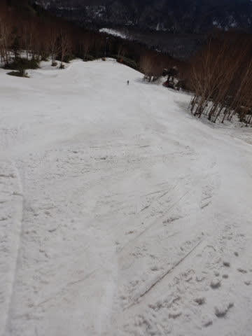

# 2021/4/24(土)の志賀高原スキー場は…晴天！で，異常に暑く，雪の滑りも良くない一日(涙）

📅 投稿日時: 2021-04-24 22:03:25

ってなわけで．

本日も完全徹夜で志賀高原へやってきたわけですが．

ほとんどを交代運転要員に運転してもらい，

気づくと焼額第2ゴンドラ駐車場だったという，

荷物のようにスキー場まで運ばれてきた

Skier_Sです．

で．

徹夜で朝2時過ぎに家を出て．

車の中で2時間半ほど寝て，

6時半からの早朝営業に参戦したわけですが…

早朝営業開始前，結構人が並んでますね．

で．

山頂へ出ると…

なぬ？？

早朝開始時から気温は+8℃！？？(涙)

なんという高温…！！

でも，朝早くにはかなり冷えていたのか…

バーンは結構いい感じに硬く，ガッツリ

締まったシマシマ！！

朝の1本目は，硬すぎるくらい，

しっかりしたいい感じの最高

バーン！

いや…

最高！！

徹夜で来たかいがあるというもの！！←良い子は寝ないで

スキーに来るのはやめましょう

1本目のゴンドラこそ並んだものの，

2本目以降はゴンドラ待ちはほとんどなく．

バーンもがらがら！

…だけど．

すっきり晴天＆高温の本日．

早朝2本目には早くも，日当たりのいい部分が

ところどころ緩みはじめ…

早朝営業終了のころには，バーンの硬さは

なくなってました…(涙）

8:30には，ざぶざぶというほどではないけど

硬いバーンが緩んじゃった感じになってきて．

そして…

早くも朝9時には，パノラマコースの

廊下部分の雪の滑りが悪くなり始めましたよ…(恐怖）

ああ…

普通のシーズン中ならうれしい，この晴天が

憎い！

でも．

早朝営業が終わったら，

「通常営業の方が人が少ないのでは…？」

というほどのガラガラさだったので．

焼額山は，朝には雪は緩みきったものの，

板が潜ってしまうほどのザブザブバーン

にはならず，それほど荒れない，比較的

フラットなバーンをキープ！

焼額の第2ゴンドラのコース上部，パノラマコースが，

朝のうちからところどころ滑りが悪い，

ブレーキがかかる雪になっていったものの…

意外と，第4ロマンス降り場から下の

サウスコースは，雪は汚れているものの

ストップ雪にならずに，

終日そこそこ滑る雪をキープして

くれました！！

ただ…

滑っている人が少なく，

ゲレンデ表面が削られないので，

表面にかなり汚れが浮いてきちゃってますが…

でも，逆に言えば．

ゲレンデ表面の汚れがスキーで削られない

ほどのガラガラっぷりだったので．

今日の焼額は，ラストまでバーンは

ほぼフラットのまま！

うーん．

ゲレンデ上部．

特にこの廊下部分と，その周辺部分が

かなり貼りつく雪だったところが

かなり惜しかったかな…

でも．

本当に午後は焼額スキー場全部でお客さんが

10人ほどしかいないほどのガラガラだったので．

晴天の下，今日もラストまでほぼフラット

バーンをキープしてくれて．

板が潜るようなドボドボ雪になることもなく．

最後まで大回り板で滑れるほどでした～！

ってなことで．

徹夜で早朝から滑っていた本日．

「今日は早めに上がろう…」

と心に強く思っていたのに．

…気づくとやっぱり，

昼休みも取らずひたすら営業終了まで

滑り続けていた，Skier_Sだったのでした…

しかし．

本日，最高気温は+15℃という．

スキー場にあるまじき気温にまで

上がっちゃったけど…（激涙）

意外なことに，まだ雪はコース全面に

ついていて．

少なくともGW前半は，問題なく滑れ

そうな感じですよ～！！！

## 💬 コメント一覧

### 💬 コメント by (ほっぽ)
**タイトル**: 4/24　志賀高原
**投稿日**: 2021-04-25 07:00:54

Ｓさん

昨日もご挨拶のみで失礼しました。

早朝から終日ヤケビとは素晴らしいヤケビ愛ですね。

私は８時からの奥志賀エキスパスタートで、

何時も通り高天ヶ原でランチして午後にＮＨＫ１本滑ったら

転倒した際に左股関節を捻ってしまい強制終了。

多分、今シーズンの終了と思います。

まだまだ春スキー満喫される皆さん、

ケガには十分気を付けて楽しんで下さい。

昨日の滑走日記はblogにアップしました。

http://hoppo.officialblog.jp/

### 💬 コメント by (ikkun)
**タイトル**: Unknown
**投稿日**: 2021-04-25 11:09:13

おはようございます❗  やはりお出ましでしたね？昨日はスキー学校大先輩と昼のみで残念でした❗行けたらお会い出来たかも( *´艸｀)  しかしやはりしかしこのタイミングって最低最悪ですね(・・;)今日も🎵楽しんでくださいませ❗

### 💬 コメント by (アリス)
**タイトル**: 睡眠取ってくださいね
**投稿日**: 2021-04-25 16:12:50

Ｓ様

仕事～ブログ更新後移動～志賀参戦お疲れ様です。

車中寝たとは言えハードだったと思います。

それでも志賀はその苦労に応えてくれたかと思います。

私は、23日は奥ゴン2番機スタート、たぶん特派員様の後ろを滑っていたと思います。

24日は、初経験で横手山の早朝に参戦で、朝食付きに釣られました。

宿の駐車場で帰り支度の際、いきなり猿が車中に乱入し封を切っていないアクエリアスを持って行かれてしまいました。

これって窃盗犯罪か、・・・運転中にドリンク行為は危険なので、猿が気を聞かせてリスクを下げてくれたのか・・・

後者ろ思えば腹も立たないですね♪

### 💬 コメント by (かず)
**タイトル**: Unknown
**投稿日**: 2021-04-25 19:30:22

本日奥志賀でSさんらしき人リフトから見かけました！自分ウェアー着てなかったので分からないと思いますけど  朝良かったですが板掴みの恐怖で腰が引けてました笑  予定どうり明日で終了します

今シーズンはなかなかお会いできませんでしたがありがとうございました

また来シーズンもパウダー予測よろしくお願いします！

とうとう○○才ですね……

### 💬 コメント by (Skier_S)
**タイトル**: 今日は楽しかったよ！
**投稿日**: 2021-04-26 01:34:34

＞ほっぽさま

怪我，大丈夫でしたか…？

GW待たずしてシーズン終了，残念でしたね．

早く良くなることを願ってます…

また来シーズンお会いしましょう！

＞ikkunさま

あら．

ぜひ志賀にお越しいただければよかったんですが．

まだGWも志賀は滑れますよ！

＞アリスさま

今回，一緒に乗りあっていく運転手がいなければ，

多分早朝に行くどころか，スキーに行けたかも怪しい感じでした…

24日は横手だったんですね．この日は横手が一番

コンディション良かったと思います．

志賀高原の一の瀬付近，車の窓から見えるところにコンビニ袋とか食料が見えると，

猿は車の持ち主が来るまで待ってたりしますよね…

今回は，危険運転しないように猿が運転手を待ってたのかも？？？(笑)．

＞かずさま

あら～！気づきませんでした．すみません…

シーズン最後のご挨拶できず残念です…

また来シーズン，よろしくお願いします！

