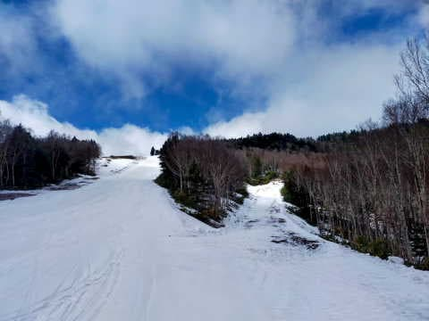

# 志賀高原スキー場のGWの営業予定とGW前半天気予想…そして4月27日(木)の志賀高原は朝は積雪2cm，午前に晴れてストップ雪に

📅 投稿日時: 2023-04-28 02:03:43

🏷️ カテゴリ: [日記](cc4b5682fb7b8b144980957a978653fb0.md)

えー．

やはり本日朝の志賀高原．

[火曜の記事での予想通り](e38ddb6f02a8dc11f603c2f0c205cb633.md)，雪が積もったわけですが…

この雪のおかげでオープンが遅れていた

志賀草津道路．

今日は11時くらいから日が射したので，

昼には雪が解けて，午後には無事オープン

したようです…！

で．

26日のどしゃ降りの影響で，志賀高原の

積雪状態と今後の営業予定はどうなったのか，

すごい気になっているわけですが…

焼額山は，当初の30日予定を一日前倒しで

29日までの営業となってしまいました(涙)

4月初めの頃は，4/16くらいで終わるかも？？

と思ってたので，それから考えると

もってくれましたが…

30日の悪天候予想で，終了を1日早めたようです（泣）

（[焼額山スキー場ホームページ](https://www.princehotels.co.jp/ski/shiga/informations/spring_skiing2023/)より）

そして，高天ヶ原スキー場は27日の営業を諦め，

今シーズンは終了となったようです…(泣）

（[志賀高原中央エリアホームページ](https://shigakogen.co.jp/archives/14926)より）

ただ，それ以外のスキー場は営業予定の

変更のアナウンスは無かったので…

奥志賀：5月7日まで

　第2，第3，(29日以降)第4リフト

　(連絡用にゴンドラ往復乗車可能)

　雪解けのため早朝無し

　…ただ，最終日までもつかどうか微妙．

　第2リフトは30日の雨で滑れなく

　なる可能性

一の瀬ファミリー：5月7日まで

　ペアリフトのみ．

　29，30日は早朝営業も予定

　ただ，あと何日もつのか…

　おそらく30日の雨で死亡

熊の湯：5月14まで（！！）

　第2ペアリフト

　29～5/7まで早朝営業予定

　ただ，山頂から滑れるのは

　29日か30日で終わりか…

　第2緩斜面はGW最後までもちそう

横手山・渋峠：雪がある限り．

　横手第1，2，3，4，渋峠ペア

　4/29～5/7は第2，渋峠で早朝予定

　おそらく第1ゲレンデは30日くらいで

　息絶えそう

という感じでしょうか．

30日の悪天候を乗り切って5月1日以降も

営業できそうなのは，

奥志賀第3，熊の湯第2下半分，

横手第2，渋峠

くらいかなぁ…

まぁこれでも，GW前に志賀高原全部

終わっちゃうんじゃないか？？

という3月ごろの予想だったのに比べれば．

意外と持ってくれたなぁ…という感じですね．

とりあえず，このGW前半の志賀高原の天気を

改めて予想しておくと…

29日(土)：晴れ～曇り．気温は朝から高い．

　朝から残念なザブ雪．滑りも悪そう．

　夜から雨

30日(日)：前日深夜から高温の雨（涙）

　それどころか風も強い荒れた天気になり…

　リフトは動かないかも？？

　かなりの雨が降ります．

　この日は諦めてください

5/1(月)：曇り⇒午後は晴れそう．

　朝は一瞬雪が硬いか？

　昼間はそこそこ気温が上がるので，

　朝早いうちから雪は緩む．

　午後は日差しが出るとヤバい雪に．

5/2(火)：晴れ！

　晴れて気温が高くて，朝から雪は

　ザブザブダメダメな感じ．

　ピークは+15℃近くまで上がり，

　午後はだんだん滑りが悪い雪に

　なっていく…バーンは荒れる．

5/3(水)：晴れ！

　この日も2日同様，晴れて気温が上がる．

　最高気温15℃くらい．暑い．

　雪はザブザブに…

　そろそろ雪が残ったゲレンデもヤバい

　感じに．

5/4(木)：曇り，夕方か夜から雨(涙）

　この日も朝から気温が高く，雪は

　ザブザブ．

　ヘタすると夜に雨になり…

　翌日はオープンできず，

　この日でクローズするゲレンデも

　あるかも？？

ってな感じです…

…やっぱり，私が祈っていた

GW中に奇跡の積雪1m

という事態は起きなさそうです（涙）←起きると信じていたのか！？？

…ってなことで．

ラストに本日の志賀高原特派員からの

レポートです～！！

まず．

あさイチは，なんとサンバレーまで白くなる

積雪があったようで…

焼額は2-3cmの積雪が！！

冬の景色に戻った感じですね…！

朝7時の気温も，-3℃まで冷えていた

ようです！

わずかとはいえ，ゲレンデに雪が積もって

くれたのはいいんですが…

こいつがかなりストップ雪で，

朝のうちはちょっと苦労したみたいです．

雪質は…

雨で湿ったザラメが固まった上に，

うっすら新雪って感じでしょうか．

滑りの悪い新雪が踏まれていくと，

そこそこ滑りの良い，意外といい感じのバーンに

なったようですが…

ちょっとパノラマコース，雪が薄めかな…？

まぁ，あと2日間はギリギリもってくれそう．

で．

11時には青空が広がり始め，

日差しで全面ストップ雪になっていった

ようです（涙）

確かに，見ただけで滑りが悪そうな雪ですね…

そして，奥志賀は…

第3ゲレンデはまだ行けそうですね！！

これは，GW前半はもってくれそうかな…

ただ，第3より下のエキスパートコースは…

これは，もう終わりげな感じ（涙）

これは，30日の雨で完全にやられそうな

予感…（泣）

エキスパートの下側もかなり雪解けが

進んじゃってますね（涙）

もう，ちゃんと滑れるのは廊下1本って感じ

ですね…

ってな感じですが．

奥志賀第3ゲレンデはもう少し持ちそう

なので，

まぁ，26日の雨によく耐えたなぁ…

…でも．

雪ってなんで解けちゃうんだろう…

雪が解けなければ，年中スキーが

できるのに！！←あまりにも危険発想すぎる…

雪が解けなければ，永久に積もり続けて日本は雪に埋もれるから
