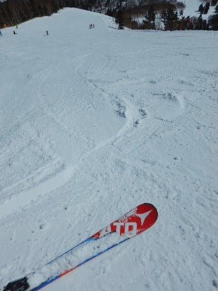

# 3月12日(月)の志賀高原，速報モード…快晴！朝は冷え冷え！昼間は微妙に気温が上がったけど…そこそこ楽しめたよ！

📅 投稿日時: 2018-03-13 01:43:05

ってなわけで．

月曜日の本日．

平日スキーという，

普通のサラリーマンではなかなか許されない，

禁断の贅沢を満喫してきたわけですが．

…本日，コンディションが良かったので，

しっかりラストリフトまで滑り倒して

しまい．←コンディションが良くなくてもラストリフトまで滑るのでは…？

帰宅後片づけやら板の手入れやらを

やっていると，やっぱり夜遅くなっちゃいました…

だもんで．

本日は定番の速報モードにて！

えー．

とりあえず．

本日は，朝から超すっきり快晴でスタート！

この日は一日中，すっきり快晴が続きました～！！！

…先週月曜日はどしゃ降りだったのに．

私が平日スキーをする月曜が快晴というのは．

きっと，私の日ごろの行いがすさまじく良いから

に違いありません！←違う．絶対違うから

いやーー．

天に祝福されているなぁ…←だから，違うから…

そして．

朝イチのゲレンデは．

ふはははは！

シマシマっ！！

晴天シマシマっ！！

…ちょいとボソボソと固まった感じのシマシマで，

ときどきボロボロと足元が崩れていくところも

あったけど…

でも，締まり気味のハイスピードシマシマ！

そして…

平日なので，ゲレンデは当然ガラガラ！！

朝イチ，ほとんど貸し切りの無人シマシマを

堪能し放題っ！！

こんな晴天ピカピカのゲレンデを．

誰もいない貸し切りで滑れるなんて…

なんてシアワセっ！！

ビバ，平日スキーっ！！！！

いやーーーー．

毎日でも平日スキーやりたいなぁ…

晴天ながらも，気温は昨日より低めだったので．

昼間になっても，日が強く当たる斜面以外は

終日締まった感じのバーンをキープ！

…ところどころ，固い下地が出てきたのが

惜しいけど．

でも，昨日よりはいい感じ！

…ただ．

日が当たる斜面．

オリンピックコースや，GSコースの

ごくわずかの部分は．

ちと雪が緩んでしまったところもあり…

雪が緩んじゃったところは，夕方には

コブになっちゃいましたが．

でも，緩んだのは日が当たる数か所のみ．

コースのほとんどは．

夕方まで結構締まった感じでもってくれて．

（ところどころ固いところも終日残ったけど）

ラストリフトまで．

晴天の中，ガラガラゲレンデをかっ飛ばせたのでした…

（ホントに今日の写真には，ほとんど人が写ってない…）

いやーー．

滑った．

今日も滑った．

ガラガラ晴天，最高でした…

ってことで．

明日また詳細レポートやります～！

## 💬 コメント一覧

### 💬 コメント by (k_harada)
**タイトル**: 初コメ入れさせていただきます
**投稿日**: 2018-03-13 07:30:28

いつも楽しい記事と専門家なみの天気予報を拝見させていただいてます

伝説のSさまがまさか月曜にいらっしゃるとは…興奮して思わず探してしまいました

子どもを連れてなければ2〜3本ご一緒させていただきたかった…残念

### 💬 コメント by (たろ)
**タイトル**: 非日常の世界
**投稿日**: 2018-03-13 10:12:12

私も偶然12日に有給を取ったので、通常なら会社でPCを立ち上げてメールチェックをしている時間にSさんとお話をさせて頂くという、非日常の瞬間を味わう事が出来ました。平日スキー万歳！ですね。

1ゴン早朝+平常営業+ナイターのトリプルコンボで2万Mを考えましたが、それでも相当な覚悟が必要です。

私のような一般レベルでは、早朝+ナイターを加算したドーピング?使っても、「猛者揃いの修羅の領域」へはたどり着けそうもありません。（笑）

### 💬 コメント by (Seeker_N.T)
**タイトル**: ひさしぶりに
**投稿日**: 2018-03-13 15:49:31

日曜日夕方、お久しぶりでした。

早朝から滑りまくっているとは思えぬ元気ハツラツ状態。

そして、お連れの方が20,000ｍ到達間近だったとか。。

先日の高天原の女性も含めると、これで殿堂入りは13人？

何年後かに「志賀高原13Legends」とか「Big13」とか語られて、なんか曼荼羅ができちゃいそうですね。いや、すごいです。ほんとに。

### 💬 コメント by (Goku)
**タイトル**: 羨ましすぎる
**投稿日**: 2018-03-13 20:34:03

週末滑れなかった私にはあまりにも残酷なレポートだ・・・

今日に長野、日中暑くて遂にクルマのエアコンを入れました。

もう季節は夏のなのですね・・・(T_T)

### 💬 コメント by (しんちゃん)
**タイトル**: 終日貸し切り？
**投稿日**: 2018-03-13 22:55:03

今回のレポートには人がいないですね。

平日は貸し切り状態になるんですね。うらやましい。

人はいないけれど夕方にコブ斜面があるってことは、Ｓさんが滑り倒したからではないかと思ってしまいました(笑)

ＧＷの営業まで、もうひと降り欲しいですね。

黒魔術で何とかお願いしま～す<(_ _)>

### 💬 コメント by (マルハバ)
**タイトル**: 平日スキーの世界へようこそ・・
**投稿日**: 2018-03-13 23:03:37

ご無沙汰しております。

月曜しか休めない私にとってそれが日常です。

でも・・

昨日のハンターMt.はなぜか混んでましたね~

駐車場はかなり埋まってましたしゴンドラの待ちも

結構ありましたね。

オリンピックの影響でもあるんでしょうかね？

さて今週末は年に一度の週末休みで志賀高原です。

Sさん17日のナイターはどちらで？

私はサンバレーまでは足を伸ばせませんので

もしダイヤモンドでしたら、

またご一緒したいものです。（1時間程度ですが）

### 💬 コメント by (なるなる)
**タイトル**: はじめまして
**投稿日**: 2018-03-13 23:46:42

昨日、1ゴン山頂で挨拶させていただいた者です。

ゴーグル・マスク付けたままで失礼しました。

何年か前の高速道路通行止めで朝方帰宅された悲惨な記事くらいから、数々の伝説読ませていただいております。

何度か、お見かけしていたのですが、お声がけできませんでした。

ステッカーありがとうございました。まさか頂けるとは思っていませんでした。

金色にチャレンジしたいところですが、さすがに無理です…

今後ともよろしくお願いいたします。

### 💬 コメント by (Hide)
**タイトル**: はじめまして
**投稿日**: 2018-03-14 07:36:02

S 様

はじめまして。

初コメさせて頂きます。

数年前より、冬季の志賀高原ピンポイント情報（笑）を収集する際に参考にさせて頂いております。大変助かっております。

ヤケビに行く都度１ゴンでお声がけさせて頂こうと思いお探しするのですが、なかなかお会いできないものですね。

１ゴン駐車場からヤケビ、奥志賀、寺子屋辺りを、K川県YH市から徘徊しています。

お見かけした際は、ぜひお声がけさせて頂きたいと思います。その節はよろしくおねがいします。

では、S様にはまだまだ長いシーズンを楽しんで下さい。

### 💬 コメント by (Skier_S)
**タイトル**: コメント遅れてごめんなさい
**投稿日**: 2018-03-15 06:54:41

＞K_haradaさま

初コメありがとうございます～．

また，焼額では声をかけていただきありがとうございます！

あんな感じで，土日はいつも焼額滑ってますので，

また志賀にお越しの際は探してみてください（笑）．

今度は一緒に滑りましょう！

＞たろさま

まさか月曜に出くわすとは思ってませんでした（笑）．

早朝～昼間～ナイターのトリプルコンボは，

私もこれで人生2度目か3度目かで，

それほど何度も経験したわけでは無いのですが，

朝早くに家を出てきてのトリプルコンボは，

さすがに死ぬかと思いました…

やらない方が身のためかと思います（笑）．

＞Seeker_NTさま

お久しぶりにお会いしましたね…

あの日は昼休みもとらず，早朝から

ナイターまででなんとか21000ｍほど

行きました．

でも，あの時お会いした時はもうへろへろ

でしたが（笑）．

そんなに元気ではなかったです…

でも，無事友人もゴールドをGetしました！

おそらく，今はゴールドステッカー保持者は

15人ほどになったかと思います…．

＞Gokuさま

この月曜日は最高の平日スキー日和でした！

…気温は高かったですが．

この週末も天気は良さそうですよ～！

日曜，かなり気温は上がりそうですが（涙）．

＞しんちゃんさま

いやーーー．

平日スキー，良かったですよ～！！！

でも，ホントにもう一降りほしい…

ゴンドラ乗り場近辺，もう雪出しを

始めてるレベルだったので，春営業は

かなりヤバそうな予感…

＞マルハバさま

月曜平日スキー，良かったです…

