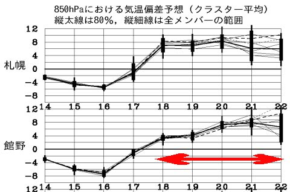
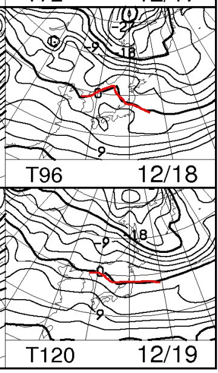
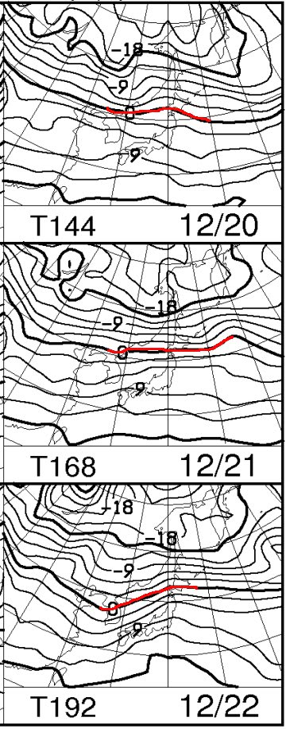
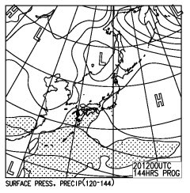
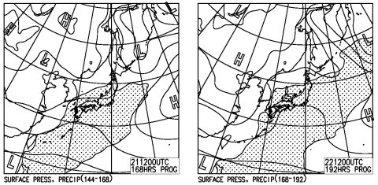
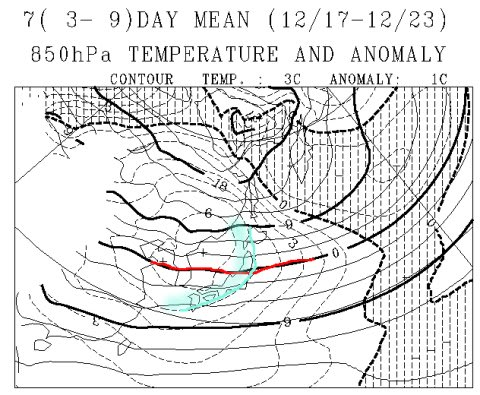
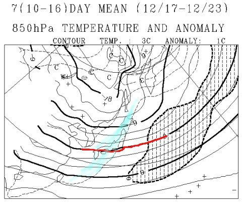
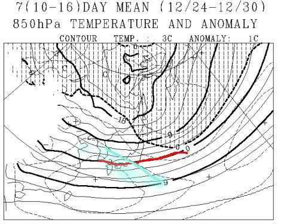

# 【緊急速報】冷え冷え祭り終了のお知らせ…来週は恐ろしい高温にっ！！！（涙）

📅 投稿日時: 2016-12-16 03:47:40

ピンポンパンぽーーーん

…

みなさま．

大変残念なお知らせです．

ここしばらく続いていた，冷え冷えウィークですが．

17日をもちまして，終了となります．

18日以降は．

昨シーズンより恐ろしい

超高温ウィークとなりますので．

ご覚悟のほど，よろしくお願い申し上げます．

…

ってか．

なんですか～っ！！！

これはっ！！！

18日以降．

平年より4℃～10℃，気温が高い日が

続くんですが…（涙）

18日以降の，850hpa図は…

…ここまででも，0℃線は志賀高原より

北に上がってしまっており．

降ったら雨になるレベル…

＃この2日間は高気圧に覆われるので晴れますが

ここまででも，12月下旬と考えると

かなり厳しい状況だけど．

これから先を見てみると…

ふ，ふぎゃーーーーっ！！！

…こ，これは．

言葉を失うレベル…（涙）．

赤くマークした0℃線．

北海道近辺まで行っちゃってるよ？？

これって…

春なら4月下旬くらいのレベルでは！？？？

22日，志賀高原には＋9℃線が近づいてるので…

22日の昼間，12月下旬だというのに．

＋10℃近くまで気温があがるってこと？

そして．

…昨日の予想とちょっとずれて，20日はなんとか

降らずに済みそうだけど．

21，22日は，降水域の網掛けが全国を

覆ってるから…

そう．

この850hpa気温で，絶対に雪になるわけがありません．

21，22日，超高温の雨です．

3連休直前，雪は壊滅的に減ります（超激烈涙）．

そもそも．

一か月予報図，FCVX12の，

12月17～23日の一週間平均予想が，だ．

…こ，こんなすごいの，見たことないよ…！！！

水色で塗られているのは，

平年比+5度のエリアなんですけどっ！！！！

一週間の平均が平年比+3℃で異常高温ですよ！！

あれだけ暖冬だった去年でも，一週間平均が

平年比+3℃を超えたのってなかったんですけど…

平年比+5℃ですかっ！！？？？

なんですか！これはっ！？？？

先週の予想では…

同じ期間の12月17～23日の予想．

せいぜいこの程度で，平年比+1℃程度だった

はずなのに…（涙）．

「大きく予想がずれちゃいました～」ってことのようで．

先週段階での予想と変わって．

超高温の予想になってしまいました…

…昨日も書いたけど．

ブロッキングHが消えたのが，痛い…（泣）．

ということで．

冷え冷え祭りは，今週土曜日で終わりです．

日曜以降，来週一週間は．

昨シーズンを超える超高温がスキー場を襲います．

来週3連休は，今週末より滑れるエリアが広がる可能性は

限りなく0です．

っつーか．

むしろ，今週末より来週3連休の方が，

滑れるエリアが減ることを覚悟してください．

ダメだ…（涙）．

読者の皆さんは．

クリスマス＆年末寒波を期待したいところだと思うけど．

12月24～30日の予想もこんな感じで．

水色で塗った，平年比+2度のエリアが

信州に近づいてます．

ダメです．

冷え冷えドサドサ雪は期待しない方がいいです．

…そう考えると．

この15日夜～17日朝の冷え冷え積雪が．

ほぼ今年のラストチャンスかも…

…

…いや！

そんなことはないはずっ！！

そんなことは私がゆるさないっ！！

また，来週の予想も．

「大きく予想がずれちゃいました～」

ってことで．

冷える予想に変わるはずっ！

変わるに違いないっ！！

そうです．

そのためには．

今年もやはり，捧げなくてはならないようです．

冷え冷え踊り ver. 2017season　‐まさか今シーズンも踊ることになろうとは－

を…っ！！！

＃今シーズンは踊らずに済むと信じていたのに…（泣）．

## 💬 コメント一覧

### 💬 コメント by (yama)
**タイトル**: 1ゴン
**投稿日**: 2016-12-16 08:52:38

17日土曜日から第１ゴンドラ（ジャイアントスラロームコース）運転開始とMessage今日のひとことにありました。暗い話題の中で良い話題もないと寂しい(ﾉ_･｡)ので一言。今シーズンもS様が娘さんといるとゲレンデの状態が良くなるのは継続しているのでしょうか。

### 💬 コメント by (かず)
**タイトル**: 昨日コメントしました
**投稿日**: 2016-12-16 10:58:08

土曜第一動くようなので　朝一第一になりそうです　お忙しいそうなので挨拶程度ですけどよろしくお願いします

### 💬 コメント by (やっさん)
**タイトル**: １年ぶり投稿させていただきます。
**投稿日**: 2016-12-16 13:39:26

いつも楽しく拝見させて頂いております❗

毎年、年末年始を家族4人、志賀高原でスキーを楽しんでいるものです。

昨年、暖冬が心配でずっと拝見させていただいたんですが、年末年始はなんだかんだ言って焼額で楽しませて頂いたと思います。

が、今年は本当にやばいんですね❗

今回のクリスマスから年末年始予報を見させて頂いて手が震えてきましたよ😢

変わる事ありますよね😱

まだ半月ありますもんね😱

祈るしかないですよね😢

### 💬 コメント by (はなげ親分)
**タイトル**: 雨なら雨で…
**投稿日**: 2016-12-16 14:39:39

ゲレンデが空いているので、それはそれで良いかもしれないとつぶやいた自分は、S様側の世界に片足を踏み入れているのでしょうか…？

### 💬 コメント by (Skier_S)
**タイトル**: 今週末は楽しみましょう！
**投稿日**: 2016-12-17 00:29:26

＞yamaさま

やったーーー！

まさか，1ゴン2ゴン揃って動くとは！！

朝イチから1ゴングルグルしています～！！

…しかし．

ホントに娘と来たときは，雪が良くなる気がしますね（笑）

＞かずさま

私も1ゴンスタートの予定です～！

娘と一緒のときは挨拶程度ですみません．

一人で滑ってる時なら，お話させてください～！

＞やっさんさま

24日以降，平年並みに近いところまで戻るので…

年末年始は何とかなるかな，と思っています．

3連休はかなりやばそうですが（涙）．

年末年始も焼額滑ってますので，

またよろしくお願いします～！

＞はなげ親分さま

いや．

私は健全ですから（きっぱり）

雨が降ればゲレンデが空いていいよな～，って

Yetiで思うことはあるけど．

志賀ではそんなことを思わないので．

はなげ親分さまに私は負けているのだと

おもいました（笑）

