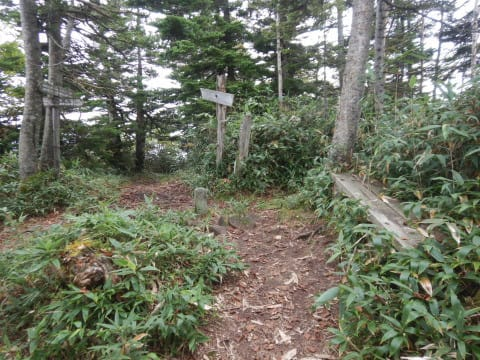

# 志賀高原の岩菅山に登ってみた３…寺子屋山頂から裏寺子屋山，ノッキリまでの尾根コース

📅 投稿日時: 2020-10-21 00:07:23

🏷️ カテゴリ: [登山・旅行](c1d637a11a25b457ac978d197adbdafc5.md)

ここ数日．

志賀高原やら狭山オープンやらのニュースが

続いていたので，しばらく中断していましたが．

本日は，しばし中断していた

岩菅山登山レポートの続きです～！

ーーーー

ということで．

[前回](e352846f889ae32395559358177c030d8.md)，寺子屋スキー場てっぺんの登山口から

登り始めたところまで書きましたが．

その登山口から，木の階段とこんな

感じの道を10分ほども登ると…

え？

なに？

もう，寺子屋山頂？

我がAmazfit PACE君は，

ゴンドラを降りてから50分，

標高2116mって言ってますね…

ゴンドラ山頂駅から寺子屋山頂までの

コースタイム49分なので．

ほぼコースタイムぴったり．

…やっぱり，このペースだと山頂は

無理っぽいな…

…しかし．

これが寺子屋山頂か…

見晴らしが無いどころか，

全然山頂っぽくない（涙）

単なる登山道途中，って感じ…

なので．

ここはさっさと通過して，さらに歩いていきますが…

うぅ．

山頂を超えたということは…

下るわけですね．

く，下りは．

太ももの筋肉と膝に優しくない…（涙）

ってなことで．

下りはかなりのゆっくりペースで歩き．

金山沢の頭の分岐に到着…

ここでコースタイム5分オーバー．

…まさか，コースタイムより遅い時間で

歩くとは…

そして．

景色がいい尾根沿いのコースだと思っていた

このルート．

ここまでは全く視界が無い，森の中の

道を歩いてきていますが…

寺子屋山頂から20分ほど歩いたあたりで．

をを！

やっと尾根沿いに出ました…！

…けど．

すっきり晴れじゃなくて．ちょっと視界が

悪いのが残念…

ここからは尾根沿いのコースを歩きますが．

尾根と言っても，周りは木で囲まれて

時折景色が見えたり隠れたり．

思ったほど，ずっとすっきり見晴らしのいい

尾根沿いコース…

ってわけではないけど．

振り返ると，今あるいてきた寺子屋

山頂が見えるし．

寺子屋山頂から30分ほど歩くと．

裏寺子屋山を越えて，向こうに岩菅が

見えるようになってきました…！

…って．

ゴンドラを降りてからもう1時間半

経ってるんだけど．

まだ岩菅山まであんなに遠いの…？？

あと2時間で山頂まで行けるのかな…？

で．

寺子屋山頂から岩菅のとりつきまで．

ほぼフラットな尾根筋…と思っていたけど．

写真を見ての通り，岩菅までは思った以上の

アップダウンがあります…

このアップダウン．

筋肉痛に優しくない…（涙）

でも．

もう花の時期は終わったよな…

と思っていたけど．

意外といろんな花が咲いてましたね…

こんな花たちに癒されながら．

時折視界が開けたり，時折木々に

囲まれたりのルートをひたすら歩く

わけですが．

…ほぼフラットだと思ったこのルート．

さりげなく標高差50mや100mのアップ

ダウンを繰り返すという，筋肉痛＆膝痛に

とっての修行のようないやらしいルート

なんですけど…（涙）

途中一カ所だけですが．

こんな風に補助ロープが張ってある

ところがあったり．

意外と地味に身体に来るアップダウンが

あります…

…いや，妙義山に比べれば，お散歩道

なんですけどね．

筋肉痛には厳しい…（涙）

という，地味なアップダウンにやられながら

歩くこと，2時間40分．

11時40分に，ノッキリへ到着！

…コースタイム2時間半のところ，

2時間40分かかっちゃったか…

とりあえずここで5分ほど休憩しますか…

で．ここから岩菅山頂までは

コースタイム45分．

…って．

え？

コースタイム通りでも，

山頂到着12時30分？？

帰りのゴンドラ時間が15:50だから，

遅くとも12時半には引き返す，と決めてたから…

きわどい．

実にきわどい．

登れたとしても，山頂でゆっくりする

時間はゼロになっちゃって，

ホントに山頂ワンタッチで戻るという，

「なにしに登ったんだ？」

状態になっちゃうから．

これは，今日は山頂は諦めるべきだな…

（続く）

## 💬 コメント一覧

### 💬 コメント by (西舘)
**タイトル**: Unknown
**投稿日**: 2020-10-21 06:38:31

諦めるべきなんだけど、なんだけど、上ってしまうS様の絶え間ない向上心で突き進む姿が見えまする〜。

私も昨日は筋肉痛で、よいしょっ!と掛け声が必要でした。

### 💬 コメント by (Skier_S)
**タイトル**: ＞西舘さま
**投稿日**: 2020-10-22 00:03:49

筋肉痛…分かります．

私もまだ日曜の登山の筋肉痛が，ふくらはぎに残ってます…

