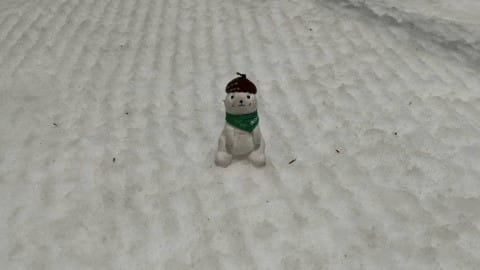
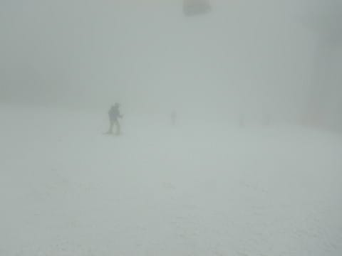
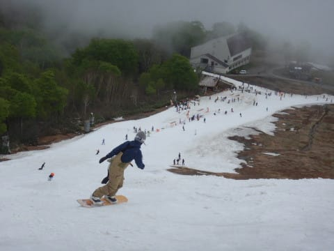

# 2021/5/23(日)のかぐらスキー場ファイナルデーの追加レポート続き…そして5/25(火)の渋峠スキー場特派員レポート！

📅 投稿日時: 2021-05-26 00:51:09

えー．

またまた本日も，期待を裏切ることなく．

いつものおこみん特派員，志賀高原の

渋峠を滑ってきたようです！

今日の朝の気温は+6℃程度と比較的低く．

そして，朝は霧も濃かったというのもあり，

ちょっと肌寒さを感じるほど．

だもんで．朝イチシマシマはいい感じで

板も走り，良かったようです…！

整備が行き届いているゲミュートコースは，

一部雪が薄いところがあるようですが．

この部分を見るとまだ雪がちゃんと着いて

いるように見えますね…

ただ，昨日までで終わりかな？

と思ったウェイバーコース．

本日も未整備ながらオープンした

ようですが…

いや…これ，滑れる状況じゃないよね！？？

で．

朝のうちは濃霧だった渋峠．

朝9:30ごろには青空ものぞき始め…

昨日ほどフラットなバーン状況では

無かったとはいうものの，人も少なく，

昼前までは結構楽しめたみたいです！

でも．

こんな感じで雪が薄くなり，幅も狭くなった

ところが数か所あるみたいなので…

果たして．

木曜27日の雨予報を乗り切って，

無事今週末までゲレンデがもつのか…？

こうご期待！←今週末自分が行く予定がないので

すごい他人事モードになっている

ってなことで．

ここからが本日の本題．

昨日，えらく長くなってしまったので，

途中までで終わった日曜のかぐら詳細

レポート．

今日はその続きです～！

というわけで．

あさイチのロープウェーの列に着いてから

1時間半の長旅を終えて．

ようやっと山頂についたわけですが…

…が．

…見えない…(涙）

ガスで全然コースが見えないんですが(泣）

コース幅が先週より狭くなったので．

狭い幅に人が集中して，コース上の

人口密度が高いのに．

それがガスで全然見えなくて，怖い！

…リフト待ちは，午前中は平均的に

この程度で．

先週に比べれば天国のように短い

待ち時間なんですけど．

なにぶん，ガスが切れた一瞬の写真を

載せておくと．

こんな感じでかなりコース幅が

狭まったため．

コース上の人口密度は，かなり高いん

ですが…(涙）

まぁ，コース幅が狭いと言っても，

シーズン初めのイエティほどでは

ないですが…

でも．

この幅に人が集まるので…

結構激しい人口密度になります(泣）

で．

当然，これだけの斜面にこれだけの人が

集まると．

あっという間にコースはコブだらけに

なるわけで…

午前中から，コースはかなり凸凹に(泣）

で．

凸凹で掘れたところは…

当然雪が少ないこのシーズン．

土が出てくるところもあるわけで…

最初はうっすら土が透けて見えていた

だけだったのが．

だんだん本格的に土が出て来て…

それがだんだんコース幅いっぱいに

広がっていきます(泣）

昼ごろには…

もう，コース幅全面，避けようがない

感じになっていきます(涙）

…いや．

これ，ガスが晴れている一瞬を狙って

撮った写真なので，しっかり見えているん

ですが．

実際は，一日のほとんどがこんな感じで，

ガスの中だったので…

この狭いコース幅の端から端までも

見えない程度で．

どこがコブなのかも分からず．

人や土もかなり近づかないと

見えないので…

怖かったです(涙）

そして．

この部分は，営業終了時にはこんな感じに…

ここ以外にも．

午後になると，山頂リフト降り場や…

和田小屋前を通り，リフト乗り場までの

部分も，土がではじめてきました（泣）

まぁ，そのおかげで．

午後はさらに人が減って．

リフト待ちはこの程度から待ち0

くらいになったけど…

でも，午後になってもコース上の

人口密度はそこそこあった感じ…

とはいえ．

土だらけのところもありながらも，

最後までクワッドが滑れたし．

巨大キッカーは無くなったものの，

最後までパークも残ったし．

ガスったものの，最後まで雨は降らずに

済んでくれたし．

まぁ，良かったかな…

と，15:15のかぐらクワッド最終まで，

ひたすら滑り続けたのでした…

…

…でも．帰り道．

ゴンドラの下りから雨が降り出し…

ざぁざぁぶりではなかったものの，

下りのみつまたクワッドでちょっと

濡れてしまったけど．

これを，

「滑っているうちは降らなかったから良かったね！」

と捉えるのか．

「雨を覚悟したのに濡れずに済んで良かった…

　と思っていたら，最後の最後に降られるとは

　ツイてない…」

と思うかで．

その人がポジティブかネガティブかが判断

できるのでは…？

そして．

自分はポジティブ人間なはずだ！

と，暗示をかけて．

…今日は滑っている間は，雨に降られずに

良かった…

と思いながら，水滴を滴らせて車に戻って．

かぐらファイナルデーを終えた，

Skier_Sだったのでした…

PS.

キャリーサービス，荷物はちゃんと屋根の下に

置いてくれるので，濡れずに済むところが

ちゃんと気づかいされていていいですね．

