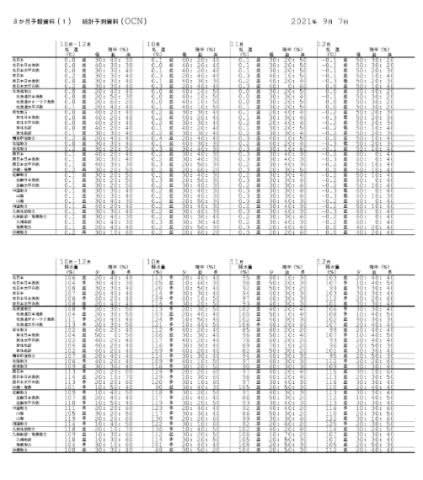
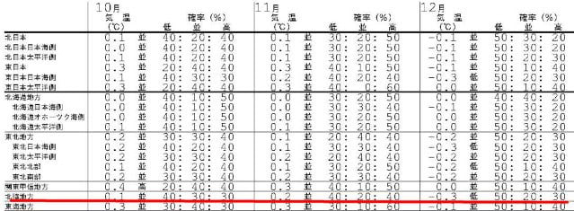
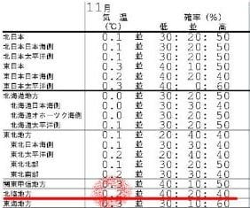
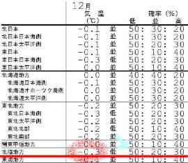
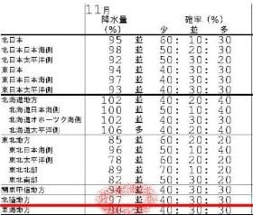
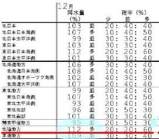

# 3か月長期予報が出たよ！…2021/2022スキーシーズン初めは冷えるのか？雪は降るのか？を占ってみる

📅 投稿日時: 2021-09-21 00:26:10

ということで．

知らぬ間に9月も下旬に突入し．

スキーシーズンまであと1か月強

という状況になってきたわけですが．

…そろそろ気になる，このシーズンインの

スキー場の天気．

果たして．

来るシーズンはシーズンインから雪に

恵まれたシアワセなシーズンになるのか？

あるいは，雪がなかなか積もらずに

やきもきするシーズンになるのか？

…全国1億5000万人のこのBlog読者に

とっては，気になりすぎて夜しか

寝られなくなるところですが．←夜は普通寝るところだから．そして読者が日本人口より多くなってるから…！！

気象庁から，10月~12月の3か月予報の

統計予測資料が発表になったので．

早速読み解いて，このシーズンインを

予言してみましょう…！！！

えー．

まず．

読み解く専門天気図はこいつ．[QXVX41](https://www.sunny-spot.net/chart/QXVX41.pdf)です．

最初に，気温傾向から見ましょうか．

志賀高原や長野のスキー場は，関東甲信地区

ではありますが．

北信だと，北陸地方の天気に近いので，

北陸地方を参照してみます…

スキー場オープン時期を左右する，

大事な11月を見てみると．

平年より気温が低い確率が40％，

平年並みの確率が20％，

平年より低い確率が40%ですか…

これは，

気温が高くなるか低くなるかどっちか

という極端な予想ですが．

一体どっちになるんだ？？？

と，気温予想のところを見ると…

うむ．全体平均では，

11月は平年より+0.2度高い

ということのようですので…

うーむ．

やっぱり気温は高くなるのか？？

でも．

ここは．

気温が低くなるかもしれない40%

に賭けましょう…！

そして．

12月の気温を見ると…

おおおおお！

これは…平年比-0.3℃！

それも，北陸以外でも全体的にマイナスに

なっていて．全国的に気温が下がりそうな

予感…！！

さらに，水色矢印で示すように，気温が

低くなる確率が50%ってことなので…

半分の確率で寒い12月になるという

ことですね．

平年並みが20%，高くなるのが30%の

確率ということですから．

これ，かなりの確率で12月は冷え冷えに

なりそう…！！！

さらに，降水量の方を見てみると…

うむ．11月は平年比降水量97％．

そして，降水量が少ない確率が40％と

いうことで．

どうやら，ドサドサ降り続ける確率は

低そうな感じ…

ですが，12月を見ると…

ををを！

降水量平年比112%，

降水量が平年より多い確率60%！！

これは…

今年の12月は，平年と比べて

冷えて降る

ということですね…！！

ってなことで，この冬は．

11月からドサドサ，というわけには

行かなさそうですけど．

12月になれば，例年より冷え冷えで，

日本海側は降ってくれそうな予感…！！

とりあえず．

この12月は，冷えて降ります！！

昨シーズンの12月はなかなか雪が積もらず，

焼額もゴンドラ営業開始が12月19日まで

遅れましたが．

次のシーズンは，12月オープンからゴンドラが

滑れるといいなぁ…！

…ただ．

長期予想って．

時々，1か月くらい経つと

「予想，変わりました~（てへ）」

みたいな感じで全然変わっちゃうことが

あるので．

今から1か月後の長期予想が，

ガラッと変わって，

「え？なに言ってるんですか？12月は高温の予想にかわりましたよ？」

ってならないことを祈るばかり…

…やっぱり，気温が冷える予想に安心せず．

いつもの踊りを踊っといた方がいいのかな…

## 💬 コメント一覧

### 💬 コメント by (アリス)
**タイトル**: 低温予想いいですね
**投稿日**: 2021-09-21 20:36:47

S様

スキーシーズンを待ちわびてる身からすると、12月は冷えて降るの予想は嬉しいですね♪

仮に暖冬で雪が降らなくても、Sさんのせいにはしませんから大丈夫です・・・

やはり、自然の驚異ですから。

志賀高原の紅葉も素晴らしいですよね♪

私は、ジャイアントと奥志賀の紅葉が綺麗で忘れられません・・・

たぶんですが、この時期はGokuさんが奥志賀でゴルフのコソ練してるかと思います♪

### 💬 コメント by (Skier_S)
**タイトル**: ＞アリスさま
**投稿日**: 2021-09-22 08:12:06

12月，予想通り冷えてくれると嬉しいんですけど…

しっかり12月頭から冷えてほしいところ．

…そして，志賀高原の紅葉，きれいですよね．

私は木戸池周辺が好きかも…

### 💬 コメント by (Goku)
**タイトル**: Unknown
**投稿日**: 2021-09-22 20:44:12

奥志賀でのコソ連がバレていたとは・・・

その割にたいして上達しませんがｗｗｗ

### 💬 コメント by (Skier_S)
**タイトル**: ＞Gokuさま
**投稿日**: 2021-09-23 04:22:57

奥志賀にコソ連しに行ってたんですか…

てっきりあのYouTubeの動画を撮るために，横手に夕日を見に行ったのかと（笑）

